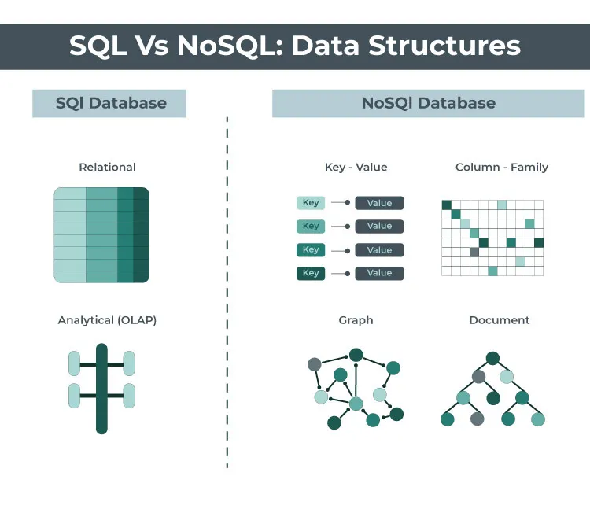

<!-- _header: '' -->
<!-- _footer: '' -->
<!-- _paginate: skip -->

<div class="grid grid-cols-3 grid-flow-col gap-2 text-center">
  <div class="row-span-1">


  </div>

  <div class="row-span-1 row-start-3">
  
  
  </div>
  
  <div class="row-span-3 col-span-3">


# Architectures modernes

### INTES

### 2024-2025

  </div>
  
  <div class="row-span-1 row-start-3">

###### Fabien HAINGUE

  </div>
</div>

---

## Sommaire

- Types de solutions logicielles
- Architecture d'application
- Big data
- Infrastructure
- Méthodologies
  - Gestion de projet
  - Developpement
- Pratiquez !

---
<!-- header: 'Types de solutions logicielles' -->

## Types de solutions logicielles

- Application
  - Desktop
  - Mobile
  - Web
- Service
  - Batch / Job
  - API web
  - Librairy
  - ...

---
<!-- header: 'Architecture d''applications' -->

## Architecture d'application
### Monolith VS Micro-service

<center>


</center>

---
<!-- header: 'Architectures d''applications' -->
<div class="grid grid-cols-2">
  <div>
  
### Statefull
Application gardant un état interne, ce qui rend le multi-instance difficile (lancer plusieurs fois l'application).
Ex: sessions utilistateur
  </div>
  <div>

### Stateless
Application sans état, ce qui rend le multi-instance facile (cloud ready).
  </div>
</div>

---
<!-- header: 'Architectures d''applications' -->
> La methodologie [12factors](https://12factor.net/fr/) est une méthodologie pour concevoir des logiciels en tant que service qui :
> - Utilisent des formats déclaratifs pour mettre en oeuvre l’automatisation, pour minimiser le temps et les coûts pour que de nouveaux développeurs rejoignent le projet;
> - Ont un contrat propre avec le système d’exploitation sous-jacent, offrant une portabilité maximum entre les environnements d’exécution;
> - Sont adaptés à des déploiements sur des plateformes cloud modernes, rendant inutile le besoin de serveurs et de l’administration de systèmes;
Minimisent la divergence entre le développement et la production, ce qui permet le déploiement continu pour une agilité maximum;
> - et peuvent grossir verticalement sans changement significatif dans les outils, l’architecture ou les pratiques de développement;

---
<!-- header: 'Architectures d''applications' -->
### Serverless
L'informatique serverless est un modèle de développement cloud-native qui permet aux développeurs de créer et d'exécuter des applications sans avoir à gérer des serveurs.

> C'est comme créer une lambda expression


---
<!-- header: 'Big data' -->
## Data & Big data

- Database
  - Relational
  - NoSQL
  - Data Pipeline
  - ETL
  - ...
- Data plateforme

---
<!-- header: 'Big data' -->

### Database

<center>



</center>

- Relational data base
  - Postgresql
  - Mariadb
  - MSSQL
- NoSQL
  - MongoDB
  - Redis
  - Neo4j

---
<!-- header: 'Big data' -->
### ETL

<center>


</center>

---
<!-- header: 'Big data' -->
### DataPlatforme

<center>


</center>

---
<!-- header: 'Authentification' -->

## Authentification
### Active Directory
Annuaire d'utilisateur

### SSO
Sigle-Sign-on permet de se connecter à toutes les applications autorisé avec un seul compte

### RBAC
Le droit d'accès à une fonctionnalité est défini par le rôle de l'utilisateur.
Un droit = une fonctionnalité

---
<!-- header: 'Conclusion' -->

## Exemple

<center>


</center>


---
<!-- header: 'Infrastructure' -->

## Serveur / Virtualisation / Conteneurisation

### Serveur

### Virtualisation

### Conteneurisation

---
<!-- header: 'Infrastructure' -->


---
<!-- header: 'Infrastructure' -->

## Orchestration

Déploiement
- Declaration

Haute disponibilité
- Replication
- Distribution
- Auto-healing

Outils
- Security
- Isolation
- Telemetry
- ...

<!-- TODO add image of k8s implementation logo -->

---

### Kubernetes

<center>


</center>

---

<details>
<summary>Exemple d'utiliation de K8S</summary>

```YML
apiVersion: v1
kind: Namespace
metadata:
  name: intes
---
apiVersion: apps/v1
kind: Deployment
metadata:
  name: api-part-deployment
  namespace: intes
  labels:
    app: api-part
spec:
  selector:
    matchLabels:
      app: api-part
  template:
    metadata:
      labels:
        app: api-part
    spec:
      containers:
        - name: api-part
          image: haingue/api-part:arm64
          imagePullPolicy: "Always"
          ports:
            - containerPort: 8080
          resources:
            limits:
              memory: "128Mi"
              cpu: "500m"
---
apiVersion: autoscaling/v2beta2
kind: HorizontalPodAutoscaler
metadata:
  name: api-part-scale
  namespace: intes
spec:
  scaleTargetRef:
    apiVersion: apps/v1
    kind: Deployment
    name: api-part-deployment
  minReplicas: 1
  maxReplicas: 3
  metrics:
    - type: Resource
      resource:
        name: cpu
        target:
          type: Utilization
          averageUtilization: 80
    - type: Object
      object:
        metric:
          name: requests-per-second
        describedObject:
          apiVersion: networking.k8s.io/v1beta1
          kind: Ingress
          name: api-part-ingress
        target:
          type: Value
          value: 500
---
apiVersion: v1
kind: Service
metadata:
  name: api-part-service
  namespace: intes
  labels:
    app: api-part
spec:
  ports:
    - port: 8080
      protocol: TCP
  selector:
    app: api-part
---
apiVersion: networking.k8s.io/v1
kind: Ingress
metadata:
  name: api-part-ingress
  namespace: intes
  annotations:
    nginx.ingress.kubernetes.io/rewrite-target: /
spec:
  rules:
    - host: api-part.imt.com
      http:
        paths:
          - path: /
            pathType: Prefix
            backend:
              service:
                name: api-part-service
                port:
                  number: 8080
```
</details>

---
<!-- header: 'Infrastructure' -->

### Infrastructure-as-code

<center>


</center>

---
<!-- header: 'Infrastructure' -->

### Infrastructure locale ou sur le cloud ?


---
<!-- header: 'Méthodologies' -->
## Méthodologies

### Agile & Scrum
<center>


</center>

---
<!-- header: 'Méthodologies' -->

### DevOps

<center>


</center>

---

<center>


</center>

---

### DevSecOps

<center>


</center>

---

## GitOps

<center>


</center>

---

<center>


</center>

---
<!-- header: 'Architectures d'applications' -->
## Pratiques de développement

---
<!-- header: 'Architectures d'applications' -->
### Test Driven Development
Permet de garantir le bon fontionnement d'une application et d'empécher la regression des versions de l'application.

<center>


</center>

---
<!-- header: 'Architectures d'applications' -->

### Domain Driven Development

<center>


</center>

---
<!-- header: 'Architectures d'applications' -->

### Behavior Driven Development

<center>


</center>

---

# Pratiquer

[Redhat developers: environnement gratuit et complet](https://developers.redhat.com/)

[Kubernetes: tutoriels](https://kubernetes.io/fr/docs/tutorials/)
[Devops: document microsoft pour microsoft Azure](https://azure.microsoft.com/fr-fr/solutions/devops/tutorial)
[Devoxx: conférences de présentation et retours d'expérience](https://www.youtube.com/@DevoxxFRvideos)

[Cheatsheets Google](https://googlecloudcheatsheet.withgoogle.com/)