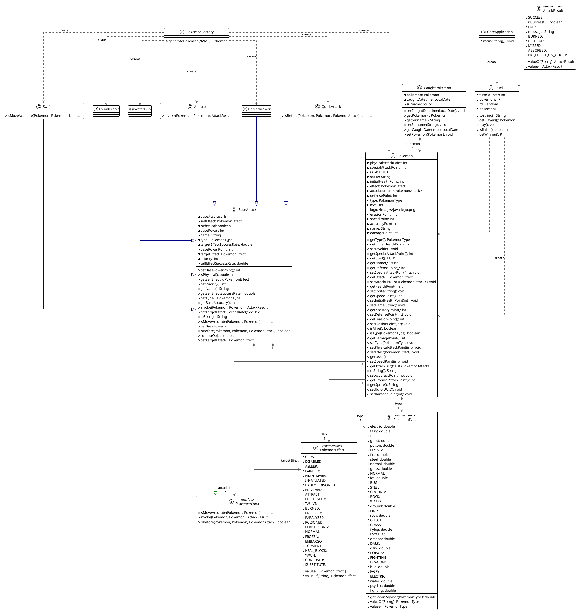

<Cover title="Formation Java" logoUrl="/images/java-logo.png" />

---
title: Sommaire
layout: chapter_title
level: 2
logo: /images/java-logo.png
---

<v-clicks>

- Java
- POO & COO
- Astuces
- Outils
- Conclusions

</v-clicks>

---
title: Fonctionnement
layout: chapter_title
transition: slide-up
level: 2
logo: /images/java-logo.png
---

:: right ::
[Java](<https://fr.wikipedia.org/wiki/Java_(technique)>) est un langage de **programmation orienté objet**.
La version 1.0 de Java est sortie en **1995** par la société [Sun Microsystems](https://fr.wikipedia.org/wiki/Sun_Microsystems).

<br/>

A l'époque, Java se démarquait des autres langages car il était **indépendant de la plateforme matérielle**.
Pour cela Java s'abstrait du système d'exploitation grâce à la Java Virtual Machine, c'est un **langage interprété**.

:: left ::


---
title: Java Virtual Machine
layout: chapter_subtitle
transition: slide-up
level: 3
logo: /images/java-logo.png
---

<p>
La machine virtuelle Java ou JVM (Java Virtual Machine) est un environnement d'exécution pour applications Java.
</p>
<p class="my-4">
C'est un des éléments les plus importants de la plate-forme Java. Elle assure l'<b>indépendance</b> du matériel et du système d'exploitation lors de l'exécution des applications Java. Une application Java ne s'exécute pas directement dans le système d'exploitation mais dans une machine virtuelle qui s'exécute dans le système d'exploitation et propose une couche d'abstraction entre l'application Java et ce système.
</p>

<Note type="info">
Son mode de fonctionnement est relativement similaire à celui d'un ordinateur :
elle exécute des instructions qui manipulent différentes zones de mémoire dédiées de la JVM.
</Note>

---
title: Compilation et Interpretation
layout: chapter_subtitle
transition: slide-up
level: 3
logo: /images/java-logo.png
---

<p class="mb-8">
La machine virtuelle ne connaît pas le langage Java : elle ne connaît que le bytecode qui est issu de la compilation de codes sources écrits en Java.
</p>


---
title: Mémoires
layout: chapter_subtitle
transition: slide-up
level: 3
logo: /images/java-logo.png
---


---
transition: slide-up
---

<div class="text-xl color-blue-400">PILE</div>

Chaque thread possède sa propre pile qui contient les variables qui ne sont accessibles que par le thread telles que les variables locales, les paramètres, les valeurs de retour de chaque méthode invoquée par le thread.

Seules des données de type primitif et des références à des objets peuvent être stockées dans la pile. La pile ne peut pas contenir d'objets.

<Note v-click class="mt-4" type="warning">
    La taille d'une pile peut être précisée à la machine virtuelle.
    <br/>
    <ul>
        <li>Si la taille d'une pile est trop petite pour les besoins des traitements d'un thread alors une exception de type <b>StackOverflowError</b> est levée.</li>
        <li>Si la mémoire de la JVM ne permet pas l'allocation de la pile d'un nouveau thread alors une exception de type <b>OutOfMemoryError</b> est levée.</li>
    </ul>
</Note>

---
transition: slide-up
level: 3
logo: /images/java-logo.png
---

<div class="text-xl color-blue-400">HEAP</div>
<p>
    Cette zone de mémoire est partagée par tous les threads de la JVM : elle stocke toutes les instances des objets créés.
</p>
<p class="my-4">
    Tous les objets créés sont obligatoirement stockés dans le tas (heap) et sont donc partagés par tous les threads. Comme les tableaux sont des objets en Java, les tableaux sont stockés dans le tas même si ce sont des tableaux de types primitifs.
</p>
<p>
    La libération de cet espace mémoire est effectuée grâce à un mécanisme automatique implémenté dans la JVM : le ramasse-miettes (<b>garbage collector</b>).<br/>
    <Note type="info">
    Le ou les algorithmes utilisés pour l'implémentation du ramasse-miettes sont à la discrétion du fournisseur de la JVM.
    </Note>
</p>

<Note v-click class="mt-4" type="warning">
    La taille du tas peut être fixe ou variable durant l'exécution de la JVM : dans ce dernier cas, une taille initiale est fournie et cette taille peut grossir jusqu'à un maximum défini.
    <br/>
    <ul>
        <li>Si la taille du heap ne permet pas le stockage d'un objet en cours de création, alors une exception de type <b>OutOfMemoryError</b> est levée.</li>
    </ul>
</Note>

---
level: 3
logo: /images/java-logo.png
---

<div class="text-xl color-blue-400">Autres zones mémoire</div>

<ul>
    <li>
        <b>Method area</b><br/>
        Cette zone de la mémoire, partagée par tous les threads, stocke la définition des classes et interfaces, le code des constructeurs et des méthodes, les constantes, les variables de classe (variables static) ...<br/>
        Comme pour la pile, seules des données de type primitif ou des références à des objets peuvent être stockées dans cette zone de mémoire. La différence est que cette zone de mémoire est accessible à tous les threads. Il est donc important dans un contexte multithread de sécuriser l'accès à une variable static même si elle est de type primitif.
    </li>
    <br/>
    <li>
        <b>Code cache</b><br/>
        Cette zone de la mémoire stocke le résultat compilé du code des méthodes. La taille par défaut est généralement de 32Mo.
    </li>
</ul>
---
title: Garbage collector
layout: chapter_subtitle
transition: slide-up
level: 3
logo: /images/java-logo.png
---


Le ramasse-miettes est une fonctionnalité de la JVM qui a pour rôle de gérer la mémoire notamment en libérant celle des objets qui ne sont plus utilisés.

La règle principale pour déterminer qu'un objet n'est plus utilisé est de vérifier qu'il n'existe plus aucun autre objet qui lui fait référence. Ainsi un objet est considéré comme libérable par le ramasse-miettes lorsqu'il n'existe plus aucune référence dans la JVM pointant vers cet objet.

---
transition: slide-up
level: 3
logo: /images/java-logo.png
---

::left::


::right::

Lorsque le ramasse-miettes va libérer la mémoire d'un objet, il a l'obligation d'exécuter un éventuel **finalizer** définit dans la classe de l'objet.

<Note class="mt-4" type='danger'>
    Attention, l'exécution complète de ce finalizer n'est pas garantie : si une exception survient durant son exécution, les traitements sont interrompus et la mémoire de l'objet est libérée sans que le finalizer soit entièrement exécuté.
</Note>

---
transition: slide-up
level: 3
logo: /images/java-logo.png
---


::left::

<div>
    <p>La mise en oeuvre d'un ramasse-miettes possède plusieurs avantages :</p>
    <ul>
        <li>elle améliore la <b>productivité</b> du développeur qui est déchargé de la libération explicite de la mémoire</li>
        <li>elle participe activement à la bonne <b>intégrité</b> de la machine virtuelle : une instruction ne peut jamais utiliser un objet qui n'existe plus en mémoire</li>
    </ul>
</div>

::right::
<div class="flex h-full flex-row-reverse">
    <div class="basis-1/1 mt-auto">
        
    </div>
</div>

---
transition: slide-up
level: 3
logo: /images/java-logo.png
---

::left::
Mais elle possède aussi plusieurs inconvénients :
- le ramasse-miettes consomme des <b>ressources</b> en terme de CPU et de mémoire
- il peut être à l'origine de la dégradation plus ou moins importante des performances de la machine virtuelle
- le mode de fonctionnement du ramasse miettes n'interdit pas les fuites de mémoires si le développeur ne prend pas certaines précautions
- Généralement issues d'erreurs de programmation <b>subtiles</b>, ces fuites sont assez difficiles à corriger.

::right::


---

::top::


::bottom::
<Note type="info">
Pour plus d'information, vous pouvez vous rendre sur le blog <a class="text-blue" href="https://www.jmdoudoux.fr/java/dej/chap-jvm.htm">jmdoudoux.fr</a> pour avoir plus d'information su la JVM.

Ou visionner la conférence <a class="text-blue" href="https://www.youtube.com/watch?v=wa_EtTUx-z0">Sous le capot d'une application JVM - Java Flight Recorder</a>
</Note>

---
title: Implementation de la JVM
layout: chapter_subtitle
transition: slide-up
level: 3
logo: /images/java-logo.png
---

<div>
    <p>Les spécifications de la machine virtuelle Java définissent :</p>
    <ul>
        <li>Les concepts du langage Java</li>
        <li>Le format des fichiers .class</li>
        <li>Les fonctionnalités de la JVM</li>
        <li>Le chargement des fichiers .class</li>
        <li>Le bytecode</li>
        <li>La gestion des threads et des accès concurrents</li>
        <li>...</li>
    </ul>
</div>

<div class="my-8" v-click>
    <p>
        Les fonctionnalités de la JVM décrites dans les <b>spécifications sont abstraites</b> : elles décrivent les fonctionnalités requises mais ne fournissent aucune implémentation ou algorithme d'implémentation. <b>L'implémentation est à la charge du fournisseur</b> de la JVM.
    </p>
    <br/>
    <p>
    Il existe de nombreuses implémentations de JVM dont les plus connues sont celles de Sun Microsystems/Oracle (HotSpot), IBM (J9), BEA/Oracle (JRockit), Azul (Zing), ...
    </p>
</div>
<Note type="info" v-click>
    <b>Le respect strict de ces spécifications par une implémentation de la JVM garantit la portabilité et la bonne exécution du bytecode.</b>
</Note>

---
title: Editions et versions
layout: chapter_title
transition: slide-up
level: 3
logo: /images/java-logo.png
---


---
title: Editions
layout: chapter_subtitle
transition: slide-up
level: 3
logo: /images/java-logo.png
---

Java possède trois éditions

<ul>
    <li><b>J</b>ava <b>R</b>untime <b>E</b>nvironment<br/>Contient uniquement l'environnement d'exécution de programmes Java.</li>
    <li><b>J</b>ava <b>D</b>evelopment <b>K</b>it<br/>Contient lui-même le JRE et un ensemble d'outils de développement de programme Java.</li>
    <li>Documentation<br/>Contient toute la documentation au format HTML des API de Java</li>
</ul>

---
title: Versions
layout: chapter_subtitle
level: 3
logo: /images/java-logo.png
---

<table class="m-auto">
    <thead>
        <tr>
            <th style="text-align: left;">version</th><th style="text-align: center;">release date</th><th style="text-align: center;">end of support</th>
        </tr>
    </thead>
    <tbody>
        <tr>
            <td style="text-align: left;">8 (LTS)</td><td style="text-align: center;">2014</td><td style="text-align: center;">2030</td>
        </tr>
        <tr>
            <td style="text-align: left;">11 (LTS)</td><td style="text-align: center;">2018</td><td style="text-align: center;">2026</td>
        </tr>
        <tr>
            <td style="text-align: left;">17 (LTS)</td><td style="text-align: center;">2021</td><td style="text-align: center;">2029</td>
        </tr>
        <tr>
            <td style="text-align: left;">21 (LST)</td><td style="text-align: center;">2023</td><td style="text-align: center;">2031</td>
        </tr>
    </tbody>
</table>

<br/>
<Note type="info">
    Utilisez uniquement les LTS, sauf si vous voulez essayer les nouvelles fonctionnalités du langage.
</Note>

---
title: Programmation orienté objet
layout: chapter_title
transition: slide-up
level: 2
logo: /images/java-logo.png
---

::top::


::bottom::
La POO permet de faciliter la vie des développeurs.<br/>
Plus longue à mettre en place, mais permet de garder une bonne structure du code.

---
title: Vocabulaire
layout: chapter_subtitle
transition: fade
level: 3
logo: /images/java-logo.png
---

::top::
- **Classes** : Une classe est un modèle ou un plan pour créer des objets. Elle définit un type de données en regroupant des attributs (données) et des méthodes (fonctions).

<v-clicks>

- **Attributs** : Les attributs sont des variables qui appartiennent à une classe. Ils représentent les données ou l'état d'un objet.
- **Méthodes** : Les méthodes sont des fonctions définies dans une classe. Elles décrivent les comportements ou les actions que les objets de la classe peuvent effectuer. On dit que l'on "**invoque**" une méthode et que l'on fait appel à une fonction.
- **Constructeur** : Un constructeur est une méthode spéciale d'une classe qui est appelée lors de l'instanciation d'un objet. Il est utilisé pour initialiser les attributs de l'objet.
</v-clicks>

::bottom::
````md magic-move {at:0}
```java
public class Person {
  /* code */
}
```
```java
public class Person {
  String name;
  int age;
}
```
```java
public class Person {
  String name;
  int age;

  String toString() {
    return name + "(" + age + (age > 1 ? "ans" : "an") + ")";
  }
}
```
```java
public class Person {
  String name;
  int age;

  Person (String name, int age) {
    this.name = name;
    this.age = age;
  }

  String toString() {
    return name + "(" + age + (age > 1 ? "ans" : "an") + ")";
  }
}
```
````

---
title: Vocabulaire
layout: chapter_subtitle
transition: fade
level: 3
logo: /images/java-logo.png
---

- **Membres** : Les membres d'une classe sont ses attributs et ses méthodes. Ils constituent les éléments fondamentaux d'une classe.

- **État** : L'état d'un objet est défini par les valeurs de ses attributs à un moment donné. Il représente les données contenues dans l'objet.

- **Comportement** : Le comportement d'un objet est défini par ses méthodes. Il décrit ce que l'objet peut faire ou les actions qu'il peut effectuer.

---
title: Vocabulaire
layout: chapter_subtitle
transition: slide-up
---

::top::

- **Instancier** (new) : Instancier une classe signifie créer un nouvel objet à partir de cette classe en utilisant le mot-clé `new`. Cela alloue de la mémoire pour le nouvel objet.

<v-clicks>

- **Notation pointée & référence** : La notation pointée est utilisée pour accéder aux membres (attributs et méthodes) d'un objet via une référence. Une référence est une variable qui pointe vers un objet.

- **Variable** : Une variable est un espace de stockage nommé qui contient des données. En Java, les variables peuvent être de différents types et peuvent représenter des valeurs primitives ou des références à des objets.

</v-clicks>

::bottom::
````md magic-move{at:0}
```java
public class Application {
  void main (String... args) {
    Person javaDesigner = new Person("James Gosling", 70);
    System.out.println(javaDesigner.toString());
  }
}
```
```java
public class Application {
  void main (String... args) {
    Person javaDesigner = new Person("James Gosling", 0);
    javaDesigner.age = 2025 - 1955;
    System.out.println("Name: " + javaDesigner.name);
    System.out.println("Age: " + javaDesigner.age);
  }
}
```
```java
public class Application {
  void main (String... args) {
    int javaDesignerAge = 2025 - 1955
    Person javaDesigner = new Person("James Gosling", javaDesignerAge);
    System.out.println(javaDesigner.toString());
  }
}
```
````
---
title: Principes
layout: chapter_subtitle
transition: slide-up
level: 3
logo: /images/java-logo.png
---

::left::
<v-switch>
    <template #0>
        <div class="text-2xl text-orange-500">Encapsulation</div>
        - L'encapsulation est le mécanisme qui consiste à regrouper les données (attributs) et les méthodes (fonctions) qui manipulent ces données au sein d'une même unité appelée classe. Elle permet de restreindre l'accès direct à certains composants d'un objet, ce qui est un moyen de prévenir les interférences et les erreurs involontaires.
        <br/>
        <br/>
        <span class="underline decoration-double font-bold">Utilisation :</span> En utilisant des modificateurs d'accès comme private, protected, et public, on peut contrôler la visibilité des membres d'une classe. Les méthodes publiques, souvent appelées getters et setters, sont utilisées pour accéder et modifier les attributs privés.
    </template>
    <template #1>
        <div class="text-2xl text-orange-500">Abstraction</div>
        - L'abstraction consiste à cacher les détails complexes et à montrer seulement les fonctionnalités essentielles de l'objet. Cela permet de réduire la complexité et d'augmenter l'efficacité du programme.
        <br/>
        <br/>
        <span class="underline decoration-double font-bold">Utilisation :</span> Les classes abstraites et les interfaces sont utilisées pour définir des contrats que les sous-classes doivent implémenter. Cela permet de se concentrer sur ce que l'objet fait plutôt que sur la manière dont il le fait.
    </template>
    <template #2>
        <div class="text-2xl text-orange-500">Héritage</div>
        - L'héritage est un mécanisme qui permet à une classe (appelée sous-classe ou classe dérivée) d'hériter des propriétés et des comportements d'une autre classe (appelée super-classe ou classe de base). Cela favorise la réutilisation du code.
        <br/>
        <br/>
        <span class="underline decoration-double font-bold">Utilisation :</span> héritage permet de créer une hiérarchie de classes où les sous-classes peuvent ajouter ou modifier des comportements tout en réutilisant le code de la super-classe.
    </template>
    <template #3>
        <div class="text-2xl text-orange-500">Polymorphisme</div>
        - L'Le polymorphisme permet à des objets de différentes classes d'être traités de manière uniforme. Cela signifie qu'une méthode peut avoir plusieurs formes ou comportements en fonction de la classe à laquelle elle appartient.
        <br/>
        <br/>
        <span class="underline decoration-double font-bold">Utilisation :</span> Le polymorphisme est souvent réalisé par le biais de la surcharge de méthodes (méthodes avec le même nom mais des paramètres différents) et de l'écrasement de méthodes (redéfinition d'une méthode de la super-classe dans une sous-classe).
    </template>
</v-switch>

::right::
````md magic-move{at:0}
```java
public class Animal {
    private String name; // Attribut privé, object String encapsulé dans Animal
    private AnimalType type;
    private int age;

    // Getter pour l'attribut name
    public String getName() {
        return name;
    }

    // Setter pour l'attribut name
    public void setName(String name) {
        this.name = name;
    }
    /* ... */
}
```
```java
abstract class Animal {
    /* ... */
    public abstract void makeSound(); // Méthode abstraite

    public void sleep() {
        System.out.println("Zzz");
    }
}

class Dog extends Animal {
    @Override
    public void makeSound() {
        System.out.println("Woof!");
    }
}
```
```java    
abstract class Animal {
    private String name; // Attribut privé, object String encapsulé dans Animal
    private AnimalType type;
    private int age;

    Animal (String name, AnimalType type, int age) {
        super();
        this.name = name;
        this.type = type;
        this.age = age;
    }
    /* ... */
    public abstract void makeSound(); // Méthode abstraite

    public void sleep() {
        System.out.println("Zzz");
    }
}

class Dog extends Animal {
    Dog (String name, int age) {
        super(name, AnimalType.Dog, age);
    }

    @Override
    public void makeSound() {
        System.out.println("Woof!");
    }

    public void eat () {
        System.out.println(this.name + "eats kibble");
        this.sleep();
    }
}
```
```java
class Cat extends Animal {
    @Override
    public void makeSound() {
        System.out.println("Meow");
    }
}

class Dog extends Animal {
    @Override
    public void makeSound() {
        System.out.println("Woof");
    }
}

public class Main {
    public static void main(String[] args) {
        Animal myAnimal = new Cat(); // Polymorphisme
        myAnimal.makeSound(); // Affiche "Meow"

        myAnimal = new Dog(); // Polymorphisme
        myAnimal.makeSound(); // Affiche "Woof"
    }
}
```
````
---
title: Types Primitifs
layout: chapter_title
transition: slide-up
level: 3
logo: /images/java-logo.png
---

::left::
<ul>
  <li>
    <div><b>byte</b></div>
    <div class="text-sx">
Taille : 8 bits<br/>
Exemple : <span class="code-line">byte b = 100;</span><br/>
Exemple avec wrapper : <span class="code-line">Byte b = Byte.valueof(100);</span>
    </div>
  </li>
  <li>
    <div><b>short</b></div>
    <div class="text-sx">
Taille : 16 bits<br/>
Exemple : <span class="code-line">short s = 1000;</span><br/>
Exemple avec wrapper : <span class="code-line">Short s = Short.valueof(1000);</span>
    </div>
  </li>
  <li>
    <div><b>int</b></div>
    <div class="text-sx">
Taille : 32 bits<br/>
Exemple : <span class="code-line">int i = 100000;</span><br/>
Exemple avec wrapper : <span class="code-line">Int i = Int.valueof(100000);</span>
    </div>
  </li>
  <li>
    <div><b>long</b></div>
    <div class="text-sx">
Taille : 64 bits<br/>
Exemple : <span class="code-line">long l = 100000L;</span><br/>
Exemple avec wrapper : <span class="code-line">Long l = Long.valueof(100000L);</span>
    </div>
  </li>
</ul>

::right::
<ul>
  <li>
    <div><b>float</b></div>
    <div class="text-sx">
Taille : 32 bits<br/>
Exemple : <span class="code-line">float f = 234.5f;</span><br/>
Exemple avec wrapper : <span class="code-line">Float f = Float.valueof(234.5f);</span>
    </div>
  </li>
  <li>
    <div><b>double</b></div>
    <div class="text-sx">
Taille : 64 bits<br/>
Exemple : <span class="code-line">double d = 123.4;</span><br/>
Exemple avec wrapper : <span class="code-line">Double d = Double.valueof(123.4);</span>
    </div>
  </li>
  <li>
    <div><b>char</b></div>
    <div class="text-sx">
Taille : 16 bits<br/>
Exemple : <span class="code-line">char c = 'A';</span><br/>
Exemple avec wrapper : <span class="code-line">`;Char c = Char.valueof('A');</span>
    </div>
  </li>
  <li>
    <div><b>boolean</b></div>
    <div class="text-xs">
Taille : non spécifiée (généralement 1 bit)<br/>
Exemple : <span class="code-line">boolean bool = true;</span><br/>
Exemple avec wrapper : <span class="code-line">Boolean b = Boolean.valueof(true);</span>
    </div>
  </li>
</ul>

::bottom::
<Note type="warning">
Pour chaque type primitif, il existe une classe standard permettant de l'emballer sous forme d'objet.
Cela vous donnes accès à des méthodes très utiles pour le developpement, mais n'oubliez pas que chaque objet Java a un poid !
</Note>

---
title: Le poids des objects
layout: chapter_subtitle
transition: slide-up
level: 3
logo: /images/java-logo.png
---

::right::
<div class="font-bold text-2xl">Explication</div>

<div class="text-xl">Types Primitifs</div>

int et double sont des types primitifs. Ils occupent directement la mémoire nécessaire pour stocker leur valeur (4 octets pour int et 8 octets pour double selon l'architecture de votre système).
<br/>
<br/>

<div class="text-xl">Wrappers</div>

Integer et Double sont des objets. En plus de la mémoire nécessaire pour stocker la valeur, ils ont un surcoût mémoire dû aux métadonnées de l'objet (comme l'en-tête de l'objet, qui peut inclure des informations sur le type, le hashcode, etc.).

::bottom::
**Estimation de la Taille Mémoire**

Un objet en Java a généralement un en-tête de 12 à 16 octets (selon l'architecture JVM).
Un Integer ou un Double nécessite donc environ 16 à 24 octets (en-tête + valeur).

::left::
```java
public class ObjectSizeExample {
    public static void main(String[] args) {
        // Types primitifs
        int primitiveInt = 42;
        double primitiveDouble = 42.0;

        // Wrappers (objets)
        Integer wrappedInt = Integer.valueOf(42);
        Double wrappedDouble = Double.valueOf(42.0);

        // Affichage des valeurs
        System.out.println("Primitive int: " + primitiveInt);
        System.out.println("Primitive double: " + primitiveDouble);
        System.out.println("Wrapped Integer: " + wrappedInt);
        System.out.println("Wrapped Double: " + wrappedDouble);
    }
}
```

---
title: Types de Référence
layout: chapter_title
transition: slide-up
level: 3
logo: /images/java-logo.png
---

::left::
<ul>
    <li>
        <div>
            Classes
        </div>
        <div>Exemple : <span class="code-line">String str = "Hello";</span></div>
    </li>
    <li>
        <div>
            Interfaces
        </div>
        <div>Exemple : <span class="code-line">List&lsaquo;String&rsaquo; list = new ArrayList&lsaquo;&rsaquo;();</span></div>
    </li>
    <li>
        <div>
            Tableaux
        </div>
        <div>Exemple : <span class="code-line">int[] arr = {1, 2, 3};</span></div>
    </li>
</ul>

::right::
<ul>
    <li>
        <div>Enums</div>
        <div><span>Exemple :</span>

  ```java
  enum Day { MONDAY, TUESDAY }
  Day day = Day.MONDAY;
  ```
  </div>
  </li>
    <li>
        <div>Annotations</div>
        <div><span>Exemple :</span>

  ```java
  @Override
  public String toString() {
      return "Example";
  }
  ```
  </div>
  </li>
</ul>
---
title: Hello World
layout: chapter_title
level: 2
logo: /images/java-logo.png
---

::top::
Il existe plus d'une trentaine de manières d'écrire un hello world en Java.


::bottom::
<v-switch>
    <template #0>Simple</template>
    <template #1>Par référence</template>
    <template #2>Via javascript</template>
    <template #3>Par réflexion</template>
</v-switch>

````md magic-move{at:1}
```java
public class Hello {
    public static void main (String[ ] args){
        System.out.println("Hello world");
    }
}
```
```java
public class HelloParRéférence {
    public static void main (String[ ] args){
        Consumer<String> hello = System.out::println;
        hello.accept("Hello world");
        /*** or ***/
        Arrays.asList("Hello world").foreach(System.out::println);
    }
}
```
```java
public class HelloParSciptEngine {
    public static void main (String[ ] args){
        ScriptEngine engine = new ScriptEngineManager().getEngineByName("rhino");
        Object result = engine.eval("print('Hello world');");
    }
}
```
```java
public class HelloParReflexion {
    public static void main (String[ ] args){
      Class<PrintStream> classPrint = PrintStream.class;
      Method method = classPrint.getMethod("println", String.class);
      method.invoke(System.out, "Hello world");
    }
}
```
````
---
title: Objet
layout: chapter_title
transition: slide-up
level: 2
logo: /images/java-logo.png
---
Un objet en Java est une instance d'une classe. Il représente une entité concrète qui encapsule un état (données) et un comportement (méthodes).

---
title: Instance d'objet
layout: chapter_subtitle
transition: slide-up
level: 3
logo: /images/java-logo.png
---

- **Constructeur** : Une méthode spéciale utilisée pour initialiser un nouvel objet. Le constructeur a le même nom que la classe et n'a pas de type de retour.
  - **Surcharge** de constructeur : Une classe peut avoir plusieurs constructeurs avec des listes de paramètres différentes. Cela permet de créer des objets de différentes manières.
  - **Chaînage de constructeurs** : Utilisation du mot-clé ```this()``` pour appeler un autre constructeur de la même classe, permettant ainsi de réutiliser le code d'initialisation.
---
transition: slide-up
level: 3
logo: /images/java-logo.png
---

- **Auto-référence**
  - ```this``` : Un mot-clé qui fait référence à l'instance actuelle de la classe. Il est utilisé pour différencier les attributs de la classe des paramètres de méthode ayant le même nom.

- **Paramètre de fonction**
  - **Passage par copie** : En Java, les paramètres de méthode sont toujours passés par copie. Pour les objets, cela signifie que la référence à l'objet est copiée, pas l'objet lui-même. Ainsi, les modifications apportées à l'objet dans la méthode affectent l'objet original.
---
transition: slide-up
level: 3
logo: /images/java-logo.png
---

- **Comparaison**
  - **Référence vs État** : La comparaison de deux objets peut se faire de deux manières:
    - **Référence** : Utilisation de l'opérateur == pour vérifier si deux références pointent vers le même objet.
    - **État** : Utilisation de la méthode equals() pour vérifier si deux objets ont le même état (mêmes valeurs d'attributs).
---
transition: slide-up
level: 3
logo: /images/java-logo.png
---

- **Méthode commune**
    - ```equals()``` : Méthode utilisée pour comparer l'égalité de deux objets en fonction de leur état.
    - ```toString()``` : Méthode qui retourne une représentation sous forme de chaîne de caractères de l'objet.
    - ```hashCode()``` : Méthode qui retourne un code de hachage pour l'objet, utilisé dans les collections basées sur le hachage comme HashMap.
---
transition: slide-up
level: 3
logo: /images/java-logo.png
---

- **Modificateurs**
  - **Modificateurs d'accès**
    Ces *access modifiers* permettent de contrôler l'encapsulation et la visibilité des membres d'une classe, ce qui est essentiel pour concevoir des applications robustes et maintenables.

    

    - ```public``` : Accessible partout.
    - ```private``` : Accessible uniquement dans la classe.
    - ```protected``` : Accessible dans la classe, les sous-classes et le même package.
    - ```package-private``` (par défaut) : Accessible uniquement dans le même package.
---
transition: slide-up
level: 3
logo: /images/java-logo.png
---

  - **Modificateurs de restrictions**
    Les *non-access modifiers* sont utilisés pour spécifier des comportements ou des propriétés supplémentaires des membres de classe ou des méthodes, sans affecter leur visibilité.
    - ```static``` : Indique qu'un membre (attribut ou méthode) appartient à la classe elle-même plutôt qu'à une instance spécifique de la classe.
    - ```abstract``` : Utilisé pour déclarer une classe ou une méthode qui doit être implémentée par une sous-classe. Une classe abstraite ne peut pas être instanciée.
    - ```final``` : Indique qu'une variable ne peut pas être modifiée après son initialisation, qu'une méthode ne peut pas être redéfinie, ou qu'une classe ne peut pas être héritée.
---
transition: slide-up
level: 3
logo: /images/java-logo.png
---

  - **Modificateurs de restrictions (moins connues)**
    - ```synchronized``` : Indique qu'une méthode ou un bloc de code ne peut être exécuté que par un seul thread à la fois.
    - ```volatile``` : Indique qu'une variable est stockée dans la mémoire principale et non dans le cache du thread, garantissant ainsi que les modifications apportées par un thread sont visibles par les autres threads.
    - ```transient``` : Indique qu'un attribut ne doit pas être sérialisé lorsque l'objet est converti en un flux d'octets.
    - ```native``` : Indique qu'une méthode est implémentée dans un langage autre que Java, généralement en C ou C++.

---
title: Démo sur les principes de la POO
layout: chapter_title
transition: slide-up
level: 3
logo: /images/java-logo.png
---

  <details>
    <summary>Exemple complet</summary>

  ```java
    // Classe de base abstraite
    abstract class Animal {
        private String name;
        private static int count = 0; // Variable statique pour compter les instances

        // Constructeur
        public Animal(String name) {
            this.name = name;
            count++;
        }

        // Surcharge de constructeur
        public Animal() {
            this("Unknown"); // Chaînage de constructeurs
        }

        // Méthode abstraite
        public abstract void makeSound();

        // Méthode statique
        public static int getCount() {
            return count;
        }

        // Redéfinition/Spécialisation de la méthode toString
        @Override
        public String toString() {
            return "Animal: " + name;
        }

        // Redéfinition/Spécialisation de la méthode equals
        @Override
        public boolean equals(Object obj) {
            if (this == obj) return true;
            if (obj == null || getClass() != obj.getClass()) return false;
            Animal animal = (Animal) obj;
            return name.equals(animal.name);
        }

        // Mutateur (getter) et Accesseur (setter)
        public String getName() {
            return name;
        }

        public void setName(String name) {
            this.name = name;
        }
    }

    // Classe dérivée
    class Dog extends Animal {
        private int age;
        private final String breed;

        // Constructeur
        public Dog(String name, int age, String breed) {
            super(name); // Appel du constructeur de la classe parente
            this.age = age;
            this.breed = breed;
        }

        // Implémentation de la méthode abstraite
        @Override
        public void makeSound() {
            System.out.println("Woof!");
        }

        // Méthode pour afficher les détails
        public void displayDetails() {
            System.out.println("Name: " + getName() + ", Age: " + age + ", Breed: " + breed);
        }

        // Méthode pour modifier l'âge
        public void setAge(int age) {
            this.age = age;
        }
    }

    public class Main {
        public static void main(String[] args) {
            // Création d'instances
            Dog dog1 = new Dog("Buddy", 3, "Golden Retriever");
            Dog dog2 = new Dog("Max", 5, "Bulldog");

            // Utilisation de méthodes
            dog1.makeSound();
            dog2.makeSound();

            // Affichage des détails
            dog1.displayDetails();
            dog2.displayDetails();

            // Comparaison d'objets
            System.out.println("dog1 equals dog2: " + dog1 == dog2);
            Dog dog3 = dog1;
            System.out.println("dog1 equals dog3: " + dog1 == dog3);

            // Comparaison d'objets
            System.out.println("dog1 equals dog2: " + dog1.equals(dog2));

            // Utilisation de la méthode statique
            System.out.println("Total animals: " + Animal.getCount());

            // Modification de l'âge
            dog1.setAge(4);
            dog1.displayDetails();

            // Utilisation de toString
            System.out.println(dog1.toString());
        }
    }
  ```

  </details>

  <details>
    <summary>Exemple avec les pokemon</summary>



  </details>

---
level: 3
logo: /images/java-logo.png
---


---
title: Syntaxe résumée
layout: chapter_title
level: 3
logo: /images/java-logo.png
---


---
title: Conception orientée objet
subtitle: Diagramme de classe
layout: chapter_title
level: 2
logo: /images/java-logo.png
---

<div class="m-auto">


</div>

---
title: Patron de conception
layout: chapter_subtitle
transition: slide-up
level: 3
logo: /images/java-logo.png
---

- Singleton
- Factory
- Iterator
- Adapter
- Decorator
- Composite
- Observer
- Strategie
- Visitor
- ...

<Note type="info">
Vous pouvez vous rendre sur le site <a class="text-blue" href="https://refactoring.guru/fr/design-patterns">refactoring.guru</a> pour identifier/comprendre le patron de conception qui pourrait vous aider.
</Note>

---
level: 3
logo: /images/java-logo.png
---

## Programmation orienté composant
La programmation orientée composant (POC) consiste à utiliser une approche modulaire de l'architecture d'un projet informatique, ce qui permet d'assurer au logiciel une meilleure lisibilité et une meilleure maintenance. Les développeurs, au lieu de créer un exécutable monolithique, se servent de briques réutilisables

La POC n'est pas sans similitudes avec la POO, puisqu'elle revient à utiliser une approche objet, non pas au sein du code, mais au niveau de l'architecture générale du logiciel.

La POC est particulièrement pratique pour le travail en équipe et permet d'industrialiser la création de logiciels.

---
title: Composant
layout: chapter_subtitle
transition: slide-up
level: 3
logo: /images/java-logo.png
---
Les caractéristiques clés d'un composant incluent :
- Encapsulation : Un composant cache ses détails d'implémentation et expose uniquement les interfaces nécessaires pour interagir avec lui.
- Réutilisabilité : Les composants sont conçus pour être utilisés dans différents contextes ou applications.
- Indépendance : Les composants peuvent être développés et déployés indépendamment les uns des autres.
- Interopérabilité : Les composants peuvent interagir avec d'autres composants via des interfaces standardisées.

---
title: Loi de demeter
layout: chapter_subtitle
transition: slide-up
---

> "Ne parlez qu'à vos amis immédiats"


---
level: 3
logo: /images/java-logo.png
---

## Clean Architecture
- DDD
  - Architecture Onion
  - Architecture Hexagonal
- ECI
- ...

> Il existe de nombreuse pratique pour concevoir une architecture logiciel, d'un projet à l'autre il faut parfois tordre les pratiques mais l'important c'est **KISS** (Keep In Stupid and Simple) !
> Utilisez ce qu'il faut au bon moment, n'ayez pas peur de réarchitecturer vos applications, cela à un coup mais si vous avez fait les bon choix étapes par étapes alors votre code devrai être adaptable facilement.

---
title: Tips
subtitle: Exception
layout: chapter_title
transition: slide-up
level: 3
logo: /images/java-logo.png
---

```java
public class FinallyExample {
    public static void main(String[] args) {
        /*   Try-catch   */
        try {
            int result = 10 / 0; // Peut lever une ArithmeticException
        } catch (ArithmeticException e) {// Permet d'attraper l'exeption et d'exécuter du code uniquement en cas ArithmeticException
            System.out.println("Division par zéro: " + e.getMessage());
        }  catch (Exception e) {// Permet d'attraper touts les autres types d'exeption et d'exécuter du code uniquement dans ce cas
            System.out.println("Division par zéro: " + e.getMessage());
        } finally { // Permet d'exécuter du code dans tout les cas
            System.out.println("Ce bloc est toujours exécuté.");
        }

        /*   Try-with-resources   */
        try (int result = 10 / 0) {
            // Utilisation de la ressource
        } catch (ExceptionType e) {
            // Gestion de l'exception
        }

    }
}
```
---
title: Instanceof
layout: chapter_subtitle
transition: slide-up
level: 4
logo: /images/java-logo.png
---
```java
  if (myAnimal instanceof Dog) {
      Dog myDog = (Dog) myAnimal; // Cast sûr
      myDog.bark(); // Affiche "Woof!"
  }
```

---
title: StringBuilder
layout: chapter_subtitle
transition: slide-up
level: 4
logo: /images/java-logo.png
---

```
StringBuilder builder = new StringBuilder();
for (String address : addresses) {
  builder.append(address).append("\n");
}
String csv = builder.toString();
```

---
title: Map & Set
layout: chapter_subtitle
transition: slide-up
level: 4
logo: /images/java-logo.png
---

- TreeMap / TreeSet
- HashMap / HashSet
- EnumMap / EnumSet
- IdentityHashMap / IdentityHashSet
- ConcurrentHashMap / ConcurrentHashSet
- ...

> Surcharger la méthode equals et compareTo permet de modifier le comportement de ces implémentations

---
title: Optional
layout: chapter_subtitle
transition: slide-up
level: 4
logo: /images/java-logo.png
---

```java
Optional<Object> wrapper = Optional.of(obj);
wrapper.ifPresent(object -> System.out.println(object));
Object resultObject = wrapper.orElseThrow(() -> new EntityNotFoundException());
```

---
title: Stream
layout: chapter_subtitle
transition: slide-up
---

```java
stream.filter(obj -> obj != null).map(obj -> obj.hashCode()).collect(Collectors.toList());
```
---
title: Remote debug
layout: chapter_subtitle
transition: slide-up
level: 4
logo: /images/java-logo.png
---

JVM options:
```
-agentlib:jdwp=transport=dt_socket,server=y,suspend=n,address=5005
```

---
title: Outils
layout: chapter_title
transition: slide-up
level: 3
logo: /images/java-logo.png
---

## Outils

---
title: IDE
layout: chapter_subtitle
transition: slide-up
level: 4
logo: /images/java-logo.png
---
Pour développer des applications de minère plus ergonomique et efficace, vous devez utiliser un environnement de développement intégré ("EDI" en français, "IDE" en anglais).

- IntelliJ
- VS Code
- Netbeans
- Eclipse
- ...

---
title: Debugger
layout: chapter_subtitle
transition: slide-up
level: 4
logo: /images/java-logo.png
---

::top::
Fini les println pour tester votre code, devenez vrai pro avec le debugger Java.


::left::
<div class="text-xl color-blue-400">Possibilités</div>

<ul>
    <li>Points d'arrêt (Breakpoints)</li>
    <!-- Vous pouvez définir des points d'arrêt dans votre code pour examiner l'état du programme à ce moment-là. -->
    <li>
        <div>Exécution pas à pas (Step Through)</div>
        <ul>
                <li>Step Over : Exécute la ligne de code actuelle et passe à la suivante, sans entrer dans les méthodes appelées.</li>
                <li>Step Into : Entre dans la méthode appelée à la ligne de code actuelle pour l'exécuter ligne par ligne.</li>
                <li>Step Out : Termine l'exécution de la méthode actuelle et retourne à la méthode appelante.</li>
        </ul>
    </li>
</ul>

::right::
<ul class="mt-10">
    <li>Inspection des variables</li>
    <!-- Permet de voir les valeurs des variables à un moment donné pendant l'exécution du programme. -->
    <li>Pile d'appels (Call Stack)</li>
    <!-- Affiche la séquence des appels de méthode qui ont conduit à l'endroit actuel dans le code. -->
    <li>Évaluation des expressions</li>
    <!-- Permet d'évaluer des expressions ou des appels de méthode pendant que le programme est en pause. -->
    <li>Surveillance (Watches)</li>
    <!-- Permet de surveiller les valeurs de certaines expressions ou variables tout au long de l'exécution. -->
    <li>Gestion des exceptions</li>
    <!-- Permet de capturer les exceptions levées pendant l'exécution et d'inspecter leur état. -->
    <li>Modification à chaud (Hot Swap)</li>
    <!-- Permet de modifier le code source pendant le débogage et de recharger les modifications sans redémarrer le programme. -->
    <li>Débogage à distance</li>
    <!-- Permet de déboguer une application Java qui s'exécute sur une machine distante. -->
</ul>

---
title: JMX
layout: chapter_subtitle
transition: slide-up
level: 4
logo: /images/java-logo.png
---

::top::
Java Management Extensions est une technologie Java qui fournit des outils pour gérer et surveiller les applications, les services système, les réseaux et autres ressources

::bottom::
<div class="text-xl color-blue-400">Outils</div>

- Java Mission Control
- ...


---
title: JShell
layout: chapter_subtitle
transition: slide-up
level: 4
logo: /images/java-logo.png
---

::left::
JShell est un outil interactif de ligne de commande introduit dans Java 9, qui permet d'exécuter des snippets de code Java sans avoir besoin de créer une classe ou une méthode main. C'est un REPL (Read-Eval-Print Loop) pour Java, qui facilite l'apprentissage, le prototypage et le test rapide de code.

::right::


::bottom::
**Caractéristiques de JShell**
- Exécution immédiate
  Exécute des expressions et des instructions Java immédiatement, sans avoir besoin de compiler un programme complet.
- Feedback instantané
  Affiche les résultats des expressions et des instructions exécutées.
- Déclarations et définitions
  Permet de déclarer des variables, des méthodes, et même des classes.
- Commandes JShell
  Fournit des commandes spécifiques pour gérer l'environnement JShell, comme /list, /edit, et /exit.

---
title: JBang
layout: chapter_subtitle
transition: slide-up
level: 4
logo: /images/java-logo.png
---
JBang est un outil qui permet d'exécuter des scripts Java directement, sans avoir besoin de configurer un projet complet avec des outils comme Maven ou Gradle. Il est conçu pour simplifier l'exécution de code Java, en particulier pour les petits scripts, les démonstrations, et les tests rapides.

<Note type="info">
Voir le lunch talk du Devoxx France pour une démo de 15min !<br/>
<a href="https://www.youtube.com/watch?v=eHTDiYFtuI8"  class="text-blue-600">JBang, un fichier Java pour les gouverner tous ?</a><br/>
<br/>
Et la documentation officiel: <a href="https://www.jbang.dev/" class="text-blue-600">jbang.dev</a>
</Note>

---
title: Maven / Gradle
layout: chapter_subtitle
transition: slide-up
level: 4
logo: /images/java-logo.png
---

Outils pour construire vos applications Java et autres

- Automatiser certaines tâches : compilation, tests unitaires et déploiement des applications qui composent le projet
- Gérer des dépendances vis-à-vis des bibliothèques nécessaires au projet
- Générer des documentations concernant le projet

<table class="rder-collapse border border-gray-400 m-auto m-y-4">
    <thead>
        <tr>
            <th class="border border-gray-300">Maven</th>
            <th class="border border-gray-300">Gradle</th>
        </tr>
    </thead>
    <tbody>
        <tr>
            <td class="border border-gray-300">Simple</td>
            <td class="border border-gray-300">Performant / Flexible</td>
        </tr>
        <tr>
            <td class="border border-gray-300">Fichier .xml</td>
            <td class="border border-gray-300">Fichier .gradle</td>
        </tr>
    </tbody>
</table>


---
title: JVM & Conteneurisation
layout: chapter_title
transition: slide-up
level: 2
logo: /images/java-logo.png
---

Java est parfaitement conteneurisable, mais il faut passer par certaine étapes pour optimiser vos conteneurs.
<br/><br/>
Pour que votre architectire applicatif conteneurisés soit viable, il faut que le temps de démarrage de votre application soit le plus court possible et que vous soyez capable de détecter les anormalités de votre application(c.a.d de la JVM).

- Taille des images
  Il existe des outils pour inclure uniquement les bibliothèques utilisées dans votre application (taille ~800Mo à <1Mo)
- Démarrage rapide
  Il existe également des outils pour compiler votre application de manière native et complètement supprimer la JVM
- ...

<Note type="info">
    Une super conférence de seulement 43min parle de différents moyen d'optimiser la taille des conteneurs Java:<br/>
    <a href="https://www.youtube.com/watch?v=scqMQ6bfHCo" class="text-blue-600">La JVM et Docker, vers une symbiose parfaite !</a>
</Note>

---
title: Kotlin
layout: chapter_title
transition: slide-up
level: 2
logo: /images/java-logo.png
---

Kotlin est un langage de programmation moderne, statiquement typé, qui s'exécute sur la machine virtuelle Java (JVM). Il a été développé par <b>JetBrains</b>, l'entreprise derrière des outils de développement populaires comme IntelliJ IDEA.

Kotlin est conçu pour être concis, expressif et sûr, tout en étant entièrement interopérable avec Java.

```kotlin
// Définition d'une classe de données
data class Person(val name: String, val age: Int)

// Fonction principale
fun main() {
    // Création d'une instance de Person
    val person = Person("Alice", 30)

    // Utilisation d'une expression lambda pour filtrer une liste
    val people = listOf(Person("Alice", 30), Person("Bob", 25))
    val adults = people.filter { it.age >= 18 }

    // Affichage des résultats
    println("Adults: $adults")
}
```

<Note type="info">C'est la version <b>Python</b>esque de Java</Note>

---
title: Conclusion
layout: chapter_title
transition: slide-up
level: 2
logo: /images/java-logo.png
---

::top::
En 2025, Java reste l'un des langages de programmation les plus populaires et les plus utilisés dans le monde.

Java a su évoluer sans cesse pour rester à la pointe des technologies modernes. Grâce à une communauté active, une feuille de route claire, et une grande compatibilité ascendante, il continue de séduire développeurs et entreprises.

<details>
<summary><b>Pourquoi Java est-il toujours au top en 2025 ?</b></summary>

- **Écosystème mature et vaste** : Java dispose de bibliothèques, frameworks (comme Spring, Jakarta EE, Quarkus) et outils de développement très puissants qui couvrent tous les besoins, du développement web aux applications mobiles et cloud-native.
- **Performance et scalabilité** : Grâce aux optimisations constantes de la JVM (Java Virtual Machine), Java offre d'excellentes performances, y compris pour les applications à grande échelle.
- **Multiplateforme** : "Write Once, Run Anywhere" reste une réalité. Java fonctionne sur toutes les plateformes majeures, y compris les architectures cloud et serveurs modernes.
- **Sécurité renforcée** : Java intègre depuis longtemps des mécanismes de sécurité robustes, qui sont essentiels dans le développement d'applications critiques.
- **Langage moderne** : Avec les versions récentes (Java 17, 21 et au-delà), le langage introduit régulièrement des fonctionnalités modernes comme les records, les pattern matching, les sealed classes ou les virtual threads, rendant le code plus concis, lisible et performant.
- **Communauté et support industriel** : Java est soutenu par une communauté mondiale et des géants de l'industrie comme Oracle, Red Hat, Amazon et bien d'autres. Cela garantit des mises à jour régulières, un support à long terme (LTS), et une adoption continue.

</details>

::bottom::
En résumé, Java n’est pas un langage du passé, c’est un langage d’avenir, prêt à relever les défis du développement logiciel moderne. Que ce soit pour des applications d’entreprise, des microservices, de l’intelligence artificielle, ou du cloud computing, Java reste un choix solide, pérenne et performant.

---
title: Sources
layout: chapter_title
transition: slide-up
level: 2
logo: /images/java-logo.png
---

<ul>
    <li><a href="https://www.jmdoudoux.fr/java/dej/chap-presentation.htm" class="text-blue-600">jmdoudoux.fr</a></li>
    <li><a href="https://java.developpez.com/" class="text-blue-600">developpez.com</a></li>
    <li><a href="https://www.youtube.com/@DevoxxFRvideos" class="text-blue-600">Devoxx France</a></li>
</ul>