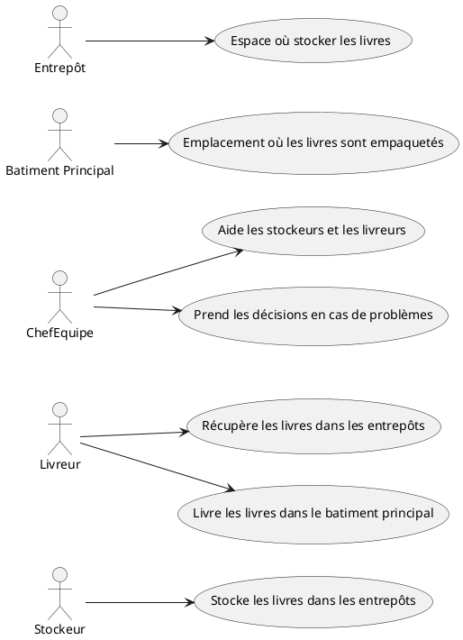
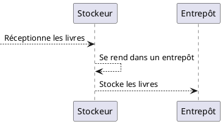
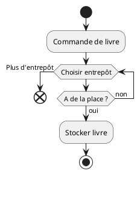
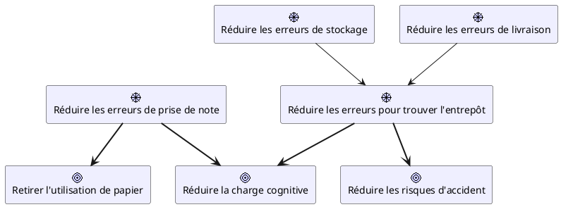
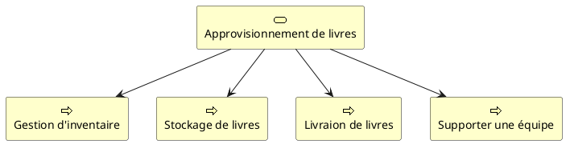

<Cover title="Conception de projet informatique" logoUrl="/images/project-managment.png" />

---
title: Sommaire
layout: chapter_title
---

<!--<Toc minDepth=1 maxDepth=2 />-->

- Introduction
- Compréhension du problème
- Conception
- Gestion du projet

---
title: Introduction
layout: chapter_title
---

Pour réaliser un projet informatique avec succès, vous devez vous assurer de bien comprendre la problèmatique que vous essayer de résoudre, pour ensuite concevoir la meilleur solution adapté à votre client.

<br/>

<div v-click
  v-motion
  :initial="{ x: -80 }"
  :enter="{ x: 0 }"
  :leave="{ x: 80 }">
Pour cela, différents types de pratiques/documents peuvent vous aider à clarifier votre projet.
</div>

<br/>

<div v-click
  v-motion
  :initial="{ x: -80 }"
  :enter="{ x: 0 }"
  :leave="{ x: 80 }">
  Ensuite, vous pourrais concevoir une architecture logiciel en prenant compte tout le cycle de vie du projet:<br/>

  <ul>
  <li>- Conception du projet</li>
  <li>- Mise en place du projet</li>
  <li>- Surveillance du projet</li>
  <li>- Maintien opérationnel du projet</li>
  <li>  - Réparation en cas de panne</li>
  <li>  - Mise à niveau (vulnérabilités, mise à jour, ...)</li>
  <li>- Arrêt/Remplacement du projet</li>
  </ul>

</div>

<br/>

<div v-click
  v-motion
  :initial="{ x: -80 }"
  :enter="{ x: 0 }"
  :leave="{ x: 80 }">
  <Note type="info">
    Tout au long du projet, la documentation sera une activité importante du projet. <br />
  Une bonne documentation peut vos aider à impliquer vos équipes, à concevoir la bonne solution, à transmettre vos connaissances, etc...
  </Note>
</div>

---
title: Compréhension du problème
layout: chapter_title
transition: slide-up
---

Dans le cadre d'un projet informatique, il faut prendre le temps necessaire pour la compréhension du problème, cela vous permettra de concevoir la meilleur solution au problème et en minimisant les imprévues.

<div class="grid place-content-center my-4">
  
</div>

<Note v-click type="info">
  Il est très rare de trouver la bonne soluton du premier coups.<br/>
  Certains choix de conception peuvent être plus lourd que d'autres, seul l'expérience peut vous aider (la votre ou celle de vos collègues)
</Note>

---
title: Comment bien comprendre un projet ?
layout: impacting_message
transition: slide-up
---

Comment faire ?

---
title: Se focaliser sur les problèmes
layout: chapter_subtitle
transition: slide-up
---

Avant de se lancer dans de la technique, il faut d'abord bien comprendre le problème que l'on essait de résoudre.

<div class="grid place-content-center my-4">
  
</div>

---
title: Genchi Genbutsu
layout: chapter_subtitle
transition: slide-up
---

Le meilleurs moyen de bien comprendre une problèmatique est d'aller voir à la source, vous pouvez ainsi discuter directement avec les personnes impliquées dans leur environnement.

 

Lors de ces échanges, il faut savoir identifier les points importants pouvant vous aiguiller sur la meilleur solution.

<Note type="info">
Il est primordiale de s'imprégner du jargon venant du métier, cela pourra vous aider à mieux communiquer avec vos clients et de faciliter l'acception de votre nouvelle solution.
</Note>

---
title: Exemple de présentation métiers
layout: chapter_subtitle
transition: slide-up
---

<div class="mt-6 mx-4 p-4 b-1px rounded-2 bg-gray-100 font-italic">
  <p>Nous sommes une entreprise qui vend des coffrets de livres.</p>
  <br/>
  <p>Dans notre batiment principal qui se trouve en centre ville, nous avons notre ligne d'assemblage où des livres bien définis sont placés dans des boîtes.</p>
  <br/>
  <p>Ces boîtes seront décorées puis emballées avant d'être envoyées dans toutes les librairies et grandes surfaces de France.</p>
  <br/>
  <p>Notre mission est d'apporter les livres dans le batiment principal.</p>
  <p>Par manque de place, on doit stocker nos livres dans des entrepôts à l'extérieur.</p>
  <p>On a 10 entrepôts autour de l'entreprise.</p>
  <p>Une équipe s'occupe de ranger les livres dans les entrepôts en attendant d'en avoir besoin.</p>
  <p>Une autre équipe va chercher les livres au bon moment en fonction des commandes.</p>
  <p>Et 2 chefs d'équipe supportent nos équipes.</p>
</div>

<div class="absolute bottom-0 right-0 h-60 w-40 flex-no-shrink fill-current stroke-black">
  <svg xmlns="http://www.w3.org/2000/svg" viewBox="-5.0 -10.0 110.0 135.0">
  <path d="m73.523 69.52c-2.4688-2.4688-5.3438-4.418-8.5508-5.8047-0.007812-0.003906-0.011718-0.003906-0.019531-0.007813-1.5664-0.66406-3.168-1.1758-4.7578-1.5273 5.7734-3.4766 9.6562-9.7852 9.6562-17v-2.9922h2.5508c0.97266 0 1.7617-0.78906 1.7617-1.7617v-5.75c0-0.97266-0.78906-1.7617-1.7617-1.7617h-0.43359c-0.75781-9.6992-7.6914-17.672-17.215-19.75-0.5-2.1641-2.4336-3.7852-4.75-3.7852s-4.25 1.625-4.75 3.7891c-9.5 2.082-16.453 10.102-17.215 19.746h-0.43359c-0.97266 0-1.7617 0.78906-1.7617 1.7617v5.75c0 0.97266 0.78906 1.7617 1.7617 1.7617h2.5508v2.9922c0 7.2148 3.8828 13.523 9.6562 17-1.5938 0.35156-3.1914 0.86328-4.7617 1.5273-0.003906 0-0.007812 0.003907-0.011719 0.003907-0.003906 0-0.003906 0-0.007812 0.003906-10.062 4.3281-16.562 14.199-16.562 25.148 0 0.97266 0.78906 1.7617 1.7617 1.7617 0.97266 0 1.7617-0.78906 1.7617-1.7617 0-8.6094 4.625-16.441 11.969-20.66v20.66c0 0.97266 0.78906 1.7617 1.7617 1.7617s1.7617-0.78906 1.7617-1.7617v-22.332c0.39062-0.14453 0.78516-0.27734 1.1797-0.40234v14.855c0 0.97266 0.78906 1.7617 1.7617 1.7617h19.145c0.97266 0 1.7617-0.78906 1.7617-1.7617v-14.855c0.39453 0.125 0.78906 0.25781 1.1797 0.40234v22.332c0 0.97266 0.78906 1.7617 1.7617 1.7617 0.97266 0 1.7617-0.78906 1.7617-1.7617v-20.652c1.8164 1.0469 3.4922 2.3086 4.9922 3.8047 4.5 4.5 6.9805 10.484 6.9805 16.848 0 0.97266 0.78906 1.7617 1.7617 1.7617 0.97266 0 1.7617-0.78906 1.7617-1.7617 0-7.3047-2.8438-14.176-8.0117-19.344zm-24.883-55.258c0-0.75 0.60938-1.3594 1.3594-1.3594s1.3594 0.60938 1.3594 1.3594v7.1523c0 0.75-0.60938 1.3594-1.3594 1.3594s-1.3594-0.60938-1.3594-1.3594zm-3.5273 2.5469v4.6055c0 2.6953 2.1914 4.8867 4.8867 4.8867s4.8867-2.1914 4.8867-4.8867v-4.5898c7.3359 2.0195 12.805 8.4844 13.543 16.086h-36.859c0.72266-7.6758 6.1172-14.09 13.547-16.105zm-15.75 19.629h41.273v2.2266h-41.273zm4.3125 8.7422v-2.9922h32.648v2.9922c0 9-7.3242 16.324-16.324 16.324s-16.324-7.3242-16.324-16.324zm8.5156 34.039v-13.906c1.2031-0.18359 2.4219-0.28125 3.6367-0.28125h8.3438c1.2148 0 2.4336 0.097656 3.6367 0.28125v13.906z"/>
  </svg>
</div>

---
title: Description du métier
layout: chapter_subtitle
transition: slide-up
---

- Liste des roles

<div clasS="grid grid-cols-2">
  <div>


  </div>
  <div class="hidden">
    
  </div>
</div>

---

- Liste des processus / gammes

<table class="m-auto">
  <thead>
    <tr class="b-1"><th>Processus</th></tr>
  </thead>
  <tbody>
    <tr class="b-1"><td>Stockage de livre</td></tr>
    <tr class="b-1"><td>Livraison de livre</td></tr>
    <tr class="b-1"><td>Empaquetage des livres</td></tr>
    <tr class="b-1"><td>Décoration des boîtes</td></tr>
    <tr class="b-1"><td>Conditionnement des boîtes</td></tr>
  </tbody>
</table>

---

- Diagramme de séquence
<div class="m-auto">

**Reception**


</div>

---

- Logigramme

<div class="m-auto">

**Livraison**


</div>

---


### Obectifs

```
On a une cadence élevée pour assembler nos colis.
On perd beaucoup de temps à trouver quel entepôt contient les bons livres et à les chercher dans nos entrepôts.
Cela augmente les risques car on doit parcourir des longues distances dans des temps limités.
Nos équipes ont parfois du mal à noter les informations sur leur bloc notes, ils voudraient avoir un outil plus rapide.
Et nous avons également des objetifs écologiques, nous aimerions baisser notre impacte environnementale.
```

---


- Liste des Obectifs / Motivations
  - Objectifs globals
  - Objectifs soujacents

<div class="m-auto">


</div>

---

- Capacités
  - Lister les process / gammes


<div class="m-auto">


</div>

---

### Valider votre compréhension

<div>
  
</div>

Lors de vos premiers échanges avec le métier, posez toutes vos questions.
Ensuite **documenter** votre compréhension du métier, de leurs problèmatiques et de leurs objectifs, ensuite **présentez** vos documents aux experts du métier pour vous assurer que votre compréhension soit la bonne.

---
title: Conception
---

### Cycle de vie

- Mise en place du projet
  - Environnement de Test / Production
- Surveillance du projet
  - Alertes
  - Monitoring
- Maintenance du projet
  - Panne
  - Mise à jour
- Arrêt du projet


---

#### Hybride diagramme


---

Dans cette architecture, j'ai fais le choix de créer une application par domaine.
Chaque application est composée d'une interface et d'une API qui utilise sa propre base de données, cela permet d'être plus résistent au panne et de partager plus facilement les informations avec d'autres systèmes.
Chaque composant d'une application peut avoir plusieurs instances en simultanés et sur différents servers.

Pour la gestion des accès/roles, j'utilise un **S**ingle **S**ign-**O**n ce qui permet d'avoir la même base d'utilisateur pour toutes les applications et demander à l'utilisateur de se connecter une seul fois.

---

#### Stack technologique
Mettre en place une applications demande beaucoup de ressources:
- Sauvegarde de code
- Outils de build
- Outils de déploiement
- Outils de monitoring
- Outils de d'alerte
- Stockage de données
- Outils de restauration
- ....

---

Il est judicieux de définir une stack technique standard pour votre entreprise couvrant toutes les strapes de vos projets.

<div class="grid grid-cols-2">
<section class="w-full">
Ex:<br/>
- Source code managment: Github<br/>
- Application<br/>
&nbsp;&nbsp;&nbsp;&nbsp;- Backend: Spring Boot<br/>
&nbsp;&nbsp;&nbsp;&nbsp;- Frontend: React<br/>
- Data<br/>
&nbsp;&nbsp;&nbsp;&nbsp;- SQL: Postgresql (cluster mode)<br/>
&nbsp;&nbsp;&nbsp;&nbsp;- NoSQL: Redis<br/>
&nbsp;&nbsp;&nbsp;&nbsp;- ETL: Pentaho Data Integration
</section>
<section class="w-full">
<br/>
- Shipment method: Container<br/>
&nbsp;&nbsp;&nbsp;&nbsp;- Image registry: Quay<br/>
&nbsp;&nbsp;&nbsp;&nbsp;- Hosting: Kubernetes<br/>
- CI/CD: Github workflow<br/>
- Monitoring<br/>
&nbsp;&nbsp;&nbsp;&nbsp;- Metrics: Prometheus + Grafana<br/>
&nbsp;&nbsp;&nbsp;&nbsp;- Metrics agregator: VictoriaMetrics<br/>
&nbsp;&nbsp;&nbsp;&nbsp;- Alertes: AlertManager
- ...
</section>
</div>

---

<div>
  
</div>

---

La liste peut être longue suivant le type de vos activités / clients.
Il est necessaire de définir une façon standard d'utiliser chaque technologie pour permettre de mutualiser les outils.
Cela vous permettra, par exemple, de mettre en place le monitoring de votre projet en quelques secondes car vous avez réutiliser la méthode standard définie par des personnes plus compètente sur ce sujet.

De plus, en utilisant le plus possible la même technologie, le maintient de celle-ci vous sera plus facile.

> Garder à l'esprit qu'une technologie doit être maintenu à jour pour réduire les failles de sécurité, quel doit être capable d'être redémarré/restaurée en cas de panne, ...

---

#### Mock-up
La partie la plus importante dans le cadre d'un projet applicatif est son interface, les autres composants ne sont que des composants techniques qui parleront aux équipes supports.
Il est donc important de présenter et valider des maquettes de l'interface aux différents experts du métier.

<div>
  
</div>

---

### Agile
##### Principes
<div>
  
</div>

##### User story
  

---

##### Versionnement
- MVP: Minimum Viable Product
- MMP: Minimum Marketable Product
- MMR: Minimum Marketable Release

---

### Finaliser un projet 
##### SLA

<div>
  
</div>

---


### Livres
- [Clean Code](https://www.amazon.fr/Clean-Code-Handbook-Software-Craftsmanship/dp/0132350882)
<div>
  
</div>

- [ENI Architecture logicielle](https://www.editions-eni.fr/livre/architecture-logicielle-pour-une-approche-organisationnelle-fonctionnelle-et-technique-2e-edition-9782746099210)

---
title: Questions ?
layout: impacting_message
---

Merci !

Avez-vous des questions ?
