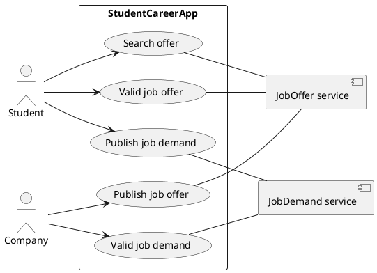
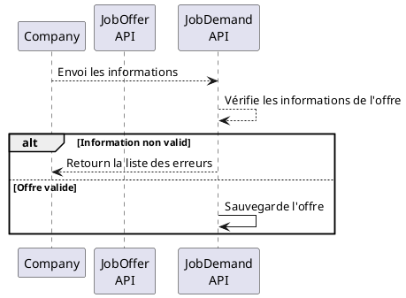
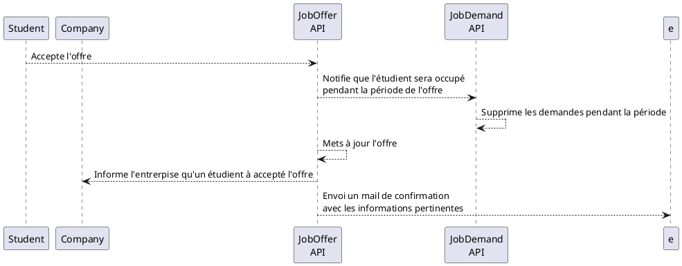
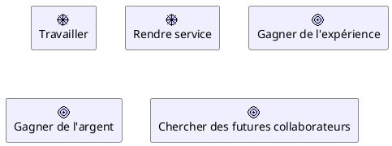
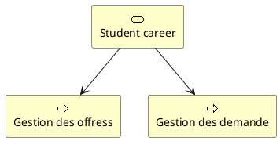
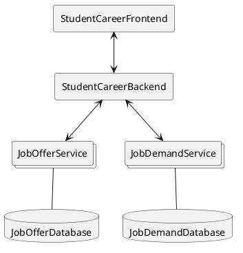
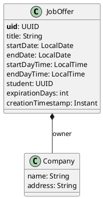
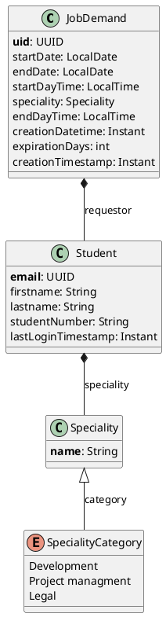

# Sujet TP – Conception de projet 2025-2026

Dans ce TP commun, nous allons définir un projet, le décrire et concevoir son architecture pour nos prochains TP de Spring-Boot et NestJS.

<br><br>

## Objectif

Définir un projet informatique complet:

1. Imaginer le projet
2. Décrire le fonctionnement
3. Détailler le fontionnement
4. Lister les objectifs/motivations du projet
5. Lister les capacités du porjet
6. Concevoir l'architecture

# Context

## Diagram de cas d'utilisation



## Details

### Publier une offre

> User story: "En tant d'**étudiant**, je veux **publier une offre à partir d'un formulaire**"


### Valider une offre



# Motivations



# Capacity



# Architecture



## JobOfferService

### Entitée

<center>



</center>

###  Contrat de service

| Method | url | request body| response body | Result | Description |
| --- | --- | --- | --- | --- | --- |
| GET | /job-offer | | [ ]: Collection\<JobOffer> | 200 ou 204 | List 10 job offers |
| GET | /job-offer | params: title | []: Collection<JobOffer> | 200 ou 201 | Permet de chercher toutes les offres par titre |
| GET | /job-offer | params: company | []: Collection<JobOffer> | 200 ou 201 | Renvoi la liste des offre de l'entrerpies |
| GET | /job-offer/{uid} | | {}: JobOffer | 200 ou 404 | Renvoi une offer sinon error |
| POST | /job-offer | {}: JobOffer | {}: JobOffer | 201 ou 400 ou 401 | Créer une offer |
| PUT | /job-offer | {}: JobOffer | {}: JobOffer | 200 ou 400 ou 401 ou 404 | Modifier une offer |
| DELETE | /job-offer/{uid} | | 200 ou 401 ou 404 | Annuler une offer |

## JobDemandService

### Entitée


<center>



</center>

###  Contrat de service

| Method | url | request body| response body | Result | Description |
| --- | --- | --- | --- | --- | --- |
| GET | /job-demand | | [ ]: Collection\<JobDemand> | 200 ou 204 | List 10 job demands |
| GET | /job-demand | student | [ ]: Collection\<JobDemand> | 200 ou 204 | Renvoi la liste de demandes de l'étudient |
| GET | /job-demand/{uid} | | {}: JobDemand | 200 ou 404 | Renvoi un job demand sinon error |
| POST | /job-demand | {}: JobDemand | {}: JobDemand | 201 ou 400 ou 401 | Créer un job demand |
| PUT | /job-demand | {}: JobDemand | {}: JobDemand | 200 ou 400 ou 401 ou 404 | Modifier un job demand |
| DELETE | /job-demand/{uid} | | 200 ou 401 ou 404 | Annuler un job demand |

# Mockup

## JSON-Server
Vous pouvez utiliser [json-server](https://www.npmjs.com/package/json-server) pour créer une première version minimaliste de vos micro-service pour pouvoir créer rapidement une maquette du projet.


```shell
json-server ./event-app_mockup.json
```
