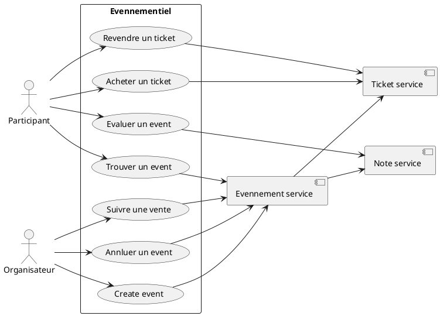
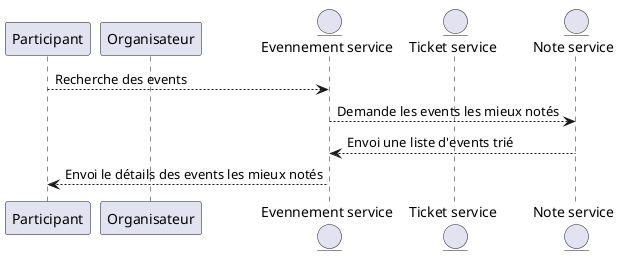
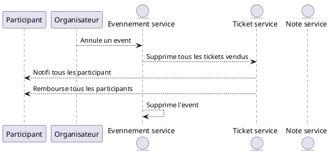
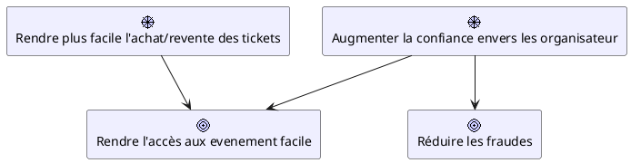
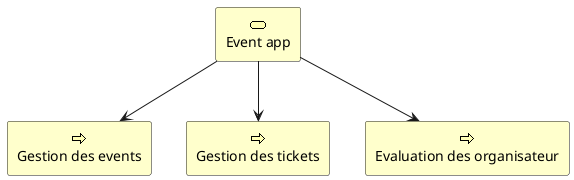
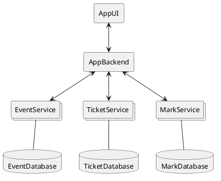

# Sujet TP – Conception de projet

Dans ce TP commun, nous allons définir un projet, le décrire et concevoir son architecture pour nos prochains TP de Spring-Boot et NestJS.

<br><br>

## Objectif

Définir un projet informatique complet:

1. Imaginer le projet
2. Décrire le fonctionnement
3. Détailler le fontionnement
4. Lister les objectifs/motivations du projet
5. Lister les capacités du porjet
6. Concevoir l'architecture


# Context

## Global



## Details

### Rechercher les events les mieux notés


### Annuler un event



# Motivations



# Capacity



# Architecture



## EventService

### Entitée

| Event |
| --- |
| __id__: UUID |
| title: String |
| description: String |
| ticketPrice: double |
| organizer: UUID |
| location: Location |
| datetime: LocalDatetime |

| Location |
| --- |
| __address__: String |
| capacity: int |


### Contrat de service

| Method | url | request body| response body | Result | Description |
| --- | --- | --- | --- | --- | --- |
| GET | /event | | [ ]: Collection\<Event> | 200 ou 204 | List 10 events |
| GET | /event/{id} | | {}: Event | 200 ou 404 | Renvoi un event sinon error |
| POST | /event | {}: Event | {}: Event | 201 ou 400 ou 401 | Créer un event |
| PUT | /event | {}: Event | {}: Event | 200 ou 400 ou 401 ou 404 | Modifier un event |
| DELETE | /event/cancel/{id} | | 200 ou 401 ou 404 | Annuler un event |

## TicketService

### Entitée
| Ticket |
| --- |
| __id__: UUID |
| event: Event |
| participant: UUID |
| paymentDatetime: LocalDatetime |
| creationDatetime: LocalDatetime |

| Event |
| --- |
| __id__: UUID |
| title: String |
| ticketPrice: double |
| datetime: LocalDatetime |

### Contrat de service

| Method | url | request body| response body | Result | Description |
| --- | --- | --- | --- | --- | --- |
| GET | /ticket/{id} | | {}:Ticket | 200 ou 404 | Récupére un tickets |
| GET | /ticket?eventId={eventId} | | [ ]: Collection\<Ticket> | 200 ou 204 | Lister tous les tickets d'un event |
| POST | /buy-ticket | Ticket | Ticket | 200 ou 204 | Acheter un ticket |
| POST | /sell-ticket/{id} | | Ticket | 200 ou 400 | Revendre un ticket |

## MarkService

### Entitée

| Mark |
| --- |
| __id__: UUID |
| event: Event |
| participant: UUID |
| value: int |
| creationDatetime: LocalDatetime |

| Event |
| --- |
| __id__: UUID |
| title: String |
| organizer: UUID |
| datetime: LocalDatetime |

### Contrat de service

| Method | url | request body| response body | Result | Description |
| --- | --- | --- | --- | --- | --- |
| GET | /mark/{id} | | {}:Mark | 200 ou 404 | Récupére une mark |
| GET | /mark?eventId={eventId} | | [ ]: Collection\<Mark> | 200 ou 204 | Lister toutes les mark d'un event |
| GET | /top-event | | [ ]: Collection\<Event> | 200 ou 204 | Lister le top 10 des meilleurs event |
| GET | /top-organisator | | [ ]: Collection\<UUID> | 200 ou 204 | Lister le top 10 des meilleurs organisateur |
| POST | /evaluate | Mark |Mark | 200 ou 400 ou 401 | Evaluer un event |

# Mockup

## JSON-Server
Vous pouvez utiliser [json-server](https://www.npmjs.com/package/json-server) pour créer une première version minimaliste de vos micro-service pour pouvoir créer rapidement une maquette du projet.


```shell
json-server ./event-app_mockup.json
```
