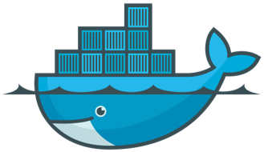
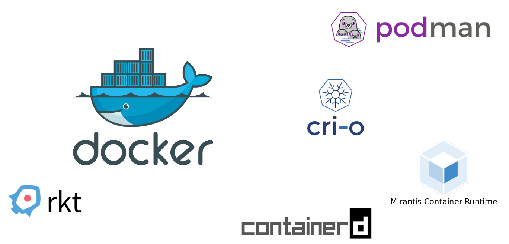

  

  
  

  

  
  
  

  
  

  

  # Docker
  ### INTES
  ### 2023-2024
  

  
  

  ###### Fabien HAINGUE

  

---
## Sommaire

- Docker
  - Principes
  - Moteur de conteneur
  - Conteneur
  - Dockerfile
- docker-compose
  - Fonctionnement
- Conteneuriser vos application
  - Spring Boot
  - NodeJS
  - ...

---
<!-- _class: partie -->
## Principes

Docker est une technologie de conteneurisation.
Pour mieux comprendre pourquoi on est arrivée à la conteneurisation, il faut comprendre ce que l’on utilisez avant.

Serveur:
1 gros serveur physique
OS et bin/lib adapté aux application installée dessus.
Toutes les composant doivent être compatible entre eux.
Quand une mise à jour est à faire, c’est très complique car il faut s’assurer que tout reste compatible, et redémarrer le serveur redémarre également ses applications.

Virtualisation:
1 gros serveur physique avec un hyperviseur
Chaque VM créée possède des ressources réservés par l’hyperviseur (RAM/Disk/CPU).
L’avantage est que si on redémarre une VM, les autres ne sont pas impacté.
Et chaque VM peuvent avoir des installations différentes.

Conteneurisation:
1 serveur physique ou virtuel avec un moteur de conteneur
Chaque container est un processus sur son système hôte, ce qui permet de libérer des ressources (RAM/CPU) quand il ne les utilise pas.
Comme la virtualisation, la VM ou le container est indépendant du serveur hôte et de ses voisins (OS libre de choix, version d’outils au choix)

---
## Moteur de conteneur

Depuis 2015, il existe l’Open Container Initiatives qui est une sorte d’association qui définie le fonctionnement d’un moteur de container.

Il existe plusieurs moteur de conteneurs, certains ont des usages différents:
- ContainerD : moteur très léger destiné à l’embarque (IoT)
- Podman: demonless
- …
