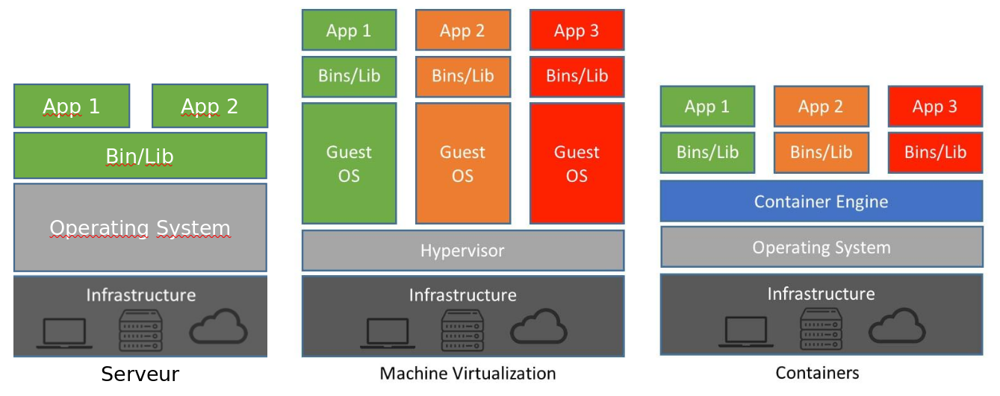
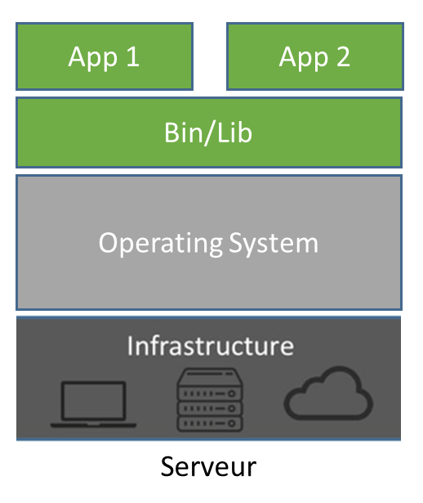
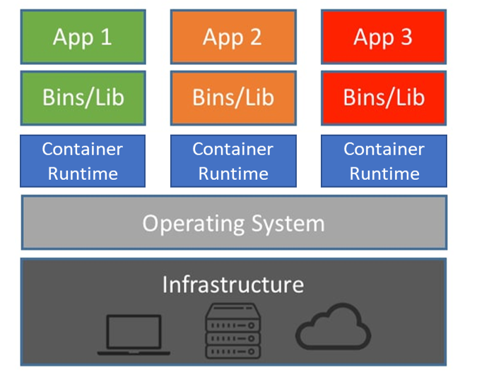
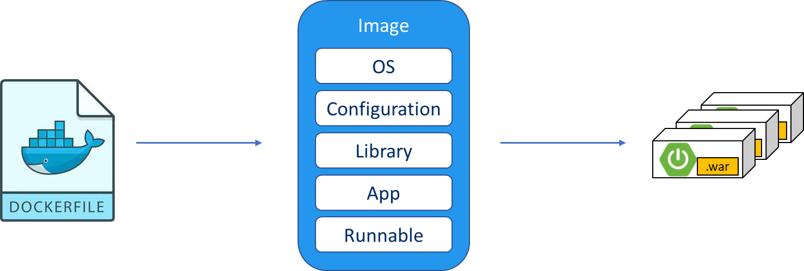
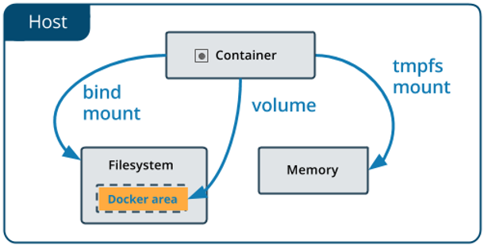
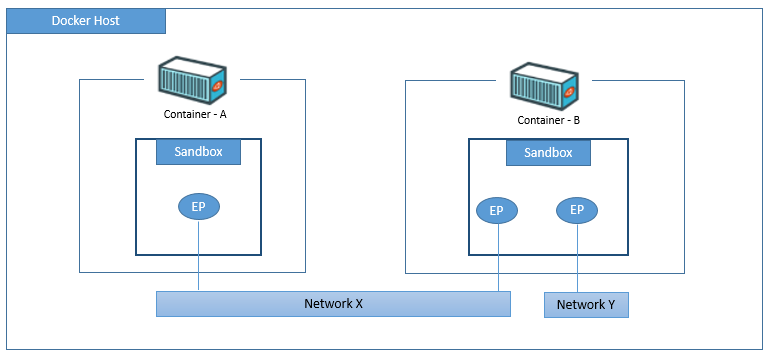
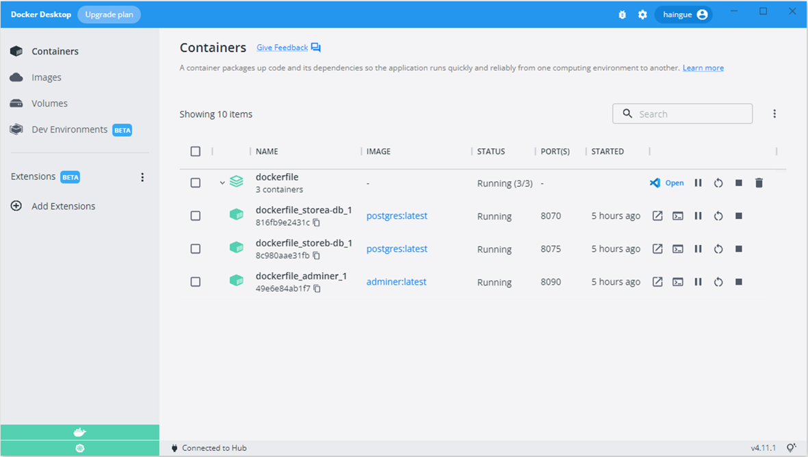

<!-- _header: '' -->
<!-- _footer: '' -->
<!-- _paginate: skip -->
<div class="grid grid-cols-3 grid-flow-col gap-2 text-center">
  <div class="row-span-1">


  </div>

  <div class="row-span-1 row-start-3">
  
  
  </div>
  
  <div class="row-span-3 col-span-3">


# Docker

### INTES

### 2024-2025

  </div>
  
  <div class="row-span-1 row-start-3">

###### Fabien HAINGUE

  </div>
</div>

---

## Sommaire

- Conteneurisation
  - Principes
  - Moteur de conteneur
  - Conteneur
  - Image de conteneur
- Docker CLI
- Volume
- Network
- docker-compose
  - Fonctionnement
- Docker Desktop

---

## Principes

Docker est une technologie de conteneurisation.
Pour mieux comprendre pourquoi on est arrivé à la conteneurisation, il faut comprendre ce que l’on utilisait avant.



---

**Serveur**:
1 gros serveur physique<br/>
OS et bin/lib adaptés aux applications installées dessus.<br/>
Toutes les composants doivent être **compatibles** entre eux.<br/>
Quand une mise à jour est à faire cela est très compliqué, car il faut s’assurer que tout soit compatible et redémarrer le serveur redémarre également **toutes** ses applications.



---

**Virtualisation**:
1 gros serveur physique avec un hyperviseur<br/>
Chaque VM créée possède des ressources réservées par l’hyperviseur (RAM/Disk/CPU).<br/>
L’avantage est que si on redémarre une VM, les autres ne sont pas impactés.<br/>
Et chaque VMs peuvent avoir des **installations différentes**.


---

**Conteneurisation**:
1 serveur physique ou virtuel avec un moteur de conteneur<br/>
Chaque conteneur est un **processus** sur son système hôte, ce qui permet de libérer des ressources (RAM/CPU) quand il ne les utilise pas.<br/>
Comme la virtualisation, la VM ou le container est indépendant du serveur hôte et de ses voisins (OS libre de choix, version d’outils au choix)

## 

---

## Moteur de conteneur

Depuis 2015, il existe l’Open Container Initiatives qui est une sorte d’association qui définit les règles de fonctionnement d’un conteneur.

Le terme "Docker" désigne le logiciel/entreprise, il est souvent utilisé pour parler de conteneur ou moteur de conteneur car ils ont popularisé la conteneurisation mais c'est un abus de langage.

---


[Source](https://jvns.ca/blog/2020/04/27/new-zine-how-containers-work/)

---

Il existe plusieurs moteurs de conteneurs, certains ont des usages différents:

- [Docker](https://docs.docker.com/get-started/overview/#docker-architecture)
- [containerd](https://containerd.io/) (moteur très léger)
- [Podman](https://podman.io/) (moteur sans démon ce qui permet d'être plus fiable que les autres (daemonless))
- [rkt](https://www.redhat.com/en/technologies/cloud-computing/openshift/what-was-coreos)
- [cri-o](https://cri-o.io/)
- [Mirantis](https://www.mirantis.com/software/mirantis-container-runtime/?utm_source=paid-search&utm_medium=google&utm_campaign=EMEA-EN-Brand&utm_term=mirantis%20container%20runtime&gclid=CjwKCAjwh8mlBhB_EiwAsztdBKMF4RDtSGVyXrOT2TAWiH_W75fF3FlrCtl5D0__CpgTlnUPQgOcIRoCT8IQAvD_BwE)
- ...


---

> Si vous souhaitez mieux comprendre comment fonctionne un moteur de conteneur et comment nous sommes arrivés à ce niveau, je vous recommande grandement de regarder cette conférence: <br/> [De chroot à Docker à Podman à Wasm, 40 ans d'évolutation](https://www.youtube.com/watch?v=dikQOyAzdS4&pp=ygUQZGV2b3h4IGNvbnRhaW5lcg%3D%3D)

---

## Conteneur

Un conteneur est un groupe de processus isolé de son hôte.
Docker a rendu la création de conteneur plus facile en deux étapes:

1. Créer une image de conteneur ***(recette de cuisine)***
   - Ecrire un fichier de configuration (Dockerflile en YAML)
     - Spécifier l'image de base
     - Installer les dépendances
     - Copier les fichiers de l'application
     - Exposer les ports
     - Définir la commande de démarrage
   - Fabriquer l'image de conteneur (binaire)
2. Lancer un conteneur à partir d'une image ***(réalisation de la recette)***

---



---

## Image de conteneur

<p>
  Une image de conteneur va décrire comment créer un conteneur pour exécuter votre programme.

  Et pour cela, vous avez besoin d'un fichier **[Dockerfile](https://docs.docker.com/engine/reference/builder/)**.

Un Dockerfile est un fichier écrit en **[YAML](https://fr.wikipedia.org/wiki/YAML)** qui sert à décrire toutes les étapes pour créer votre conteneur.

</p>
<p>
  Toutes les images docker sont stockées dans un registre d'image.<br/>
  Toutes les images que vous créez sont stockées sur votre registre local, mais il existe des registres sur internet, comme <span><b><a href="https://hub.docker.com/">DockerHub</a></b></span> qui est le registre officiel de Docker.
<p>

---

### Contenu d'un Dockerfile

#### Image de base

La première instruction d'un Dockerfile est une instruction spécifiant l'image de base utilisé pour votre image:

```yaml
FROM <image>:<tag>
```

Vous pouvez utiliser l'une de vos images ou utiliser une image officielle depuis [DockerHub](https://hub.docker.com/).

Il y a plusieurs types d'image de base, pour choisir la bonne il faut d'abord comprendre ce dont vous avez besoins ([voir article](https://redhat-connect.gitbook.io/catalog-help/container-images/container-image-details/container-image-types)).

---

Une image doit être la plus légère possible pour pouvoir démarrer rapidement et avec le moins d'outils/librairies superflus pour limiter la surface de cyber-attaque.

> Utiliser une image de base **slim** ou **distroless** vous permettra d'avoir une image très légère, mais avec peu d'outils pour lancer votre application (ex: [alpine](https://hub.docker.com/_/alpine)).<br/>
> Utiliser une image **flatpack** vous permettra d'avoir accès à de nombreux outils, mais alourdira drastiquement votre image (ex: [debian](https://hub.docker.com/_/debian)).

---

> **Attention**: utilisez uniquement des images officielles et vérifiées, plus de 50% des images sur DockerHub (sur 4 millions) ont des vulnérabilités.
> 

---

#### Dossier de travail

Il est judicieux de préciser dans quel dossier du conteneur on souhaite se placer pour la suite.

```yaml
WORKDIR <path>
```

> **Conseil**: ne vous mettez jamais à la racine de votre conteneur (**/**).
> Si une personne arrive à se connecter à votre conteneur via votre application, elle pourra plus facilement prendre la main du conteneur en étant à la racine du système.<br/>

---

#### Importation de fichier

Maintenant, vous pouvez importer des fichiers tiers à l'intérieur de votre conteneur pour les utiliser, comme votre code source.

```yaml
ADD <fichier ou dossier sur votre machine hôte> <chemin dans votre conteneur>
```

---

#### Exposition de port

Si votre application utilise des ports de communication, vous devez les préciser.

```yaml
EXPOSE 8080
```

> **Conseil**: exposez uniquement les ports dont vous avez besoin, cela limitera votre surface d'attaque

---

#### Lancement de commande

Si vous avez besoin de lancer des commandes système, vous pouvez les faire à l'aide de cette instruction:

```yaml
CMD <commande>
```

Chaque commande seront executées depuis le dossier précisé avec **WORKDIR**.

---

#### Lancement de votre programme

Pour lancer votre programme, vous avez deux façons de faire.
Soit vous utilisez l'instruction **CMD** qui permettra de lancer votre programme.<br/>
Soit en Utilisant l'instruction **ENTRYPOINT** qui permet également de lancer votre programme, mais si votre programme se termine, le conteneur sera arrêté.

```yaml
ENTRYPOINT <commande>
```

---

#### Multi-stage builds

Vous pouvez optimiser vos images de conteneur en utilisant le [**multi-stage builds**](https://docs.docker.com/build/building/multi-stage/).
Cela vous permet d'utiliser plusieurs images de conteneur pour fabriquer une image de conteneur optimisé.

---

Exemple:

- Une image de conteneur lourd avec tous les outils de compilation (avec une grande surface d'attaque et des programmes en trop)
  - Java: maven
  - NodeJS: nodejs
- Une image de conteneur léger avec uniquement les composants servant à démarrer votre programme
  - Java openJRE
  - NodeJS: httpd

---

Pour cela vous devez nommer vos étapes de cette manière:

```yaml
FROM <image de base 1> as <nom de l'étape 1>
---
FROM <image de base 2> as <nom de l'étape 2>
```

Vous pouvez Transférer des fichiers entre chaque étape (ex: code compilé) avec cette instruction:

```yaml
COPY --from=<nom du container source> <chemin dans le conteneur source> <chemin vers le conteneur destinataire>
```

---

#### Exemple complet

```yaml
ARG JAR_FILE=*.jar
ARG ENV_NAME=default

# Build application
FROM maven:3.8.4-openjdk-11-slim as builder
ARG ENV_NAME
ENV ENV_NAME $ENV_NAME
WORKDIR /app
COPY pom.xml .
RUN mvn dependency:go-offline
COPY ./src ./src
COPY ./config ./config
RUN mvn clean install -P$ENV_NAME
#RUN mvn clean package -Dmaven.test.skip=true -P$ENV_NAME

# Run application
FROM openjdk:11-jre-buster
ARG JAR_FILE
ENV JAR_FILE $JAR_FILE
ARG ENV_NAME
ENV ENV_NAME $ENV_NAME
WORKDIR /opt/app
RUN addgroup --system spring && adduser --system spring --ingroup spring
USER spring:spring
EXPOSE 8080
COPY --from=builder /app/target/${JAR_FILE} /opt/app
ENTRYPOINT ["sh", "-c", "java -jar /opt/app/$JAR_FILE --spring.profiles.active=$ENV_NAME"]
```

---

## Docker cli

Vous pourrez trouver un tutoriel sur le [site officiel](https://docs.docker.com/get-started/ "lien vers le tutoriel officiel").

---

### Télécharger une image

```shell
$ docker pull <nom image>:<tag>
```

### Fabriquer une image

```shell
$ docker build -t <nom image>:<tag> -f <dockerfile> <chemin vers le dossier>
```

> Par défaut la commande va essayer de trouver un fichier "Dockerfile" dans le dossier courant
>
> ```shell
> ...$ docker build .
> ```

---

### Afficher les images de votre registre locale

```shell
$ docker image ls
```

---

### Fabriquer un conteneur

```shell
$ docker run -p <port hôte>:<port conteneur> <nom image>:<tag> -d
```

> l'argument "-d" permet de détacher l'invité de commande et de vous rendre la main<br/>
> Si vous ne le mettez pas, votre invité de commande affichera les logs du conteneur et en faisant Ctrl+C votre conteneur s'arrêtera.

### Afficher la liste de conteneur sur votre machine

```shell
$ docker ps
```

---

## Rendre un conteneur persistence

Actuellement, vos conteneurs ne sont pas persistent.
Une fois supprimés, vous perdez vos données.<br/>

Si vous voulez garder des données venant de vos conteneurs, il vous faut utiliser un [**Volumes**](https://docs.docker.com/storage/volumes/).


Un volume est un lien vers un espace de stockage qui se trouve sur l'hôte, vos conteneurs peuvent utiliser se lien pour y stocker des fichiers.<br/>
Une fois vos conteneurs détruits, vos volumes restent présents et peuvent être réutilisés par d'autres conteneurs.

---

### Créer un volume

```yaml
docker volume create <nom du volume>
```

### Afficher vos volumes

```yaml
docker volume ls
```

### Inspecter un volume

```yaml
docker volume inspect <nom du volume>
```

### Supprimer un volume

```yaml
docker volume rm <nom du volume>
```

---

## Gérer la communication entre conteneurs

Pour sécuriser vos conteneurs, vous pouvez définir des réseaux spécifiques.<br/>

> Par défaut, souvent le réseau utiliser par le moteur de conteneur est de type "réseau par pont" (_bridge_) qui permet d'isoler la communication entre un conteneur et son hôte.



---

## Pilotes réseau

<div class="gap-8 columns-2">
  <div class="w-full truncate">
  
  - **bridge**: Le pilote réseau par défaut. Si vous ne spécifiez pas de pilote, il s'agit du type de réseau que vous créez. Les réseaux de pont sont généralement utilisés lorsque vos applications s'exécutent dans des conteneurs autonomes qui doivent communiquer.

  - **hôte**: pour les conteneurs autonomes, supprimez l'isolation réseau entre le conteneur et l'hôte Docker, et utilisez directement la mise en réseau de l'hôte.

  - **superposition**: les réseaux de superposition connectent plusieurs démons Docker ensemble et permettent aux services Swarm de communiquer entre eux. Vous pouvez également utiliser des réseaux superposés pour faciliter la communication entre un service swarm et un conteneur autonome, ou entre deux conteneurs autonomes sur différents démons Docker. Cette stratégie supprime la nécessité d'effectuer un routage au niveau du système d'exploitation entre ces conteneurs.

  - **ipvlan**: les réseaux IPvlan offrent aux utilisateurs un contrôle total sur l'adressage IPv4 et IPv6. Le pilote VLAN s'appuie sur cela en donnant aux opérateurs un contrôle complet du balisage VLAN de couche 2 et même du routage IPvlan L3 pour les utilisateurs intéressés par l'intégration du réseau sous-jacent.

  </div>
  <div class="w-full truncate">

  - **macvlan**: les réseaux Macvlan vous permettent d'attribuer une adresse MAC à un conteneur, le faisant apparaître comme un périphérique physique sur votre réseau. Le démon Docker achemine le trafic vers les conteneurs par leurs adresses MAC. L'utilisation du pilote macvlan est parfois le meilleur choix lorsqu'il s'agit d'applications héritées qui s'attendent à être directement connectées au réseau physique, plutôt que d'être acheminées via la pile réseau de l'hôte Docker.

  - **none**: pour ce conteneur, désactivez tous les réseaux. Généralement utilisé en conjonction avec un pilote réseau personnalisé. none n'est pas disponible pour les services Swarm.

  - **Plugins réseau**: vous pouvez installer et utiliser des plugins réseau tiers avec Docker. Ces plugins sont disponibles sur Docker Hub ou auprès de fournisseurs tiers. Consultez la documentation du fournisseur pour installer et utiliser un plug-in réseau donné.
  </div>
</div>

---

> **A retenir**:
>
> - Les réseaux de pont sont les meilleurs lorsque vous avez besoin de plusieurs conteneurs pour communiquer sur le même hôte Docker.
> - Les réseaux hôtes sont les meilleurs lorsque la pile réseau ne doit pas être isolée de l'hôte Docker, mais que vous souhaitez que d'autres aspects du conteneur soient isolés.
> - Les réseaux superposés sont les meilleurs lorsque vous avez besoin de conteneurs exécutés sur différents hôtes Docker pour communiquer, ou lorsque plusieurs applications fonctionnent ensemble à l'aide de services Swarm.
> - Les réseaux Macvlan sont les meilleurs lorsque vous migrez à partir d'une configuration de machine virtuelle ou que vous avez besoin que vos conteneurs ressemblent à des hôtes physiques sur votre réseau, chacun avec une adresse MAC unique.
> - Les plug-ins réseau tiers vous permettent d'intégrer Docker à des piles réseau spécialisées.

---

### Créer un réseau de conteneur

```shell
$ docker network create <nom du réseau>
```

### Connecter un conteneur à un réseau

```shell
$ docker network connect <nom du réseau> <nom du conteneur>
```

### Supprimer un réseau de conteneur

```shell
$ docker network rm <nom du réseau>
```

---

## docker-compose

Il est vite compliqué de gérer plusieurs conteneurs avec tous leurs composants (volumes/réseaux/...).

Docker a donc créé un outil appelé [**docker-compose**](https://docs.docker.com/compose/gettingstarted/) qui simplifie le déploiement et la gestion de plusieurs conteneurs inter-connectés en fournissant une configuration déclarative au format YAML.

---

Principales caractéristiques et fonctionnalités de docker-compose :

- **Configuration déclarative**: Avec docker-compose, tu peux décrire la structure de ton application et les services associés dans un fichier YAML. Cette configuration déclarative permet de spécifier les images de conteneurs, les dépendances, les variables d'environnement, les volumes, les ports exposés, etc.

- **Gestion des services**: docker-compose permet de gérer et de contrôler plusieurs services conteneurisés en une seule commande. Tu peux définir des services individuels dans le fichier de configuration, qui peuvent être démarrés, arrêtés, redémarrés ou supprimés en tant qu'ensemble cohérent.
---
- **Orchestration multi-conteneurs**: docker-compose facilite le déploiement et l'orchestration d'applications multi-conteneurs. Tu peux définir des dépendances entre les services, spécifier l'ordre de démarrage et docker-compose s'occupera de les lancer dans l'ordre approprié et de gérer les dépendances.

- **Gestion des réseaux**: docker-compose crée automatiquement un réseau isolé pour les services de ton application, permettant aux conteneurs de communiquer entre eux via des noms de service au lieu d'adresses IP. Cela facilite la communication et l'interaction entre les différents composants de ton application.

- **Facilité de déploiement**: Grâce à docker-compose, tu peux déployer ton application multi-conteneurs en une seule commande. Il simplifie le processus de déploiement, réduit les erreurs potentielles et assure la cohérence de l'environnement de développement à la production.

---

Exemple "_docker-compose.yml_":

```yaml
version: "3.9"
volumes:
  db-data:
networks:
  overlay:
services:
  wordpress:
    image: wordpress
    ports:
      - "8080:80"
    networks:
      - overlay
    deploy:
      mode: replicated
      replicas: 2
      endpoint_mode: vip
  mysql:
    image: mysql
    volumes:
      - db-data:/var/lib/mysql/data
    networks:
      - overlay
    deploy:
      mode: replicated
      replicas: 2
      endpoint_mode: dnsrr
      resources:
      limits:
        cpus: "0.50"
        memory: 50M
      reservations:
        cpus: "0.25"
        memory: 20M
```

---

### Vérifier un fichier docker-compose

```shell
$ docker-compose config
```

### Lancer un docker-compose

```shell
$ docker-compose up -d
```

### Afficher les logs d'un docker-compose

```shell
$ docker-compose events
```

### Stopper un docker-compose

```shell
$ docker-compose down
```

> Par défaut, toutes ses commandes vont chercher à utiliser un fichier dans le dossier courant nommé "docker-compose.yml" ou "compose.yml"

---

## Docker Desktop

Si l'invité de commande n'est pas votre allié, vous pouvez installer **[Docker Desktop](https://www.docker.com/products/docker-desktop/)** qui vous permettra d'avoir une interface ergonomique pour gérer vos conteneurs.



> **Conseil**: cet outil est parfait pour le développement, mais pas pour de la production, donc familiarisez-vous avec les commandes pour mieux gérer vos déploiement.

---

## Tips

- **Toujours conteneuriser vos applications**<br/>
  Quand vous développez une application, pensez toujours à "comment vous allez la déployer en production" (propriétés différentes pour chaque environnement Test/Prod, gestion des secrets, ...).<br/>
  Cela doit être l’une de vos priorités, la conteneurisation est l’une des meilleurs solution pour ça donc je vous conseille vivement de le faire pour tous vos projets (Cloud ready).

---
- **Multi-stage builds**<br/>
  Cela permet de réduire la surface d’attaque, mais également la taille de vos images ce qui améliore donc la vitesse de déploiement…
<br/>
- **Utilsez les images officielles**<br/>
  Il y a énormément d’images disponibles sur internet (docker-hub), la plupart son soit des images avec des spywares ou des images avec des failles de sécurité.<br/>
  C’est pour cela, qu’il faut absolument utiliser les images officielles créées par un organisme officiel, car elles sont vérifiées et régulièrement mis à jour.

---

## Aller plus loin

- [Best pratices](https://docs.docker.com/build/building/best-practices/)
- [Secrets managment](https://docs.docker.com/engine/swarm/secrets/)
- [Kubernetes](https://fr.wikipedia.org/wiki/Kubernetes)
- Awesome list
  - [Docker exemples](https://github.com/docker/awesome-compose)
  - [Awesome containers](https://github.com/pditommaso/awesome-containers)
  - [Awesome docker](https://github.com/veggiemonk/awesome-docker?tab=readme-ov-file)
