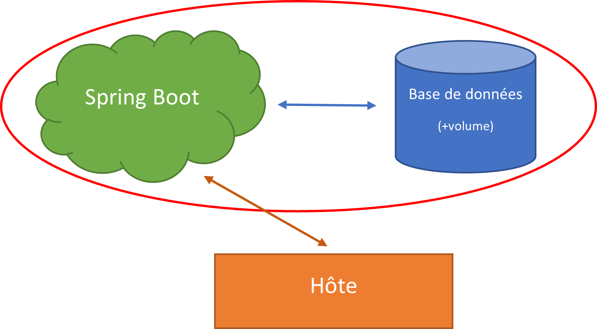

# Sujet TP - Docker
Dans ce TP, vous aller apprendre/revoir comment utiliser Docker et déployer une application web.

<br><br>
## Objectif
Conteneuriser en utilisant les bonnes pratiques une application
1. Utiliser une base de données conteneurisée
2. Créer une image docker de votre application
3. Rendre persiste votre base de données
4. Créer un network pour isoler votre base de données
5. Utiliser un conteneur pour compiler votre projet
<br>

## Prérequis
-	[Docker installé sur votre machine](https://docs.docker.com/engine/install/ "Documentation officielle")

<br><br>
## 1. Utilisez une base de données conteneuriser
Vous pouvez vous aidez du fichier « dockerfile/intes_db.yml » de l’archive « Ressources.rar » disponible sur MyLearningSpace > Intes.

<br><br>
## 2. Conteneurisez votre application
Pour débuter, à l’aide du cours, conteneurisez votre application en utilisant directement l’archive jar fabriquer avec maven.
<br>

Générer un Jar exécutable avec maven : 
```shell
$ mvn install
```
L’archive se trouvera dans le dossier « target » de votre projet.
<br>

Une fois votre archive prête, testez là avant de la conteneuriser :
```shell
$ java -jar ./target/<nom du .jar>
```
 
<br><br>
## 3. Utiliser docker-compose
Un fichier docker-compose vous permettra de créer plus facilement les différents composant de votre projet.
<br>

Ecrivez une fichier docker-compose permettant de lancer votre base de données et votre application dans des conteneurs en respectant l’architecture ci-dessous :


<br><br>
## 4. Ajouter un conteneur de Build
Pendant le cours vous avez vu un moyen de compiler votre application directement lors de la fabrication de votre image docker.
<br>
Reproduisez le même fonctionnement dans votre image docker vous permettant de compiler et exécuter votre application dans un conteneur.

<br><br>
## 5. Bonus : publier votre image docker
Une fois votre image docker prête, vous pouvez la publier sur un registre d’image publique (ex : [DockerHub](https://hub.docker.com/search?q= "hub.docker.com"))

1.	Créer un compte sur Docker Hub (gratuit)
2.	Lancer la commande pour vous authentifier sur votre machine
    ```shell
    $ docker login
    ```

3.	Pousser votre image sur le dépôt d'image<br>
    ```shell
    $ docker push <dépôt>/<nom image>:<tag de l’image>
    ```
    >*(Docker Hub est configurer par défaut, donc pas besoin de le spécifier)*<br>

    Ex:
    ```shell
    $ docker push YourLogin/ImageName:latest
    ```
<br>

Maintenant, n’importe qui peut utiliser votre image docker (y compris vous), en utilisant la commande suivante :
```shell
$ docker pull <dépôt>/<nom image>:<tag de l’image>
```

Ex :
```shell
$ docker pull YourLogin/ImageName:latest
```
