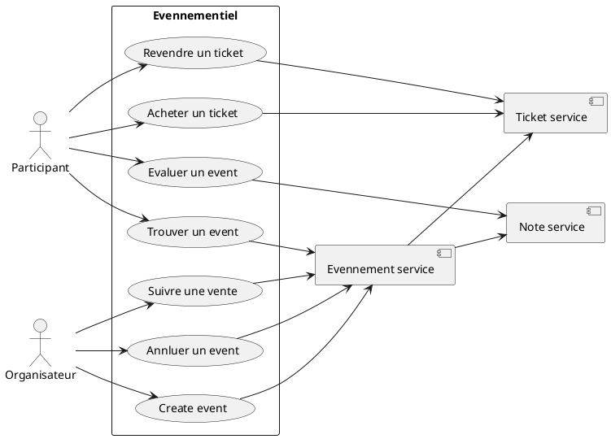
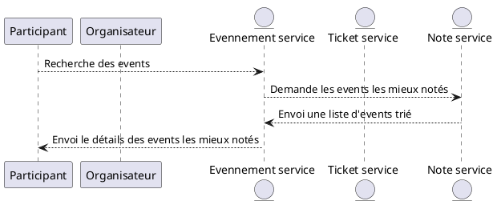
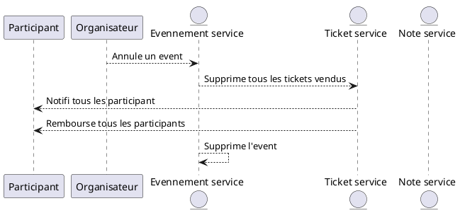
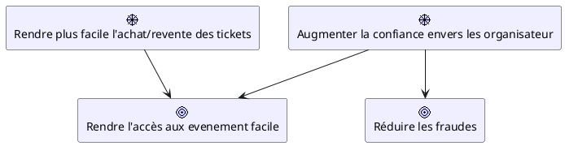
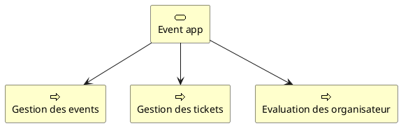
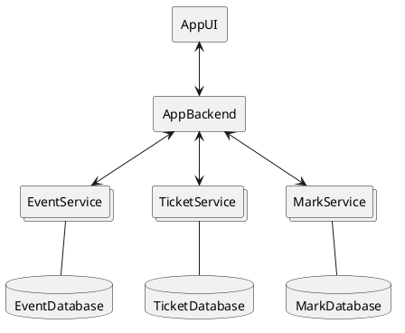

Suejt : application evenementiel

Roles:
- Administrateur
- Organisateur
- Particiant
(- Propriétaire)

Capacités:
- Rendre plus facile l'organisation d'event
  - Oraganiser des events
  - Gérer la vente des tickets
  - Chercher du personel
- Rendre plus facile l'accès à des events
  - Chercher des events
  - Acheter des tickets
  - Revente des tickets
- Augmenter la confiance envers les organisateur
  - Système de votes

# Context
## Global

## Details
### Rechercher les events les mieux notés

### Annuler un event

# Motivations

# Capacity

# Architecture

## EventService
### Entitée
| Event |
| --- |
| __id__: UUID |
| title: String |
| description: String |
| ticketPrice: double |
| organisator: UUID |
| location: Location |
| datetime: LocalDatetime |

| Location |
| --- |
| __address__: String |
| capacity: int |

### Contrat de service
| Method | url | body | Result | Description |
| --- | --- | --- | --- | --- |
| GET | /event | [ ]: Collection\<Event> | 200 ou 204 | List 10 events |
| GET | /event/{id} | {}: Event | 200 ou 404 | Renvoi un event sinon error |
| POST | /event | {}: Event | 201 ou 400 ou 401 | Créer un event |
| PUT | /event | {}: Event | 200 ou 400 ou 401 ou 404 | Modifier un event |
| DELETE | /event/cancel/{id} | | 200 ou 401 ou 404 | Annuler un event |

## TicketService
### Entitée
| Ticket |
| --- |
| __id__: UUID |
| event: Envent |
| participant: UUID |
| paymentDatetime: LocalDatetime |
| creationDatetime: LocalDatetime |

| Event |
| --- |
| __id__: UUID |
| title: String |
| ticketPrice: double |
| organisator: UUID |
| datetime: LocalDatetime |
