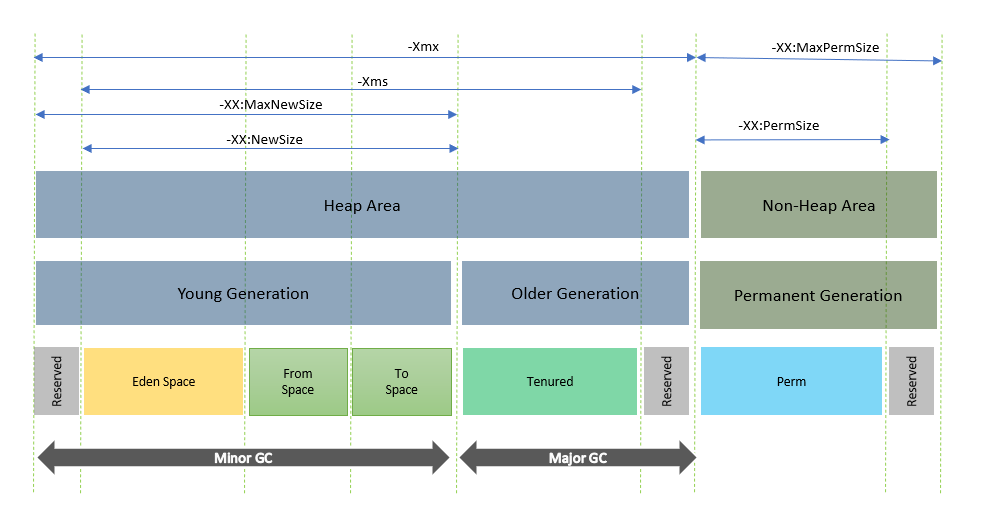
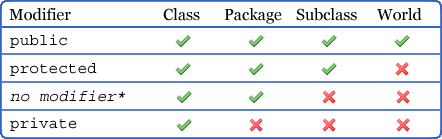

<!-- _header: '' -->
<!-- _footer: '' -->
<!-- _paginate: skip -->
<div class="grid grid-cols-3 grid-flow-col gap-2 text-center">
  <div class="row-span-1">


  </div>

  <div class="row-span-1 row-start-3">
  
  
  </div>
  
  <div class="row-span-3 col-span-3">

  

# Java

### INTES

### 2025-2026

  </div>
  
  <div class="row-span-1 row-start-3">

###### Fabien HAINGUE

  </div>
</div>

---

## Sommaire

- Les origines de Java
  - Histoire
  - Crossplatforme
  - Fonctionnement
- Versions et licenses
  - liste des version avec licence
  - LTS ?
- La programmation orientée objet
  - Vocabulaire
    - classes
    - attributs
    - méthodes
    - membres
    - état
    - comportement
    - instancier (new)
    - notation pointé & référence
    - constructeur
    - variable
  - Les types
    - primitif
    - objet
    - classe
  - Object
    - Instance d'objet
      - constructeur (notion de surcharge et de chainage)
    - Poid
    - auto-référence (this)
    - paramètre de fonction (toujours par copie => si objet alors copie de la référence)
    - Comparaison (ref != état)
    - Méthode commune
      - equals
      - toString
      - ...
    - Modificateur (static / abstract / final)
  - Paquetage (package) & modules
- La visibilité
  - public
  - private
  - protected
{java-poo-steps.jpg}
- La conception orientée objet
  - Accesseurs (getter) / Mutateur (setter)
  - Wrapper
  - Encapsulation
  - Heritage (spécialisation & Polymorphisme & Redéfinition & Substitution & Transtypage)
  - Classe/methode abstraite (exemple: pièces echec)
  - Les types de classe
    - Objet
    - Interface (défintion -> Implémentation)
    - Enum (+constantes)
    - Records
  - Patron de conception - Design pattern
    - Singleton
    - Factory
    - Iterator
    - Adapter
    - Decorator
    - Composite
    - Observer
    - Strategie
    - Visitor
    - ...
    - (more...)[https://refactoring.guru/fr/design-patterns]
  - Approche orienté composant
    - composant (robuste, générique, abstrait)
    - Loi de demeter
- Les APIs du SDK à connaître + Opérateurs & syntaxe
  - condition
  - loop
  - exception
  - try-catch
  - lambda expression
  - type générique (diamond type)
  - StringBuilder
  - Optional
  - Streams
  - Thread
  - Immutable
  - Varargs
  - var
  - Underscores in numeric literals
  - Map.of || List.of
  - instanceof-resource
  - try with resource
  - loops with break/continue
  - Assertions
- Les libs à connaître
  - Swing / JavaFX
  - Apache commons
  - Log4J
  - Jackson / Gson : JSON parsing, ...
- Tooling
  - IDE
  - Debbugueur
  - JMX / JMC / JBang
  - JShell / JBang
  - Maven / Graddle
- JVM & Conteneurisation
  - Garbage collectors
  - Graal VM
- Kotlin
- Conclusion
  - Java en 2025 ?
  - Toujours d'actualité ?

---

<!-- header: 'Java' -->

## Fonctionnement

[Java](<https://fr.wikipedia.org/wiki/Java_(technique)>) est un langage de **programmation orienté objet**.
La version 1.0 de Java est sortie en **1995** par la société [Sun Microsystems](https://fr.wikipedia.org/wiki/Sun_Microsystems).

<br/>

A l'époque, Java se démarquait des autres langages car il était **indépendant de la plateforme matérielle**.
Pour cela Java s'abstrait du système d'exploitation grâce à la Java Virtual Machine, c'est un **langage interprété**.

---
## JVM
---
<!-- header: 'JVM' -->

### Java Virtual Machine

La machine virtuelle Java ou JVM (Java Virtual Machine) est un environnement d'exécution pour applications Java.

C'est un des éléments les plus importants de la plate-forme Java. Elle assure l'indépendance du matériel et du système d'exploitation lors de l'exécution des applications Java. Une application Java ne s'exécute pas directement dans le système d'exploitation mais dans une machine virtuelle qui s'exécute dans le système d'exploitation et propose une couche d'abstraction entre l'application Java et ce système.


> Son mode de fonctionnement est relativement similaire à celui d'un ordinateur :
> elle exécute des instructions qui manipulent différentes zones de mémoire dédiées de la JVM.

--- 

### Compilation et Interpretation

La machine virtuelle ne connaît pas le langage Java : elle ne connaît que le bytecode qui est issu de la compilation de codes sources écrits en Java.


---

### Mémoires

<center>

  

</center>

---

#### PILE
Chaque thread possède sa propre pile qui contient les variables qui ne sont accessibles que par le thread telles que les variables locales, les paramètres, les valeurs de retour de chaque méthode invoquée par le thread.

Seules des données de type primitif et des références à des objets peuvent être stockées dans la pile. La pile ne peut pas contenir d'objets.

La taille d'une pile peut être précisée à la machine virtuelle.

Si la taille d'une pile est trop petite pour les besoins des traitements d'un thread alors une exception de type **StackOverflowError** est levée.

Si la mémoire de la JVM ne permet pas l'allocation de la pile d'un nouveau thread alors une exception de type **OutOfMemoryError** est levée.

---

#### HEAP
Cette zone de mémoire est partagée par tous les threads de la JVM : elle stocke toutes les instances des objets créés.

Tous les objets créés sont obligatoirement stockés dans le tas (heap) et sont donc partagés par tous les threads. Comme les tableaux sont des objets en Java, les tableaux sont stockés dans le tas même si ce sont des tableaux de types primitifs.

La libération de cet espace mémoire est effectuée grâce à un mécanisme automatique implémenté dans la JVM : le ramasse-miettes (garbage collector). Le ou les algorithmes utilisés pour l'implémentation du ramasse-miettes sont à la discrétion du fournisseur de la JVM.

La taille du tas peut être fixe ou variable durant l'exécution de la JVM : dans ce dernier cas, une taille initiale est fournie et cette taille peut grossir jusqu'à un maximum défini.

Si la taille du heap ne permet pas le stockage d'un objet en cours de création, alors une exception de type **OutOfMemoryError** est levée.

---

#### Autres zones mémoire

- Method area
  Cette zone de la mémoire, partagée par tous les threads, stocke la définition des classes et interfaces, le code des constructeurs et des méthodes, les constantes, les variables de classe (variables static) ...

  Comme pour la pile, seules des données de type primitif ou des références à des objets peuvent être stockées dans cette zone de mémoire. La différence est que cette zone de mémoire est accessible à tous les threads. Il est donc important dans un contexte multithread de sécuriser l'accès à une variable static même si elle est de type primitif.


- Code cache
  Cette zone de la mémoire stocke le résultat compilé du code des méthodes. La taille par défaut est généralement de 32Mo.

---

### Garbage collector

Le ramasse-miettes est une fonctionnalité de la JVM qui a pour rôle de gérer la mémoire notamment en libérant celle des objets qui ne sont plus utilisés.

La règle principale pour déterminer qu'un objet n'est plus utilisé est de vérifier qu'il n'existe plus aucun autre objet qui lui fait référence. Ainsi un objet est considéré comme libérable par le ramasse-miettes lorsqu'il n'existe plus aucune référence dans la JVM pointant vers cet objet.

Lorsque le ramasse-miettes va libérer la mémoire d'un objet, il a l'obligation d'exécuter un éventuel **finalizer** définit dans la classe de l'objet. Attention, l'exécution complète de ce finalizer n'est pas garantie : si une exception survient durant son exécution, les traitements sont interrompus et la mémoire de l'objet est libérée sans que le finalizer soit entièrement exécuté.

---

La mise en oeuvre d'un ramasse-miettes possède plusieurs avantages :

- elle améliore la productivité du développeur qui est déchargé de la libération explicite de la mémoire
- elle participe activement à la bonne intégrité de la machine virtuelle : une instruction ne peut jamais utiliser un objet qui n'existe plus en mémoire

---

Mais elle possède aussi plusieurs inconvénients :
- le ramasse-miettes consomme des ressources en terme de CPU et de mémoire
- il peut être à l'origine de la dégradation plus ou moins importante des performances de la machine virtuelle
- le mode de fonctionnement du ramasse miettes n'interdit pas les fuites de mémoires si
- le développeur ne prend pas certaines précautions. Généralement issues d'erreurs de programmation subtiles, ces fuites sont assez difficiles à corriger.

<center>


</center>

---



> Pour plus d'information, vous pouvez vous rendre sur le blog (jmdoudoux.fr)[https://www.jmdoudoux.fr/java/dej/chap-jvm.htm] pour avoir plus d'information su la JVM.
> Ou visionner la conférence (Sous le capot d'une application JVM - Java Flight Recorder)[https://www.youtube.com/watch?v=wa_EtTUx-z0]


---

### Implementation de la JVM

Les spécifications de la machine virtuelle Java définissent :
- Les concepts du langage Java
- Le format des fichiers .class
- Les fonctionnalités de la JVM
- Le chargement des fichiers .class
- Le bytecode
- La gestion des threads et des accès concurrents
- ...

---

Les fonctionnalités de la JVM décrites dans les **spécifications sont abstraites** : elles décrivent les fonctionnalités requises mais ne fournissent aucune implémentation ou algorithme d'implémentation. **L'implémentation est à la charge du fournisseur** de la JVM.

Il existe de nombreuses implémentations de JVM dont les plus connues sont celles de Sun Microsystems/Oracle (HotSpot), IBM (J9), BEA/Oracle (JRockit), Azul (Zing), ...

> **Le respect strict de ces spécifications par une implémentation de la JVM garantit la portabilité et la bonne exécution du bytecode.**

---
<!-- header: 'Editions et versions' -->

## Editions et versions

---

### Editions

Java possède trois éditions

- **J**ava **R**untime **E**nvironment
  Contient uniquement l'environnement d'exécution de programmes Java.
- **J**ava **D**evelopment **K**it
  Contient lui-même le JRE et un ensemble d'outils de développement de programme Java.
- Documentation
  Contient toute la documentation au format HTML des API de Java

---

### Versions

<center>

| version  | release date | end of support |
| :------- | :----------: | :------------: |
| 8 (LTS)  |     2014     |      2030      |
| 11 (LTS) |     2018     |      2026      |
| 17 (LTS) |     2021     |      2029      |
| 21 (LST) |     2023     |      2031      |

</center>

> Conseil: utilisez uniquement les LTS, sauf si vous voulez essayer les nouvelles fonctionnalités du langage.

---
<!-- header: 'POO' -->

## Programmation orienté objet

<center>


</center>
La POO permet de faciliter la vie des développeurs.<br/>
Plus longue à mettre en place, mais permet de garder une bonne structure du code.


---

### Vocabulaire

- **Classes** : Une classe est un modèle ou un plan pour créer des objets. Elle définit un type de données en regroupant des attributs (données) et des méthodes (fonctions).

- **Attributs** : Les attributs sont des variables qui appartiennent à une classe. Ils représentent les données ou l'état d'un objet.

- **Méthodes** : Les méthodes sont des fonctions définies dans une classe. Elles décrivent les comportements ou les actions que les objets de la classe peuvent effectuer.

- **Membres** : Les membres d'une classe sont ses attributs et ses méthodes. Ils constituent les éléments fondamentaux d'une classe.

- **État** : L'état d'un objet est défini par les valeurs de ses attributs à un moment donné. Il représente les données contenues dans l'objet.

---

- **Comportement** : Le comportement d'un objet est défini par ses méthodes. Il décrit ce que l'objet peut faire ou les actions qu'il peut effectuer.

- **Instancier** (new) : Instancier une classe signifie créer un nouvel objet à partir de cette classe en utilisant le mot-clé `new`. Cela alloue de la mémoire pour le nouvel objet.

- **Notation** pointée & référence : La notation pointée est utilisée pour accéder aux membres (attributs et méthodes) d'un objet via une référence. Une référence est une variable qui pointe vers un objet.

- **Constructeur** : Un constructeur est une méthode spéciale d'une classe qui est appelée lors de l'instanciation d'un objet. Il est utilisé pour initialiser les attributs de l'objet.

- **Variable** : Une variable est un espace de stockage nommé qui contient des données. En Java, les variables peuvent être de différents types et peuvent représenter des valeurs primitives ou des références à des objets.

---

### Principes
- **Encapsulation**
  - **Description** : L'encapsulation est le mécanisme qui consiste à regrouper les données (attributs) et les méthodes (fonctions) qui manipulent ces données au sein d'une même unité appelée classe. Elle permet de restreindre l'accès direct à certains composants d'un objet, ce qui est un moyen de prévenir les interférences et les erreurs involontaires.

  - **Utilisation** : En utilisant des modificateurs d'accès comme private, protected, et public, on peut contrôler la visibilité des membres d'une classe. Les méthodes publiques, souvent appelées getters et setters, sont utilisées pour accéder et modifier les attributs privés.

  - **Exemple** :
    ```java
    public class Person {
        private String name; // Attribut privé

        // Getter pour l'attribut name
        public String getName() {
            return name;
        }

        // Setter pour l'attribut name
        public void setName(String name) {
            this.name = name;
        }
    }
    ```

- **Abstraction**
  - **Description** : L'abstraction consiste à cacher les détails complexes et à montrer seulement les fonctionnalités essentielles de l'objet. Cela permet de réduire la complexité et d'augmenter l'efficacité du programme.

  - **Utilisation** : Les classes abstraites et les interfaces sont utilisées pour définir des contrats que les sous-classes doivent implémenter. Cela permet de se concentrer sur ce que l'objet fait plutôt que sur la manière dont il le fait.

  - **Exemple** :
    ```java
    abstract class Animal {
        public abstract void makeSound(); // Méthode abstraite

        public void sleep() {
            System.out.println("Zzz");
        }
    }

    class Dog extends Animal {
        @Override
        public void makeSound() {
            System.out.println("Woof!");
        }
    }
    ```

- Héritage
  - **Description** : L'héritage est un mécanisme qui permet à une classe (appelée sous-classe ou classe dérivée) d'hériter des propriétés et des comportements d'une autre classe (appelée super-classe ou classe de base). Cela favorise la réutilisation du code.

  - **Utilisation** : L'héritage permet de créer une hiérarchie de classes où les sous-classes peuvent ajouter ou modifier des comportements tout en réutilisant le code de la super-classe.

  - **Exemple** :
    ```java
    class Vehicle {
        protected String brand;

        public Vehicle(String brand) {
            this.brand = brand;
        }

        public void displayBrand() {
            System.out.println("Brand: " + brand);
        }
    }

    class Car extends Vehicle {
        private int numberOfDoors;

        public Car(String brand, int numberOfDoors) {
            super(brand);
            this.numberOfDoors = numberOfDoors;
        }

        public void displayDetails() {
            displayBrand();
            System.out.println("Number of doors: " + numberOfDoors);
        }
    }
    ```
  
- Polymorphisme
  - **Description** : Le polymorphisme permet à des objets de différentes classes d'être traités de manière uniforme. Cela signifie qu'une méthode peut avoir plusieurs formes ou comportements en fonction de la classe à laquelle elle appartient.

  - **Utilisation** : Le polymorphisme est souvent réalisé par le biais de la surcharge de méthodes (méthodes avec le même nom mais des paramètres différents) et de l'écrasement de méthodes (redéfinition d'une méthode de la super-classe dans une sous-classe).

  - **Exemple** :
    ```java
    class Animal {
        public void makeSound() {
            System.out.println("Some generic animal sound");
        }
    }

    class Cat extends Animal {
        @Override
        public void makeSound() {
            System.out.println("Meow");
        }
    }

    class Dog extends Animal {
        @Override
        public void makeSound() {
            System.out.println("Woof");
        }
    }

    public class Main {
        public static void main(String[] args) {
            Animal myAnimal = new Cat(); // Polymorphisme
            myAnimal.makeSound(); // Affiche "Meow"

            myAnimal = new Dog(); // Polymorphisme
            myAnimal.makeSound(); // Affiche "Woof"
        }
    }
    ```  

---

### Types Primitifs
  - byte<br/>
    Taille : 8 bits<br/>
    Exemple : ```byte b = 100;```<br/>
    Exemple avec wrapper : ```Byte b = Byte.valueof(100)```
  - short<br/>
    Taille : 16 bits<br/>
    Exemple : ```short s = 1000;```<br/>
    Exemple avec wrapper : ```Short s = Short.valueof(1000)```
  - int<br/>
    Taille : 32 bits<br/>
    Exemple : ```int i = 100000;```<br/>
    Exemple avec wrapper : ```Int i = Int.valueof(100000)```
  - long<br/>
    Taille : 64 bits<br/>
    Exemple : ```long l = 100000L;```<br/>
    Exemple avec wrapper : ```Long l = Long.valueof(100000L)```
  - float<br/>
    Taille : 32 bits<br/>
    Exemple : ```float f = 234.5f;```<br/>
    Exemple avec wrapper : ```Float f = Float.valueof(234.5f)```
  - double<br/>
    Taille : 64 bits<br/>
    Exemple : ```double d = 123.4;```<br/>
    Exemple avec wrapper : ```Double d = Double.valueof(123.4)```
  - char<br/>
    Taille : 16 bits<br/>
    Exemple : ```char c = 'A';```<br/>
    Exemple avec wrapper : ;```;Char c = Char.valueof('A')```
  - boolean<br/>
    Taille : non spécifiée (généralement 1 bit)<br/>
    Exemple : ```boolean bool = true;```<br/>
    Exemple avec wrapper : ```Boolean b = Boolean.valueof(true)```

> Pour chaque type primitif, il existe une classe standard permettant de l'emballer sous forme d'objet.
> Cela vous donnes accès à des méthodes très utiles pour le developpement, mais n'oubliez pas que chaque objet Java à un poid !

---

#### le poids des objects

```java
public class ObjectSizeExample {
    public static void main(String[] args) {
        // Types primitifs
        int primitiveInt = 42;
        double primitiveDouble = 42.0;

        // Wrappers (objets)
        Integer wrappedInt = Integer.valueOf(42);
        Double wrappedDouble = Double.valueOf(42.0);

        // Affichage des valeurs
        System.out.println("Primitive int: " + primitiveInt);
        System.out.println("Primitive double: " + primitiveDouble);
        System.out.println("Wrapped Integer: " + wrappedInt);
        System.out.println("Wrapped Double: " + wrappedDouble);
    }
}
```
**Explication**
Types Primitifs : int et double sont des types primitifs. Ils occupent directement la mémoire nécessaire pour stocker leur valeur (4 octets pour int et 8 octets pour double selon l'architecture de votre système).

Wrappers : Integer et Double sont des objets. En plus de la mémoire nécessaire pour stocker la valeur, ils ont un surcoût mémoire dû aux métadonnées de l'objet (comme l'en-tête de l'objet, qui peut inclure des informations sur le type, le hashcode, etc.).

**Estimation de la Taille Mémoire**
Un objet en Java a généralement un en-tête de 12 à 16 octets (selon l'architecture JVM).
Un Integer ou un Double nécessite donc environ 16 à 24 octets (en-tête + valeur).

---

### Types de Référence
- Classes
  Exemple : ```String str = "Hello";```
- Interfaces
  Exemple : ```List<String> list = new ArrayList<>();```
- Tableaux
  Exemple : ```int[] arr = {1, 2, 3};```
- Enums
  Exemple :
  ```java
  enum Day { MONDAY, TUESDAY }
  Day day = Day.MONDAY;
  ```
- Annotations
  Exemple :
  ```java
  @Override
  public String toString() {
      return "Example";
  }
  ```

---

### Objet
Un objet en Java est une instance d'une classe. Il représente une entité concrète qui encapsule un état (données) et un comportement (méthodes).

#### Instance d'objet
- **Constructeur** : Une méthode spéciale utilisée pour initialiser un nouvel objet. Le constructeur a le même nom que la classe et n'a pas de type de retour.
  - **Surcharge** de constructeur : Une classe peut avoir plusieurs constructeurs avec des listes de paramètres différentes. Cela permet de créer des objets de différentes manières.
  - **Chaînage de constructeurs** : Utilisation du mot-clé ```this()``` pour appeler un autre constructeur de la même classe, permettant ainsi de réutiliser le code d'initialisation.

- **Auto-référence**
  - ```this``` : Un mot-clé qui fait référence à l'instance actuelle de la classe. Il est utilisé pour différencier les attributs de la classe des paramètres de méthode ayant le même nom.

- **Paramètre de fonction**
  - **Passage par copie** : En Java, les paramètres de méthode sont toujours passés par copie. Pour les objets, cela signifie que la référence à l'objet est copiée, pas l'objet lui-même. Ainsi, les modifications apportées à l'objet dans la méthode affectent l'objet original.

- **Comparaison**
  - **Référence vs État** : La comparaison de deux objets peut se faire de deux manières:
    - **Référence** : Utilisation de l'opérateur == pour vérifier si deux références pointent vers le même objet.
    - **État** : Utilisation de la méthode equals() pour vérifier si deux objets ont le même état (mêmes valeurs d'attributs).

- **Méthode commune**
    - ```equals()``` : Méthode utilisée pour comparer l'égalité de deux objets en fonction de leur état.
    - ```toString()``` : Méthode qui retourne une représentation sous forme de chaîne de caractères de l'objet.
    - ```hashCode()``` : Méthode qui retourne un code de hachage pour l'objet, utilisé dans les collections basées sur le hachage comme HashMap.

- **Modificateurs**
  - **Modificateurs d'accès**<br/>
    Ces *access modifiers* permettent de contrôler l'encapsulation et la visibilité des membres d'une classe, ce qui est essentiel pour concevoir des applications robustes et maintenables.

    <center>

      

    </center>

    - ```public``` : Accessible partout.
    - ```private``` : Accessible uniquement dans la classe.
    - ```protected``` : Accessible dans la classe, les sous-classes et le même package.
    - ```package-private``` (par défaut) : Accessible uniquement dans le même package.
  - **Modificateurs de restrictions**<br/>
    Les *non-access modifiers* sont utilisés pour spécifier des comportements ou des propriétés supplémentaires des membres de classe ou des méthodes, sans affecter leur visibilité.
    - ```static``` : Indique qu'un membre (attribut ou méthode) appartient à la classe elle-même plutôt qu'à une instance spécifique de la classe.
    - ```abstract``` : Utilisé pour déclarer une classe ou une méthode qui doit être implémentée par une sous-classe. Une classe abstraite ne peut pas être instanciée.
    - ```final``` : Indique qu'une variable ne peut pas être modifiée après son initialisation, qu'une méthode ne peut pas être redéfinie, ou qu'une classe ne peut pas être héritée.
    - ```synchronized``` : Indique qu'une méthode ou un bloc de code ne peut être exécuté que par un seul thread à la fois.
    - ```volatile``` : Indique qu'une variable est stockée dans la mémoire principale et non dans le cache du thread, garantissant ainsi que les modifications apportées par un thread sont visibles par les autres threads.
    - ```transient``` : Indique qu'un attribut ne doit pas être sérialisé lorsque l'objet est converti en un flux d'octets.
    - ```native``` : Indique qu'une méthode est implémentée dans un langage autre que Java, généralement en C ou C++.

---

> Démo sur les principes de l'encapsulation

---

  <details>

    <summary>Exemple complet</summary>

    ```java
    // Classe de base abstraite
    abstract class Animal {
        private String name;
        private static int count = 0; // Variable statique pour compter les instances

        // Constructeur
        public Animal(String name) {
            this.name = name;
            count++;
        }

        // Surcharge de constructeur
        public Animal() {
            this("Unknown"); // Chaînage de constructeurs
        }

        // Méthode abstraite
        public abstract void makeSound();

        // Méthode statique
        public static int getCount() {
            return count;
        }

        // Redéfinition/Spécialisation de la méthode toString
        @Override
        public String toString() {
            return "Animal: " + name;
        }

        // Redéfinition/Spécialisation de la méthode equals
        @Override
        public boolean equals(Object obj) {
            if (this == obj) return true;
            if (obj == null || getClass() != obj.getClass()) return false;
            Animal animal = (Animal) obj;
            return name.equals(animal.name);
        }

        // Mutateur (getter) et Accesseur (setter)
        public String getName() {
            return name;
        }

        public void setName(String name) {
            this.name = name;
        }
    }

    // Classe dérivée
    class Dog extends Animal {
        private int age;
        private final String breed;

        // Constructeur
        public Dog(String name, int age, String breed) {
            super(name); // Appel du constructeur de la classe parente
            this.age = age;
            this.breed = breed;
        }

        // Implémentation de la méthode abstraite
        @Override
        public void makeSound() {
            System.out.println("Woof!");
        }

        // Méthode pour afficher les détails
        public void displayDetails() {
            System.out.println("Name: " + getName() + ", Age: " + age + ", Breed: " + breed);
        }

        // Méthode pour modifier l'âge
        public void setAge(int age) {
            this.age = age;
        }
    }

    public class Main {
        public static void main(String[] args) {
            // Création d'instances
            Dog dog1 = new Dog("Buddy", 3, "Golden Retriever");
            Dog dog2 = new Dog("Max", 5, "Bulldog");

            // Utilisation de méthodes
            dog1.makeSound();
            dog2.makeSound();

            // Affichage des détails
            dog1.displayDetails();
            dog2.displayDetails();

            // Comparaison d'objets
            System.out.println("dog1 equals dog2: " + dog1 == dog2);
            Dog dog3 = dog1;
            System.out.println("dog1 equals dog3: " + dog1 == dog3);

            // Comparaison d'objets
            System.out.println("dog1 equals dog2: " + dog1.equals(dog2));

            // Utilisation de la méthode statique
            System.out.println("Total animals: " + Animal.getCount());

            // Modification de l'âge
            dog1.setAge(4);
            dog1.displayDetails();

            // Utilisation de toString
            System.out.println(dog1.toString());
        }
    }
    ```

  </details>

---

<center>


</center>

---


---

## Syntaxe résumée

<center>


</center>

---
<!-- header: 'COO' -->

## Conception orientée objet

### Diagramme de classe

<center>


</center>

### Patron de conception

- Singleton
- Factory
- Iterator
- Adapter
- Decorator
- Composite
- Observer
- Strategie
- Visitor
- ...

> Vous pouvez vous rendre sur le site (refactoring.guru)[https://refactoring.guru/fr/design-patterns] pour identifier/comprendre le patron de conception qui pourrait vous aider.

---

## Programmation orienté composant
La programmation orientée composant (POC) consiste à utiliser une approche modulaire de l'architecture d'un projet informatique, ce qui permet d'assurer au logiciel une meilleure lisibilité et une meilleure maintenance. Les développeurs, au lieu de créer un exécutable monolithique, se servent de briques réutilisables

La POC n'est pas sans similitudes avec la POO, puisqu'elle revient à utiliser une approche objet, non pas au sein du code, mais au niveau de l'architecture générale du logiciel.

La POC est particulièrement pratique pour le travail en équipe et permet d'industrialiser la création de logiciels.

### Composant
Les caractéristiques clés d'un composant incluent :
- Encapsulation : Un composant cache ses détails d'implémentation et expose uniquement les interfaces nécessaires pour interagir avec lui.
- Réutilisabilité : Les composants sont conçus pour être utilisés dans différents contextes ou applications.
- Indépendance : Les composants peuvent être développés et déployés indépendamment les uns des autres.
- Interopérabilité : Les composants peuvent interagir avec d'autres composants via des interfaces standardisées.

### Loi de demeter

<center>


</center>

---

## Tips

### Exception

```java
public class FinallyExample {
    public static void main(String[] args) {
        /*   Try-catch   */
        try {
            int result = 10 / 0; // Peut lever une ArithmeticException
        } catch (ArithmeticException e) {// Permet d'attraper l'exeption et d'exécuter du code uniquement en cas ArithmeticException
            System.out.println("Division par zéro: " + e.getMessage());
        }  catch (Exception e) {// Permet d'attraper touts les autres types d'exeption et d'exécuter du code uniquement dans ce cas
            System.out.println("Division par zéro: " + e.getMessage());
        } finally { // Permet d'exécuter du code dans tout les cas
            System.out.println("Ce bloc est toujours exécuté.");
        }

        /*   Try-with-resources   */
        try (int result = 10 / 0) {
            // Utilisation de la ressource
        } catch (ExceptionType e) {
            // Gestion de l'exception
        }

    }
}
```

### Instanceof
```java
  if (myAnimal instanceof Dog) {
      Dog myDog = (Dog) myAnimal; // Cast sûr
      myDog.bark(); // Affiche "Woof!"
  }
```

### StringBuilder

```
StringBuilder builder = new StringBuilder();
for (String address : addresses) {
  builder.append(address).append("\n");
}
String csv = builder.toString();
```

### Optional

```java
Optional<Object> wrapper = Optional.of(obj);
wrapper.ifPresent(object -> System.out.println(object));
Object resultObject = wrapper.orElseThrow(() -> new EntityNotFoundException());
```
---
### Stream

```java
stream.filter(obj -> obj != null).map(obj -> obj.hashCode()).collect(Collectors.toList());
```

### Remote debug

JVM options:
```
-agentlib:jdwp=transport=dt_socket,server=y,suspend=n,address=5005
```

---

<!-- header: 'Maven / Gradle' -->

## Maven / Gradle

Outils pour construire vos applications Java et autres

- Automatiser certaines tâches : compilation, tests unitaires et déploiement des applications qui composent le projet
- Gérer des dépendances vis-à-vis des bibliothèques nécessaires au projet
- Générer des documentations concernant le projet

<center>

|  **Maven**   |      **Gradle**       |
| :----------: | :-------------------: |
|    Simple    | Performant / Flexible |
| Fichier .xml |    Fichier .gradle    |

</center>

---

```java
public class Hello {
    public static void main (String[ ] args){
        System.out.println("Hello");
    }
}
```
```java
public class HelloParRéférence {
    public static void main (String[ ] args){
        Arrays.asList("Hello").foreach(System.out::println);
    }
}
```


---
## Sources

- [jmdoudoux.fr](https://www.jmdoudoux.fr/java/dej/chap-presentation.htm)
- [developpez.com](https://java.developpez.com/)