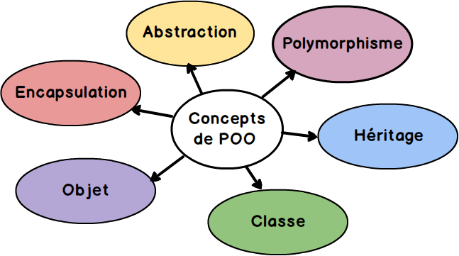
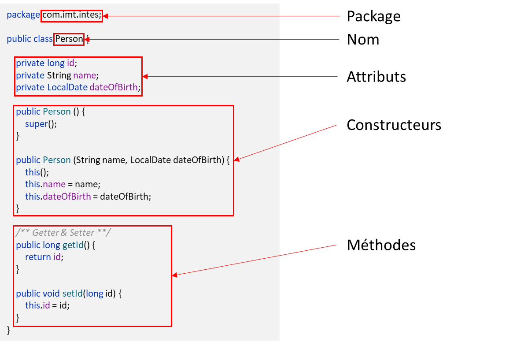

<!-- _header: '' -->
<!-- _footer: '' -->
<!-- _paginate: skip -->
<div class="grid grid-cols-3 grid-flow-col gap-2 text-center">
  <div class="row-span-1">


  </div>

  <div class="row-span-1 row-start-3">
  
  
  </div>
  
  <div class="row-span-3 col-span-3">

  

# Java

### INTES

### 2025-2026

  </div>
  
  <div class="row-span-1 row-start-3">

###### Fabien HAINGUE

  </div>
</div>

---

## Sommaire

- Les origines de Java
  - Histoire
  - Crossplatforme
  - Fonctionnement
- Versions et licenses
  - liste des version avec licence
  - LTS ?
- La programmation orientée objet
  - Vocabulaire
    - classes
    - attributs
    - méthodes
    - membres
    - état
    - comportement
    - instancier (new)
    - notation pointé & référence
    - constructeur
    - variable
  - Les types
    - primitif
    - objet
    - classe
  - Object
    - Instance d'objet
      - constructeur (notion de surcharge et de chainage)
    - Poid
    - auto-référence (this)
    - paramètre de fonction (toujours par copie => si objet alors copie de la référence)
    - Comparaison (ref != état)
    - Méthode commune
      - equals
      - toString
      - ...
    - Modificateur (static / abstract / final)
  - Paquetage (package) & modules
- La visibilité
  - public
  - private
  - protected
{java-poo-steps.jpg}
- La conception orientée objet
  - Accesseurs (getter) / Mutateur (setter)
  - Wrapper
  - Encapsulation
  - Heritage (spécialisation & Polymorphisme & Redéfinition & Substitution & Transtypage)
  - Classe/methode abstraite (exemple: pièces echec)
  - Les types de classe
    - Objet
    - Interface (défintion -> Implémentation)
    - Enum (+constantes)
    - Records
  - Patron de conception - Design pattern
    - Singleton
    - Factory
    - Iterator
    - Adapter
    - Decorator
    - Composite
    - Observer
    - Strategie
    - Visitor
    - ...
    - (more...)[https://refactoring.guru/fr/design-patterns]
  - Approche orienté composant
    - composant (robuste, générique, abstrait)
    - Loi de demeter
- Les APIs du SDK à connaître + Opérateurs & syntaxe
  - condition
  - loop
  - exception
  - try-catch
  - lambda expression
  - type générique (diamond type)
  - StringBuilder
  - Optional
  - Streams
  - Thread
  - Immutable
  - Varargs
  - var
  - Underscores in numeric literals
  - Map.of || List.of
  - instanceof-resource
  - try with resource
  - loops with break/continue
  - Assertions
- Les libs à connaître
  - Swing / JavaFX
  - Apache commons
  - Log4J
  - Jackson / Gson : JSON parsing, ...
- Tooling
  - IDE
  - Debbugueur
  - JMX / JMC / JBang
  - JShell / JBang
  - Maven / Graddle
- JVM & Conteneurisation
  - Garbage collectors
  - Graal VM
- Kotlin
- Conclusion
  - Java en 2025 ?
  - Toujours d'actualité ?

---

<!-- header: 'Java' -->

## Fonctionnement

[Java](<https://fr.wikipedia.org/wiki/Java_(technique)>) est un langage de **programmation orienté objet**.
La version 1.0 de Java est sortie en **1995** par la société [Sun Microsystems](https://fr.wikipedia.org/wiki/Sun_Microsystems).

<br/>

A l'époque, Java se démarquait des autres langages car il était **indépendant de la plateforme matérielle**.
Pour cela Java s'abstrait du système d'exploitation grâce à la Java Virtual Machine.


---

## Editions

Java possède trois éditions

- **J**ava **R**untime **E**nvironment
  Contient uniquement l'environnement d'exécution de programmes Java.
- **J**ava **D**evelopment **K**it
  Contient lui-même le JRE et un ensemble d'outils de développement de programme Java.
- Documentation
  Contient toute la documentation au format HTML des API de Java

---

## Versions

<center>

| version  | release date | end of support |
| :------- | :----------: | :------------: |
| 8 (LTS)  |     2014     |      2030      |
| 11 (LTS) |     2018     |      2026      |
| 17 (LTS) |     2021     |      2029      |
| 21 (LST) |     2023     |      2031      |

</center>

> Conseil: utilisez uniquement les LTS, sauf si vous voulez essayer les nouvelles fonctionnalités du langage.

---

## Programmation orienté objet

<center>



</center>
La POO permet de faciliter la vie des développeurs.<br/>
Plus longue à mettre en place, mais permet de garder une bonne structure du code.

---

## Syntaxe

<center>



</center>

---

## Tips

### StringBuilder

```java
StringBuilder builder = new StringBuilder();
for (String address : addresses) {
  builder.append(address).append("\n");
}
String csv = builder.toString();
```

### Optional

```java
Optional<Object> wrapper = Optional.of(obj);
wrapper.ifPresent(object -> System.out.println(object));
Object resultObject = wrapper.orElseThrow(() -> new EntityNotFoundException());
```
---
### Stream

```java
stream.filter(obj -> obj != null).map(obj -> obj.hashCode()).collect(Collectors.toList());
```

### Remote debug

JVM options:
```
-agentlib:jdwp=transport=dt_socket,server=y,suspend=n,address=5005
```

---

<!-- header: 'Maven / Gradle' -->

## Maven / Gradle

Outils pour construire vos applications Java et autres

- Automatiser certaines tâches : compilation, tests unitaires et déploiement des applications qui composent le projet
- Gérer des dépendances vis-à-vis des bibliothèques nécessaires au projet
- Générer des documentations concernant le projet

<center>

|  **Maven**   |      **Gradle**       |
| :----------: | :-------------------: |
|    Simple    | Performant / Flexible |
| Fichier .xml |    Fichier .gradle    |

</center>

---

```java
public class Hello {
    public static void main (String[ ] args){
        System.out.println("Hello");
    }
}
```
```java
public class HelloParRéférence {
    public static void main (String[ ] args){
        Arrays.asList("Hello").foreach(System.out::println);
    }
}
```


---
## Sources

- [jmdoudoux.fr](https://www.jmdoudoux.fr/java/dej/chap-presentation.htm)
- [developpez.com](https://java.developpez.com/)