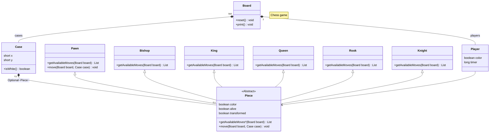

```mermaid
classDiagram
  note "Chess game"
  class Board {
    +reset() void
    +print() void
  }
  Board "8x8" *-- Case : cases
  Board "2" *-- Player : players
  class Case {
    short x
    short y
    +isWhite() boolean
  }
  Case "0,1" *-- "0,1" Piece : Optional~Piece~
  <<Abstract>> Piece 
  class Piece {
    boolean color
    boolean alive
    boolean transformed

    +getAvailableMoves*(Board board) List<Case>
    +move(Board board, Case case) void
  }
  class Pawn {
    +getAvailableMoves(Board board) List<Case>
    +move(Board board, Case case) void
  }
  Pawn <|-- Piece
  class Bishop {
    +getAvailableMoves(Board board) List<Case>
  }
  Bishop <|-- Piece
  class King {
    +getAvailableMoves(Board board) List<Case>
  }
  King <|-- Piece
  class Queen {
    +getAvailableMoves(Board board) List<Case>
  }
  Queen <|-- Piece
  class Rook {
    +getAvailableMoves(Board board) List<Case>
  }
  Rook <|-- Piece
  class Knight {
    +getAvailableMoves(Board board) List<Case>
  }
  Knight <|-- Piece

  class Player {
    boolean color
    long timer
  }
  Player --> Piece

```