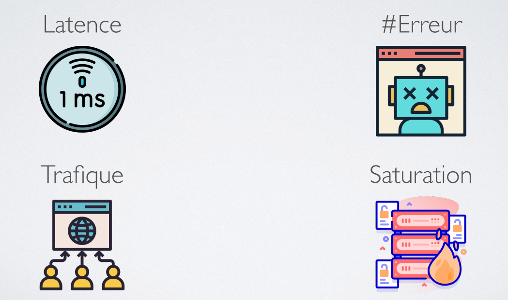
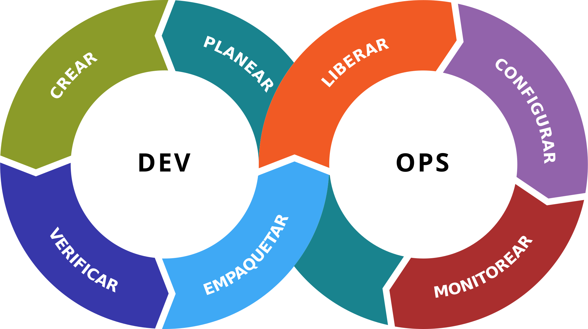
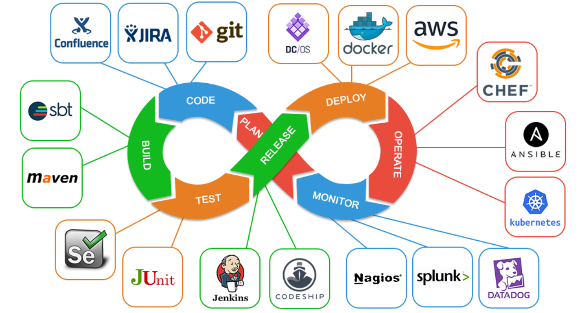
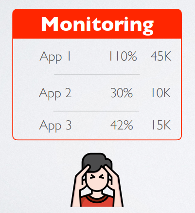
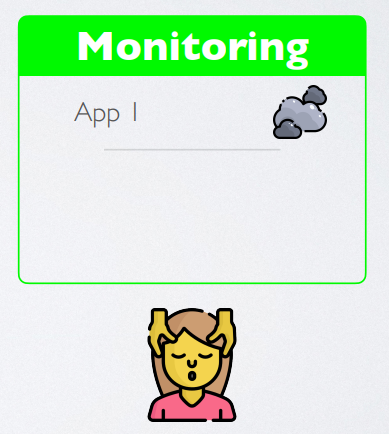
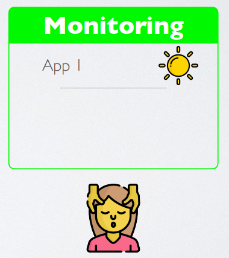
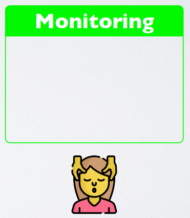
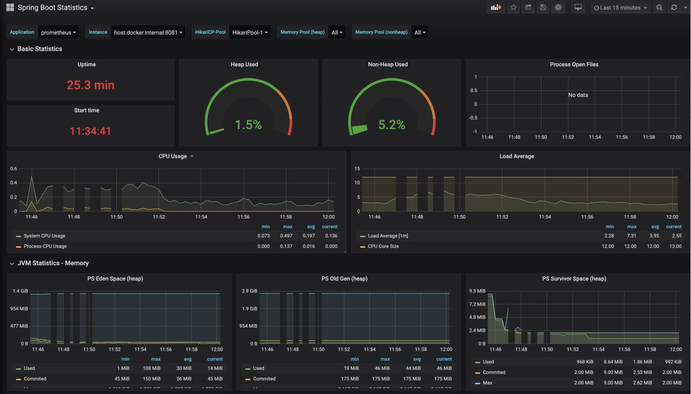
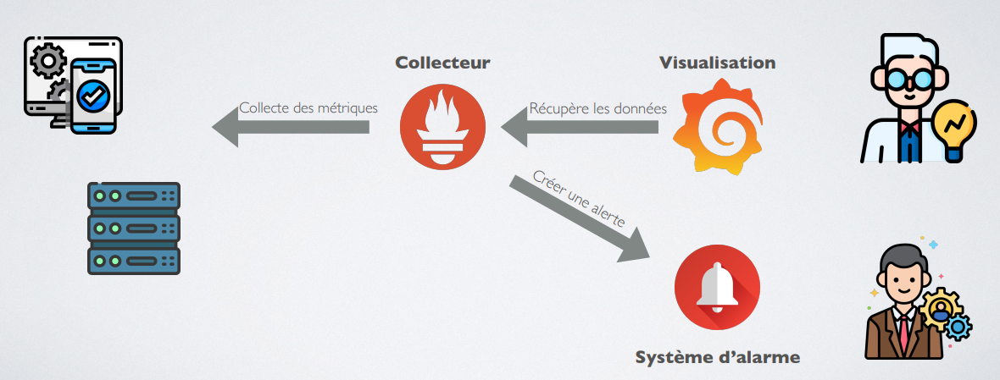

<!-- _header: '' -->
<!-- _footer: '' -->
<!-- _paginate: skip -->

  

  

  

  
  
  

  
  

# Monitoring

### INTES

### 2023-2024

  

  
  

###### Fabien HAINGUE

  

---

## Monitoring
### Supervision
- Etat actuel
- Alertes
### Métrologie
- Historique de mesure

---

## Golden signals

---

### Latence
Le temps nécessaire pour traiter une demande.

Il est important de faire la distinction entre la latence des requêtes réussies et la latence des requêtes échouées.
Par exemple, une erreur HTTP 500 déclenchée en raison d'une perte de connexion à une base de données ou à un autre backend critique peut être traitée très rapidement ; cependant, comme une erreur HTTP 500 indique une requête ayant échoué, la prise en compte de 500 secondes dans votre latence globale peut entraîner des calculs trompeurs. En revanche, une erreur lente est encore pire qu’une erreur rapide !

Par conséquent, il est important de suivre la latence des erreurs, plutôt que de simplement filtrer les erreurs.

---

### Nombre d'erreurs
Le taux de requêtes qui échouent, soit explicitement (par exemple, HTTP 500), implicitement (par exemple, une réponse réussie HTTP 200, mais couplée à un contenu incorrect), ou par stratégie (par exemple, « Si vous vous êtes engagé à une seconde temps de réponse, toute requête supérieure à une seconde est une erreur").

Lorsque les codes de réponse du protocole sont insuffisants pour exprimer toutes les conditions de défaillance, des protocoles secondaires (internes) peuvent être nécessaires pour suivre les modes de défaillance partielle.

La surveillance de ces cas peut être radicalement différente : la capture des HTTP 500 au niveau de votre équilibreur de charge peut faire un travail décent en interceptant toutes les requêtes complètement échouées, tandis que seuls les tests système de bout en bout peuvent détecter que vous diffusez le mauvais contenu.

---

### Trafic
Mesure de la quantité de demande vers votre système, mesurée dans une métrique de haut niveau spécifique au système.

Pour un service Web, cette mesure correspond généralement au nombre de requête HTTP par seconde, éventuellement réparties selon la nature des requêtes (par exemple, contenu statique ou dynamique).
Pour un système de streaming audio, cette mesure peut se concentrer sur le débit d'E/S du réseau ou sur les sessions simultanées. Pour un système de stockage clé-valeur, cette mesure peut être constituée de transactions et de récupérations par seconde.

---

### Saturation
Dans quelle mesure votre service est-il « complet ». Une mesure de la fraction de votre système, mettant l'accent sur les ressources les plus contraintes (par exemple, dans un système à mémoire limitée, afficher la mémoire ; dans un système à contraintes d'E/S, afficher les E/S).
Notez que les performances de nombreux systèmes se dégradent avant d'atteindre une utilisation à 100 %, il est donc essentiel d'avoir un objectif d'utilisation.

> Dans les systèmes complexes, la saturation peut être complétée par une mesure de charge de plus haut niveau : votre service peut-il gérer correctement le double du trafic, gérer seulement 10 % de trafic en plus ou encore moins de trafic qu'il n'en reçoit actuellement ?
>
> Pour les services très simples qui n'ont aucun paramètre modifiant la complexité de la requête (par exemple, "Donnez-moi une occasion" ou "J'ai besoin d'un entier monotone globalement unique") et qui changent rarement de configuration, une valeur statique provenant d'un test de charge peut être adéquate.
>
> Cependant, comme indiqué dans le paragraphe précédent, la plupart des services doivent utiliser des signaux indirects, tels que l'utilisation du processeur ou la bande passante du réseau, dont la limite supérieure est connue. Les augmentations de latence sont souvent un indicateur avancé de saturation. Mesurer votre temps de réponse au 99e percentile sur une petite fenêtre (par exemple, une minute) peut donner un signal très précoce de saturation.
> Enfin, la saturation concerne également les prédictions de saturation imminente, telles que « Il semble que votre base de données remplira son disque dur dans 4 heures ».

---

## DevOps

---

### Technologies

---

## Minimalisme & pertinence
### Mauvais monitoring

- Liste complètes
- Valeurs incohérentes
- valeurs non significatives

---

## Minimalisme & pertinence
### Bon monitoring

- Mise en avant d'éléments 
- Icône simple

---

## Minimalisme & pertinence
### Bon monitoring

- Mise en avant d'éléments 
- Icône simple

---

## Minimalisme & pertinence
### Bon monitoring

- Mise en avant d'éléments 
- Icône simple

---

## Monitoring détaillé

- Adapté à la technologie
- Fait par et pour les experts

---

## Prometheus
- Collecter des métriques
- Exposer ses données collectées
- Envoyer des alarmes

---

## Grafana
- Visualiser des données

---

## Monitoring

---

## Exemple complet

[Thales: Architecture pour monitorer des cluste K8S](https://doc.kaas.thalesdigital.io/docs/Features/grafana)

[Vidéo de présentation](https://www.youtube.com/watch?v=clTicMiwBCk)