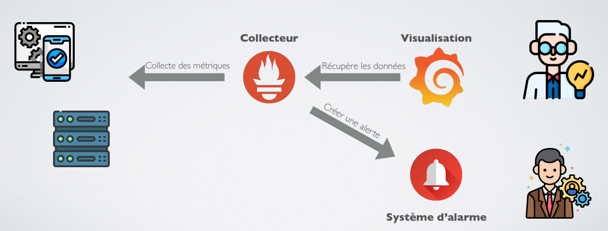

# Sujet TP – Monitoring

Dans ce TP, vous aller apprendre à utiliser déployer un monitoring.

<br><br>

## Objectif

Monitorez vos application NestJs et Spring-Boot.

- Monitorez vos application
  - Adaptez vos applications pour **exposer des métriques**
  - Utiliser l'API ProductService

- Mettez en place un monitoring
  - Ecrivez un docker-compose permettant de lancer Prometheus/Grafana/AlertManager et vos applications
  - Adaptez la configuration de Prometheus pour **collecter vos les métriques**
  - Créer un dashboard global et un technique par application
  - Créer des alertes
  - Fiabilisez vos services

---

## 1. Prérequis

Pour démarrer, vous devez avoir un composant à monitorer.
Pour cela, 2 options:

- Utiliser l'API Product Service example ([docker hub](https://hub.docker.com/r/haingue/product_service))
- Utiliser votre propre application

### Option 1: Lancer une application web

Vous pouvez utiliser l'image docker **haingue/product_service** pour démarrer une simple API Web codé avec Spring Boot.

```yml
version: '3.7'
services:
  product_service:
    image: haingue/product_service
    ports:
      - 8085:8080
    restart: always
```

Rendez-vous sur `http://localhost:8085/swagger-ui/index.html` pour tester l'API

### Option 2: Adaptez et utilisez vos applications

#### Spring-Boot

- Ajoutez Prometheus à vos dépendance pour générer automatiquement des métriques
  ```xml
      <dependency>
  		<groupId>org.springframework.boot</groupId>
  		<artifactId>spring-boot-starter-actuator</artifactId>
  	</dependency>
  	<dependency>
  		<groupId>io.micrometer</groupId>
  		<artifactId>micrometer-registry-prometheus</artifactId>
  		<scope>runtime</scope>
  	</dependency>
  ```
- Ajouter une métrique static pour mieux identifier votre application

  ```properties
  # Metrics parameters (actuator)
  management.endpoints.web.exposure.include=*
  management.endpoint.health.show-details=when_authorized

  # Prometheus tags
  management.metrics.tags.application=<Nom de l'application>
  ```

[Baeldung documentation](https://www.baeldung.com/spring-boot-self-hosted-monitoring)

[Medium tutoriel (custom metrics)](https://mehmetozkaya.medium.com/monitor-spring-boot-custom-metrics-with-micrometer-and-prometheus-using-docker-62798123c714)

#### Nestjs

- Installation de nestjs-prometheus
  ```shell
  npm install @willsoto/nestjs-prometheus prom-client
  ```
- Configurer Nestjs
    <center>
        app.module.ts
    </center>

  ```TypeScript
  import { PrometheusModule } from '@willsoto/nestjs-prometheus';

  Module({
      imports: [
          ...
          PrometheusModule.register(),
          ...
      ]
  })
  export class AppModule {}
  ```

[Github](https://github.com/willsoto/nestjs-prometheus)

[Medium tutoriel](https://medium.com/cp-massive-programming/how-to-monitor-a-distributed-system-with-a-nestjs-application-edb86d170d4e)

---

## Mettez en place votre monitoring

<center>



</center>

---

## 2. Prometheus

Pour commencer, le composant le plus important de votre architecture est l'outils qui collectera et centralisera vos mesures.

Pour cela, nous allons utiliser [Prometheus](https://prometheus.io/docs/introduction/overview/) !

[Prometheus tutoriel](https://prometheus.io/docs/prometheus/latest/getting_started/)

[Prometheus documentation](https://prometheus.io/docs/prometheus/latest/configuration/configuration/)

### 2.1. Instanciez Prometheus

D'après la [documentation officiel de Prometheus](https://prometheus.io/docs/prometheus/latest/installation/), vous pouvez utiliser un conteneur pour créer votre première instance.

<details>
<summary>Cliquez pour voir une aide</summary>

```yml
prometheus:
image: prom/prometheus:v2.36.2
ports:
  - 9090:9090
```

</details>

### 2.2. Configurez Prometheus

Vous devez configurer Prometheus pour monitorer votre application et ajuster certains comportement.

<details>
<summary>Cliquez pour voir une aide</summary>

Il faut créer un fichier [prometheus.yml](prometheus/conf/prometheus.yml) et le partager avec le conteneur.
Dans ce fichier, il y aura toutes les propriétés de Prometheus dont les cybles à monitorer.

</details>

### 2.3. Testez Prometheus

Rendez-vous sur l'interface de Prometheus et essayez de visualiser certaines mesures de votre applications.

<details>
<summary>Cliquez pour voir une aide</summary>
Pour afficher le nombre de requête avec un code 2xx par server:
sum(http_server_requests_seconds_count{status=~"2.."}) by (instance)
</details>

### 2.4. Bonus

- Rendez votre conteneur persistent

---

## 3. Grafana

Maintenant que vous collectez des mesures, il vous faut les visualiser.
Pour cela nous allons utiliser [Grafana](https://grafana.com/) !

[Grafana documentation](https://grafana.com/docs/grafana/latest/setup-grafana/installation/docker/)

### 3.1. Instanciez Grafana

D'après la [documentation officiel de Grafana](https://grafana.com/docs/grafana/latest/setup-grafana/installation/), vous pouvez utiliser un conteneur pour créer votre première instance.

<details>
<summary>Cliquez pour voir une aide</summary>

```yml
grafana:
  image: grafana/grafana
  depends_on:
    - prometheus
  ports:
    - 3000:3000
```

</details>

### 3.2. Créez votre premier dashboard
Pour créer un dashboard, il suffit de cliquer sur le bouton `+` puis sur `New dashboard`.
Ensuite, vous pouvez soit créer une Row, une Visualization ou importer des éléments d'autre personne.

- Row: élément permettant de grouper des visualizations
- Visualization: éléments visuel permettant d'afficher des données et de définir des alertes

> Je vous laisse regarder la démo et la documentation officiel pour aller plus loin:
> [Grafana dashboards](https://grafana.com/docs/grafana/latest/dashboards/)
> [Grafana alerting](https://grafana.com/docs/grafana/latest/alerting/)

### 3.3. Importez un dashboard détaillé
Rendez-vous sur [Grafana labs](https://grafana.com/grafana/dashboards/) pour pouvoir trouver le dashboard qu'il vous faut ([exemple](https://grafana.com/grafana/dashboards/3662-prometheus-2-0-overview/)).

> Pour importer un dashboard, il suffit de copier son identifiant dans votre grafana `DashBoard > New > Import`.

### 3.4. Exportez votre dashboard
Depuis l'édition d'un dashboard, vous pouvez le partager en cliquant sur le bouton de partage.

> Cela permet de générer un fichier JSON, ce fichier peut être placé sur Git et automatiquement importer lors de la création d'une instance Grafana. 

### 3.5. Configurer Grafana
Si vous voulez configurer automatiquement Grafana, vous pouvez donner au conteneurs des fichiers YAML pour préremplir l'application (datasource, dashboard, ...)

Pour cele, il vous suffit de remplacer les fichiers ce trouvant dans le dossier _/etc/grafana/provisioning/_ du conteneur.

---

## 4. AlertManager

A ce stade, vous monitorez vos application mais n'être pas alarmé en cas de problème.
Pour cela nous allons utiliser [AlertManager](https://github.com/prometheus/alertmanager) !


### 4.1. Instanciez AlertManager
[Docker Hub](https://hub.docker.com/r/prom/alertmanager/)

### 4.2. Configurez AlertManager
[AlertManager documentation](https://prometheus.io/docs/alerting/latest/configuration/)

### 4.3. Configurez Prometheus
Sachez que Prometheus peut envoyer des alertes à différents type de système et que vous êtes libre de créer n'importe quelle alerte.

#### 4.3.1. Configurer les cannaux de communication
<details>
<summary>Cliquez pour voir un exemple</summary>

prometheus.yml
```yml
# alert
alerting:
  # Nom du d'alerte
  alertmanagers:
  - scheme: http
    static_configs:
    - targets:
      # URL du serveur cible
      - "alertmanager:9093"
```
</details>

#### 4.3.2. Configurer les alertes
<details>
<summary>Cliquez pour voir un exemple</summary>

alert.rules
```yml
  # Alert for any instance that is unreachable for >2 minutes.
  - alert: service_down
    # Expression évaluer pour déclencher l'alarme
    expr: up == 0
    # Délai d'évaluation
    for: 2m
    labels:
      # Niveau de sévérité
      severity: page
    annotations:
      # Contenu du message d'alerte
      summary: "Instance {{ $labels.instance }} down"
      description: "{{ $labels.instance }} of job {{ $labels.job }} has been down for more than 2 minutes."
```
</details>

### 4.4. Testez AlertManager
[TODO]

> Vous pouvez utiliser l'exemple de ce repository si vous avez des difficultés à démarrer.
> <details>
> <summary>Cliquez pour voir une aide complète</summary>
> 
> ```shell
> docker-compose -f ./monitoring/docker-compose.yml up -d
> ```
> 
> </details>

---

## 5. Déployez vos applications en même temps que votre monitoring
Pour gérer le monitoring de vos applications, plusieurs possibilitées s'offre à vous:
- Créer un monitoring complet pour toutes vos applications et gérer la configuration indépendament de votre projet/équipe
- Créer un monitoring complet par application
- Ajouter uniquement une instance prometheus pour chaque application

### 5.1 Ajoutez Prometheus/Grafana/AlertManager à vos docker-compose
Vous pouvez ajouter toutes vos configuration dans le repository Git de votre projet, ensuite vous pouvez ajouter les services necessaire (conteneurs) à votre docker-compose ou autre solution permettant de déployer votre application.

<details>
<summary>Cliquer pour voir une solution</summary>

```yml
version: '3.7'

# Permet de rendre vox conteneurs persistents
volumes:
  prometheus_data: {}
  grafana_data: {}

services:
  # Conteneur de Prometheus
  prometheus:
    image: prom/prometheus:v2.36.2
    volumes:
      # Permet de configurer automatiquement Prometheus
      - ./prometheus/conf/:/etc/prometheus/
      # Permet de garder les données de collectées
      - prometheus_data:/prometheus
    command:
      - '--config.file=/etc/prometheus/prometheus.yml'
      - '--storage.tsdb.path=/prometheus'
      - '--web.console.libraries=/usr/share/prometheus/console_libraries'
      - '--web.console.templates=/usr/share/prometheus/consoles'
    ports:
      - 9090:9090
    links:
      - alertmanager:alertmanager
    # Permet de redémarrer le conteneur en cas de crash
    restart: always

  # Conteneur de AlertManager
  alertmanager:
    image: prom/alertmanager
    ports:
      - 9093:9093
    volumes:
      # Permet de configurer automatiquement Prometheus
      - ./alertmanager/conf/:/etc/alertmanager/
    command:
      - '--config.file=/etc/alertmanager/config.yml'
      # Permet de préciser l'emplacement des données d'AlertManager (il suffit de l'ajouter au volume pour les rendre persistentes)
      - '--storage.path=/alertmanager'
    # Permet de redémarrer le conteneur en cas de crash
    restart: always

  # Conteneur de Grafana
  grafana:
    image: grafana/grafana
    user: '472'
    depends_on:
      - prometheus
    ports:
      - 3000:3000
    volumes:
      # Permet de garder la configurer de Grafana
      - grafana_data:/var/lib/grafana
      # Permet d'importer automatiquement vos dashboard
      - ./grafana/provisioning/:/etc/grafana/provisioning/
    env_file:
      - ./grafana/config.monitoring
    # Permet de redémarrer le conteneur en cas de crash
    restart: always

  # Conteneur de votre application
  product_service:
    image: haingue/product_service
    ports:
      - 8085:8080
    # Permet de redémarrer le conteneur en cas de crash
    restart: always
```
</details>
