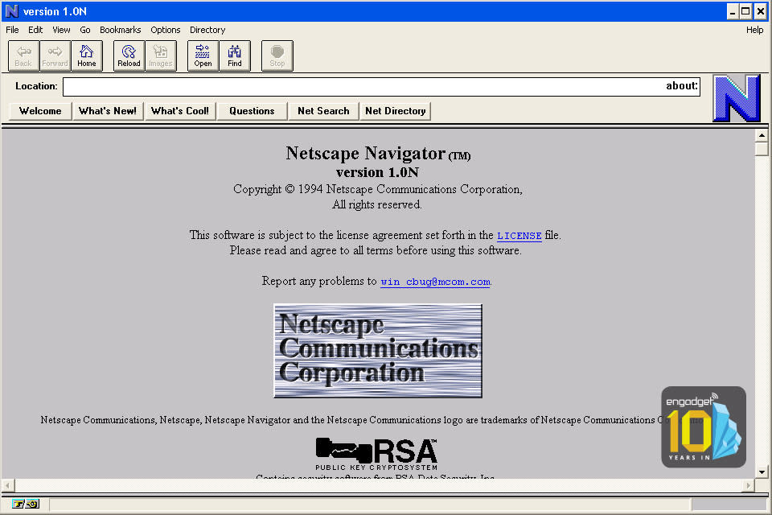
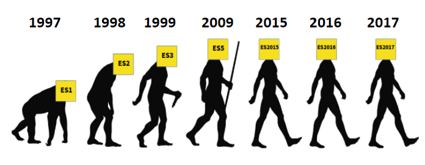
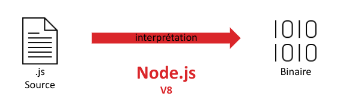
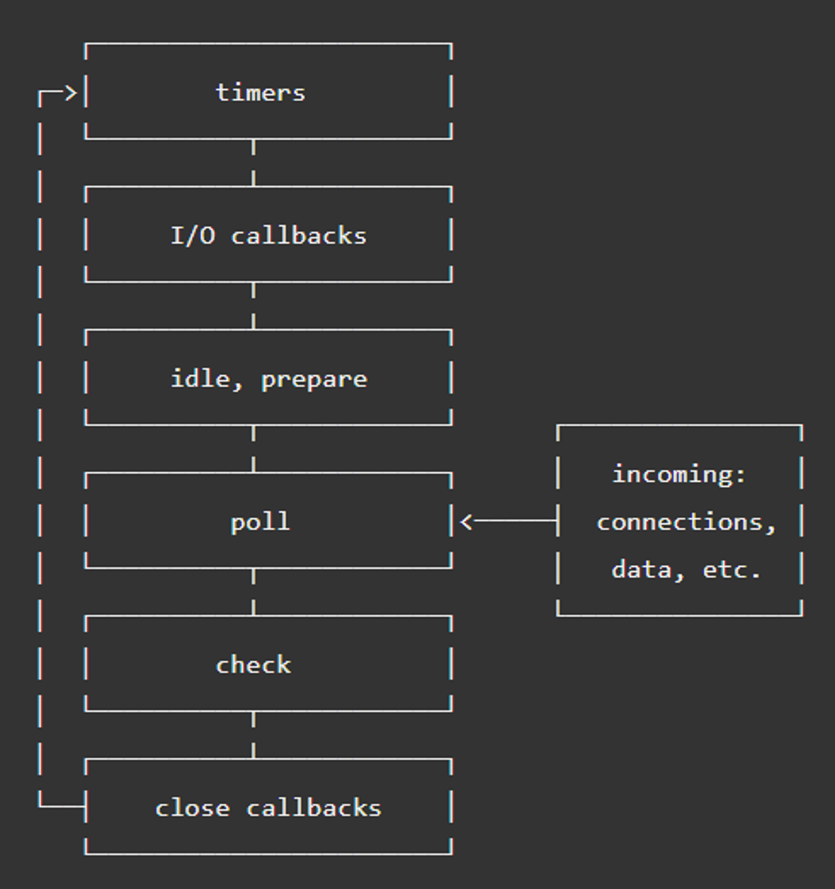
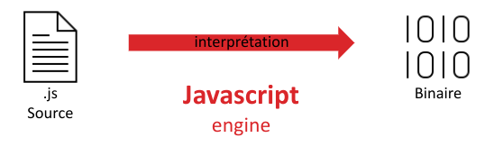
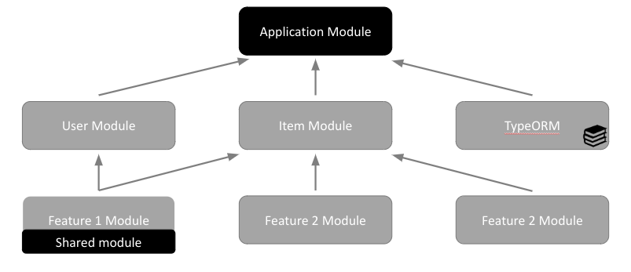
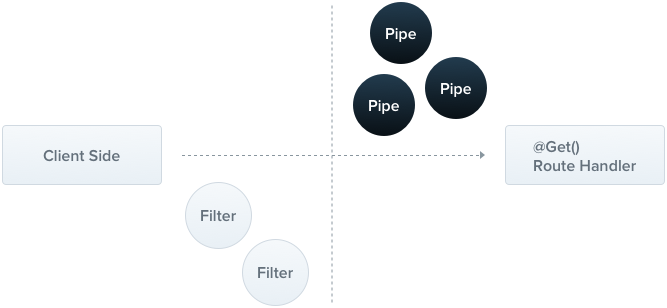
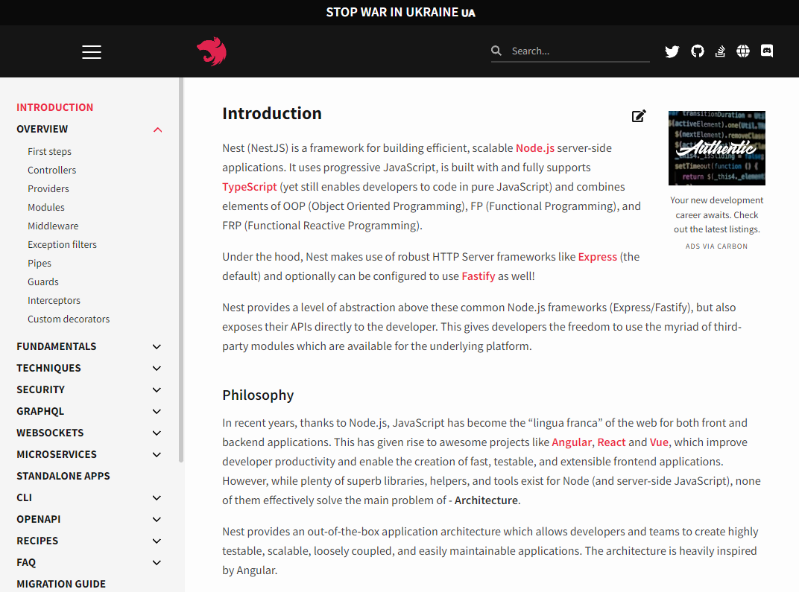

<!-- _header: '' -->
<!-- _footer: '' -->
<!-- _paginate: skip -->
<div class="grid grid-cols-3 grid-flow-col gap-2 text-center">
  <div class="row-span-1">


  </div>

  <div class="row-span-1 row-start-3">
  
  
  </div>
  
  <div class="row-span-3 col-span-3">


# NestJS

### INTES

### 2023-2024

  </div>
  
  <div class="row-span-1 row-start-3">

###### Fabien HAINGUE

  </div>
</div>

---

## Sommaire

- Javascript
  - Fonctionnement
  - Synctaxe
- Node.js
  - Principes
  - Fonctionnement
- Nest.js
  - ...
  - Modules

---

<!-- header: 'Javascript' -->

## JavaScript

Javascript est un langage de script créé en 1995 par **Sun Microsystems** et **Netscape** pour le navigateur Netscape.
Initialement, il était utilisé pour donner du dynamise aux pages HTML côté **navigateur (client)**, mais maintenant, on l’utilise aussi bien pour du backend/frontend côté client/serveur.

<center>



</center>

---

> Au départ, le langage devait s'appeler LiveScript, mais le nom Javascript a été utilisé pour faciliter l’acception de la technologie et faire un coup de pub. <br/>
> Au final, cela a causé de la confusion entre Java et JavaScript.

Javascript est un langage qui n’a pas de moteur officiel. C’est-à-dire qu’à l’époque, Netscape avait son moteur Javascript et Microsoft le sien nommé Jscript, etc…

---

<!-- header: 'Javascript' -->

## Fonctionnement

Javascript est un langage de type script basé sur la [programmation orientée prototype](https://developer.mozilla.org/fr/docs/Glossary/Prototype-based_programming).<br/>
Il a été standardisé pour facilité son utilisation, c’est ECMA international qui s’en est occupé pour la première fois en 1997

ECMA est un ensemble de norme à propos des langages de type script créés par ECMA international.

---
<!-- header: 'Javascript' -->

### Standards
- Standardisé sous le nom **ECMAScript**
  - ECMA-262: 1997
  - ECMA-6: 2015
  - ECMA-12: 2021
  - ECnext: en cours

  

---
<!-- header: 'Javascript' -->

### Comment Javascript, fonctionne-t-il ?
C’est un **langage interprété**.<br>
C’est-à-dire que le code source et directement lu pendant son exécution ce qui rend le langage **cross-platform**.
<center>



</center>

---

<!-- header: 'Javascript' -->

## Syntaxe

- Variable 
  - var
  - let 
  - const

- Function
  ```Javascript
  function maFonction () {
    return 42;
  }
  ```
---
- Fonction anonyme
  ```Javascript
  () => 42
  ```
  ```Javascript
  () => {
    return 42
  }
  ```

---

- Prototype
  ```Javascript
  function UserConstructeur (name) {
    this.name = name;
    this.age = 20;
  }
  let user1 = new UserConstructeur("Pierre");
  ```
- Object (ECMAScript 6)
  ```Javascript
  class User {
    constructor (name) {
      this.name = name
      this.age = 20;
    }
  }
  let user = new User("Pierre");
  ```

---
<!-- header: 'Javascript' -->

## Syntaxe

### ECMAScript
```Javascript
class User {
    constructor (name) {
        this.name = name
        this.age = 20;
    }

    getName () {
	return this.name
    }
}


let user1 = new User("Pierre")
user1.getName()
```

---

### Java
```Java
class User {

   String name;
   int age;

   public User(String name, int age) {
      this.name = name;
      this.age = age;
   }

   public String getName() {
      return name;
   }
}

User user1 = new User("Pierre");
user1.getName();
```

---
<!-- header: 'Node.js' -->

## Node.js


Node.js est un moteur d'exécution de Javascript qui fonctionne côté serveur, il utilise :
- le moteur Javascript **V8** de Google
- la librairie **LibUV** (permet de gérer sa boucle événementielle).

---

Ce projet open-source permet de créer des applications web événementiel:
- **cross-platforme**
- **hautement concurrent** (ne créer pas de nouveau thread par requête d'utilisateur et est non bloquant).

---
<!-- header: 'Node.js' -->

## Boucle d'événement

voir: [practicalprogramming.fr/event-loop-nodejs](practicalprogramming.fr/event-loop-nodejs)

---
<!-- header: 'Node.js' -->

## Fonctionnement
```Javascript
const { createServer } = require('http');

//Creation du serveur
const server = createServer((request, response) => {
    response.writeHead(200, {'Content-Type': 'text/plain'});
    response.end('Hello World\n');
});

server.listen(3000, () => 
    console.log('Adresse du serveur: http://localhost:3000')
);
```

---

#### Comment Javascript, fonctionne-t-il ?
C’est un **langage interprété**.<br>
C’est-à-dire que le code source et directement lu pendant son exécution ce qui rend le langage **cross-platform**.
<center>



</center>

---
<!-- header: 'Nest.js' -->

## Nest.js


Nest.js est un Framework Node.js qui permet de créer des applications côté serveur efficaces et évolutives.<br/>

Comme Spring Boot, il utilise l’**inversion de contrôle** ([IoC](https://gayerie.dev/docs/spring/spring/principe_ioc.html)), ce qui permet de mieux séparer le code métier du code technique. <br/>

---

On retrouve le même principes:
- **Controller**: ensemble de classe gérant les entrées/sorties de l’application
- **Module**: ensemble de classe liant les différentes parties du projet
- **Provider** (~Service): ensemble de classe gérant les logiques


Avec Nest.js, vous pouvez écrire votre code en Javascript classique (vanilla) ou en TypeScript.
> Il est conseillé d’utiliser TypeScript.<br/>
> TypeScript est une variante du Javascript, « c’est la même chose, mais avec du typage ».

---
<!-- header: 'Nest.js' -->

 ## Modules technique

- Web
  - Express
  - fastify
  - WebSockets
- ORM
  - Sequelize
  - TypeORM
  - Mongoose
- Test
  - Jest

[Voir documentation](https://docs.nestjs.com/modules)

---
<!-- header: 'Nest.js' -->

 ## TypeScript

Ce langage est un dérivé d'ECMAScript car il ajoute la notion de typage.

```TypeScript
interface User {
  name: string;
  id: number;
}
 
class UserAccount {
  name: string;
  id: number;
 
  constructor(name: string, id: number) {
    this.name = name;
    this.id = id;
  }

  function isAdmin(): boolean {
    //...
  }
}

const user: User = new UserAccount("Murphy", 1);
```

---

```TypeScript
type state = "open" | "close";
let a:state = "open";

let b:state = "ouvert"; // Error: Type '"ouvert"' is not assignable to type ‘state'.
```

Tutoriel
- [TypeScript for JavaScript dev](https://www.typescriptlang.org/docs/handbook/typescript-in-5-minutes.html)
- [TypeScript for OOP dev](https://www.typescriptlang.org/docs/handbook/typescript-in-5-minutes-oop.html)

---
<!-- header: 'Nest.js' -->

## Controller

Un contrôleur sert à définir les comportements lors de réception de **requête HTTP** et renvoie une **réponse HTTP** au client.

---

<center>

***./hello/hello.controller.ts***

</center>

```TypeScript
@Controller({
    path: "/hello"
})
export class HelloController {
    constructor(private readonly helloService: HelloService) {}

    @Get()
    getHello(): string {
      return this.helloService.getHello();
    }
}
```

---
L’annotation **@Controller** signaler au conteneur Nest IoC que cette classe est un contrôleur, et on peut utiliser certains paramètres pour modifier l’utilisation de cette classe (ex: path).<br/>
Ensuite, j’utilise l’annotation **@Get** pour définir la méthode HTTP servant à exécuter la méthode getHello.<br/>
Il existe toutes les méthodes HTTP: **@GET**, **@POST**, **@DELETE**, **@PUT**, …

Dans le constructeur de la classe, vous pouvez voir qu’il y a un seul paramètre HelloService.
Cela sert à demander au conteneur Nest IoC de nous fournir une instance d'un objet (HelloService).

---
<!-- header: 'Nest.js' -->

## Provider

Beaucoup de classes peuvent être considérées comme un provider (service/repository/factories/helper/…) (e.q. aux composants de Spring Boot).
Un provider peut être injecté comme une **dépendance**.

--- 
<center>

**./hello/hello.service.ts**

</center>

```TypeScript
@Injectable()
export class HelloService {
    getHello(): string {
        return "Hello World !";
    }

    getHelloByName(name: string): string {
        return `Hello World ${name} !`;
    }
}
```

Dans cet exemple, j’utilise l’annotation **@Injectable** pour signaler que cette classe peut être managée par le conteneur Nest IoC (e.q @Component de Spring Boot).<br/>
Et je définis 2 méthodes pour renvoyer « Hello world », l’une avec le nom et l’autre sans.

---
<!-- header: 'Nest.js' -->

## Modules
Pour garder votre code **organisé**, vous pouvez utiliser les modules.<br/>

<center>



</center>

---

Par exemple, si vous définissez un ensemble de classe permettant de gérer des utilisateurs, vous devez créer un module et y placer toutes vos classes dedans.

Chaque application a un **module racine** défini dans le fichier « app.module.ts ».
C ’est dans ce module que vous allez importer vos modules enfant (ex: User modules/Item module) et des modules externes (orm, hbs, …).

Un module est par défaut un **singleton**, ce qui permet d’utiliser la même instance d’une classe dans plusieurs modules l’ayant importé.
Un module utilisé dans plusieurs modules est appelé un **shared module**.

---
<!-- header: 'Nest.js' -->

### Exemple
Je créais les classes suivantes:
- HelloController: définie les endpoints
- HelloService: définie le code métier

Si je ne créer pas de nouveau module, à chaque fois que je souhaiterais utiliser mon code, je devrais importer chaque classe.

---

<center>

**./app.module.ts**

</center>

```TypeScript
@Module({
  imports: [
    …
  ],
  controllers: [HelloContoller],
  providers: [HelloService],
})
export class AppModule {}
```

---

Alors que si je définis le module HelloModule, je n’aurai plus qu’a l’importer.

<center>

**./hello/hello.module.ts**

</center>

```TypeScript
@Module({
  imports: [],
  controllers: [HelloController],
  providers: [HelloService],
  exports: []
})
export class HelloModule {}
```

---

<center>

**./app.module.ts**

</center>

```TypeScript
@Module({
  imports: [
    …,
    HelloModule,
    …
  ],
  controllers: [],
  providers: [],
})
export class AppModule {}
```

> Si vous voulez avoir accès à HelloService, en important hello.module, il faut ajouter HelloService dans la liste des exports de votre module.

---
<!-- header: 'Nest.js' -->

## Pipes
Les pipes sont utilisés souvent de 2 manières :
- Pour **transformer** les données d’input en une forme plus adapté (e.g., un string deviens un integer)
- Pour **évaluer** les données d’entrée and les vérifier, et si elles sont valides, les laisse continuer sinon lance une exception.



---

> Il existe des Pipes prédéfinis:
> - ValidationPipe
> - ParseIntPipe
> - ParseFloatPipe
> - ParseBoolPipe
> - ParseArrayPipe
> - ParseUUIDPipe
> - ParseEnumPipe
> - DefaultValuePipe
> - ParseFilePipe
>
> [Voir documentation](https://docs.nestjs.com/pipes)

---

```TypeScript
@Get(':id')
async findOne(@Param('id', ParseIntPipe) id: number) {
  return this.catsService.findOne(id);
}
```

---

### Exemple de Pipe
<center>

**CustomValidationPipe.ts**

</center>

```TypeScript
import { ArgumentMetadata, BadRequestException } from "@nestjs/common";
import { Injectable, PipeTransform } from "@nestjs/common";
import { ObjectSchema } from "joi";

@Injectable()
export class CustomValidationPipe implements PipeTransform {
  constructor (private schema: ObjectSchema) {}

  transform(value: any, metadata: ArgumentMetadata) {
    const { error } = this.schema.validate(value);

    if(error) {
      throw new BadRequestException('Invalid Input Data');
    }

    return value;
  }
}
```

---

<center>

**EmployeeController.ts**

</center>

```TypeScript
export class EmployeeController {
  @Post()
  @UsePipes(new CustomValidationPipe(createEmpSchema))
  async create(@Body() createEmpDTO: CreateEmpDTO) {
    console.log("Calling the Employee Create Service")
  }
}
```

---
<!-- header: 'Nest.js' -->

## Filtres

Les filtres vont vous permettre d’attraper les **exceptions** durant l’exécution de votre code et de renvoyer un message d’erreurs à l’utilisateur.


---

### Exemple
```TypeScript
if(error) {
  throw new HttpException();
}

// JSON user response: { "statusCode": 500, "message": "Internal server error" } 

```

---
<!-- header: 'Nest.js' -->

## Guards

Un Guard sert à une seul chose, vérifier si les requêtes HTTP entrantes ont le **droit d’accéder** au point d’entrée demandé.
Il faut que la requête respecte des **conditions** (ex: rôle/permissions/…) que vous pouvais définir vous-même. (~Spring security)

<center>


</center>

---

Possibilité de créer ses propres Guard, il faut **override** la fonction *canActivate* et renvoyer une Exception, Faux ou Vrai (ex: validateRequest).

```TypeScript
@Injectable()
export class AuthGuard implements CanActivate {
  canActivate(context: ExecutionContext): boolean | Promise<boolean> | Observable<boolean> {
    const request = context.switchToHttp().getRequest();
    return validateRequest(request);
  }
}
```

---

Ensuite, il suffit de l’utiliser sur chaque contrôleur avec l’annotation **@UseGuards** avec en paramètre le type du guard ou nouvelle instance du guard.

```TypeScript
@Controller('cats')
@UseGuards(RolesGuard)
export class CatsController {}
```

---

Ou alors en déclarant votre guard comme étant le guard de toute l’application (déclaration dans le module puis import de ce module).

```TypeScript
import { Module } from '@nestjs/common';
import { APP_GUARD } from '@nestjs/core';
import { RolesGuard } from './roles.guard';

@Module({
  providers: [
    {
        provide: APP_GUARD,
        useClass: RolesGuard
    }],
})
export class RolesModule {}
```

---
<!-- header: 'Nest.js' -->

## Tests
### Jest Unit test

<center>

**hello.controller.spec.ts**

</center>

```TypeScript
describe('HelloController', () => {
  let helloController: HelloController;

  beforeEach(async () => {
    const moduleRef = await Test.createTestingModule({
      controllers: [HelloController],
      providers: [HelloService]
    }).compile();

    helloController = moduleRef.get<HelloController>(HelloController);
  });

  describe('hello', () => {
    it('should return "Hello World!"', () => {
      expect(helloController.getHello()).toBe('Hello World !');
    });
  });
});
```

---

### Jest E2E test

<center>

**app.e2e-spec.ts**

</center>

```TypeScript
describe('AppController (e2e)', () => {
  let app: INestApplication;

  beforeEach(async () => {
    const moduleFixture: TestingModule = await Test.createTestingModule({
      imports: [AppModule],
    }).compile();
    app = moduleFixture.createNestApplication();
    await app.init();
  });

  describe(‘Hello test', () => {
    it(‘/hello (GET)', () => {
      return request(app.getHttpServer())
        .get(‘/hello')
        .expect(200)
        .expect('Hello World!');
    });
  })
});
```

---
<!-- header: 'Nest.js' -->

### Documentation

[docs.nestjs.com](https://docs.nestjs.com/)

