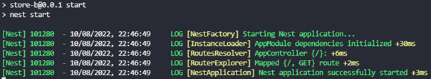
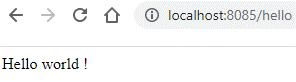

# Sujet TP – NestJs
Dans ce TP, vous aller apprendre à utiliser NestJs et ces modules pour créer une application web.

<br/>

## Objectif
Créer une application NestJs permettant de gérer des fournisseurs.
-	Ajout de fournisseur
-	Modification de fournisseur
-	Suppression de fournisseur
-	Obtenir tous les fournisseurs
-	Rechercher un fournisseur

<center>


</center>

<br/>

## Prérequis
-	[Node.js installé sur votre machine](https://nodejs.org/fr)
    -	Version 18.16.1 conseillée
-	IDE configuré
    -	[VS Code](https://code.visualstudio.com/)
    -	[WebStorm](https://www.jetbrains.com/fr-fr/lp/toolbox/ "Outil pour installer la suite JetBrain") (student edition)
- [Docker installé sur votre machine](https://docs.docker.com/engine/install/ "Documentation officielle")

<br/>

## 1. Initialisation du projet
Pour initialiser votre projet NestJs, vous aller installer puis utiliser l’outil **nestjs-cli** :
```shell
$ npm i -g @nestjs/cli
$ nest new jobdemand-service
```

-	Package manager: **npm**

<br/>

Installez les packets suivants:
-	Jest
-	Handlebars
-	TypeORM
-	Postgresql Driver
```shell
$ npm i --save-dev @nestjs/testing
$ npm install --save hbs @nestjs/typeorm typeorm pg
```

<br/>

Lancez votre application :
```shell
$ npm install
$ cd jobdemand-service
$ npm run start
```


Rendez-vous sur [http://localhost:3000](http://localhost:3000 "Lien vers votre application locale") et vous devriez avoir cet écran : ***Hello World !***

Bravo votre installation fonctionne !

<br/>

## 2. Hello World
Créez votre premier contrôleur.


<br/>

Placez le fichier **hello.controller.spec.ts** dans le même dossier que votre nouveau contrôleur
Et lancez la commande suivante :
```shell
$ npm run test
```
<details>
<summary>Cliquez pour voir le contenu de ce fichier.</summary>

```TypeScript
import { BadRequestException } from '@nestjs/common';
import { Test } from '@nestjs/testing';
import { HelloController } from './hello.controller';
import { HelloService } from './hello.service';

describe('HelloController', () => {
  let helloController: HelloController;

  beforeEach(async () => {
    const moduleRef = await Test.createTestingModule({
      controllers: [HelloController],
      providers: [HelloService]
    }).compile();

    helloController = moduleRef.get<HelloController>(HelloController);
  });

  describe('hello', () => {
    it('should return "Hello World!"', () => {
      expect(helloController.getHello()).toBe('Hello World !');
    });
  });
  
  describe('hello name', () => {
    it('should return "Hello World!" for a specific name', () => {
      expect(helloController.getHelloByName('test')).toBe('Hello World test !');
      try {
          helloController.getHelloByName(null)
      } catch (error) {
        expect(error).toBeInstanceOf(BadRequestException)
      }
    });
  });
});
```
> Ce fichier contient le test qui vérifiera si votre contrôleur fonctionne, n’hésitez pas à y jeter un coup d’œil pour le comprendre.
</details>

<br/>

## 3. HTML dynamique
Maintenant que vous avez compris le fonctionnement d’un contrôleur, vous allez pouvoir utiliser un moteur de template pour générer une page HTML dynamique.

<br/>

Nous allons utiliser **HandleBars**, mais vous pouvez parfaitement rechercher une autre solution couramment utilisé avec NestJs.

Installation de HandleBars
```shell
$ npm install --save hbs
```
Documentation de Handlebars : [docs.nestjs.com/techniques/mvc](https://docs.nestjs.com/techniques/mvc "Documentation officielle de HandleBar")

<br/>

Pour utiliser des ressources statiques comme des fichiers JS/CSS pour votre page HTML, il vous faut ajouter et paramétrer la library **serve-static** de NestJs :
```shell
$ npm install --save @nestjs/serve-static
```

Documentation : [docs.nestjs.com/recipes/serve-static](https://docs.nestjs.com/recipes/serve-static "Documentation officielle de Serve-Static")

<br/>

## 4. Les Entités
Il est temps de voir comment utiliser une base de données.

<br/>

Dans un premier, vous pouvez dès maintenant créer une base de données en utilisant le fichier intes_db.yml pour créer un container avec une base **Postgresql** :
```shell
$ docker-compose -f ./docker-compose.jobdemandservice.yml up -d
```

<br/>

Dans l’interface de **Docker Desktop**, vous devriez avoir un groupe de 3 containers :
-	jobdemand-service-db : base de données Postgresql pour l’application JobDemandService.
    - Host : jobdemand-service-db
    - Port : 8096
    - User : JobDemandService_USER
    - Password : qsp!10kpuocqs6da2ze
    - Database name : JobDemandService

<br/>

Ensuite, vous pouvez utiliser **TypeORM** pour manipuler vos données depuis votre application NestJs.
```shell
$ npm install --save @nestjs/typeorm typeorm pg
```

Documentation : [docs.nestjs.com/techniques/database](https://docs.nestjs.com/techniques/database#typeorm-integration "Documentation officielle de NestJs pour TypeORM")

<br/>

Maintenant, votre application est prête pour créer vos entités et les méthodes pour les gérer.

**Entités** :


<br/>

**Méthodes** :
-	JobDemandDto publishNewJobDemand (newJobDemand: JobDemandDto)
-	JobDemandDto cancelJobDemand (jobDemand: JobDemandDto)
-	JobDemandDto findOne (id: UUID)
-	JobDemandDto[] findAllByStudent (studentId: UUID)
-	JobDemandDto[] searchByTitle (title: string)

<br/>

## 5. Les Guards
Avant d’aller plus, il serait judicieux de protéger votre application.

Pour cela nous pouvons utiliser les **Guards**, ce type d’objet vous nous permettre de définir des méthodes d’autorisation de requêtes http, dans le but de vérifier si le demandeur a le droit d’accéder à la ressource qu’il a demandé.

<br/>

Pour commencer, vous pouvez utiliser des tests simples pour autoriser les requêtes.

<br/>

## 6. Gérer vos entités
Comme votre application est sécurisé, vous pouvez créer des points de terminaisons (**endpoints**) pour manipuler vos entités.

<br/>

Créez c’est Endpoints :
| Method | url | request body| response body | Result | Description |
| --- | --- | --- | --- | --- | --- |
| GET | /job-demand | | [ ]: Collection\<JobDemand> | 200 ou 204 | List 10 job demands |
| GET | /job-demand | studentId | [ ]: Collection\<JobDemand> | 200 ou 204 | Renvoi la liste de demandes de l'étudient |
| GET | /job-demand/{uid} | | {}: JobDemand | 200 ou 404 | Renvoi un job demand sinon error |
| POST | /job-demand | {}: JobDemand | {}: JobDemand | 201 ou 400 ou 401 | Créer un job demand |
| PUT | /job-demand | {}: JobDemand | {}: JobDemand | 200 ou 400 ou 401 ou 404 | Modifier un job demand |
| DELETE | /job-demand/{uid} | | 200 ou 401 ou 404 | Annuler un job demand |

Vous pouvez également ajouter un tableau HTML sur votre page d’accueil pour être capable de voir le contenu de votre base de données.