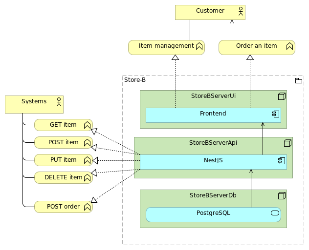
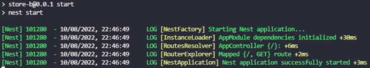

# Sujet TP – NestJs
Dans ce TP, vous aller apprendre à utiliser NestJs et ces modules pour créer une application web.

<br><br>
## Objectif
Créer une application NestJs permettant de gérer un entrepôt d’objet.
-	Ajout d’objet
-	Modification d’objet
-	Suppression d’objet
-	Obtenir tous les objets
-	Rechercher un objet

<center>



</center>

<br><br>
## Prérequis
-	[Node.js installé sur votre machine](https://nodejs.org/fr)
    -	Version 18.16.1 conseillée
-	IDE configuré
    -	[VS Code](https://code.visualstudio.com/)
    -	[WebStorm](https://www.jetbrains.com/fr-fr/lp/toolbox/ "Outil pour installer la suite JetBrain") (student edition)
- [Docker installé sur votre machine](https://docs.docker.com/engine/install/ "Documentation officielle")

<br><br>
## 1. Initialisation du projet
Pour initialiser votre projet NestJs, vous aller installer puis utiliser l’outil **nestjs-cli** :
```shell
$ npm i -g @nestjs/cli
$ nest new store-b
```

-	Package manager: **npm**

<br>

Installez les packets suivants:
-	Jest
-	Handlebars
-	TypeORM
-	Postgresql Driver
```shell
$ npm i --save-dev @nestjs/testing
$ npm install --save hbs @nestjs/typeorm typeorm pg
```

<br>

Lancez votre application :
```shell
$ npm install
$ cd store-b
$ npm run start
```


Rendez-vous sur [http://localhost:3000](http://localhost:3000 "Lien vers votre application locale") et vous devriez avoir cet écran : ***Hello World !***

Bravo votre installation fonctionne !

<br><br>
## 2. Hello World
Créez votre premier contrôleur.


<br>

Placez le fichier **hello.controller.spec.ts** dans le même dossier que votre nouveau contrôleur
Et lancez la commande suivante :
```shell
$ npm run test
```

> Ce fichier contient le test qui vérifiera si votre contrôleur fonctionne, n’hésitez pas à y jeter un coup d’œil pour le comprendre.

<br><br>
## 3. HTML dynamique
Maintenant que vous avez compris le fonctionnement d’un contrôleur, vous allez pouvoir utiliser un moteur de template pour générer une page HTML dynamique.

<br>

Nous allons utiliser **HandleBars**, mais vous pouvez parfaitement rechercher une autre solution couramment utilisé avec NestJs.

Installation de HandleBars
```shell
$ npm install --save hbs
```
Documentation de Handlebars : [docs.nestjs.com/techniques/mvc](https://docs.nestjs.com/techniques/mvc "Documentation officielle de HandleBar")

<br>

Pour utiliser des ressources statiques comme des fichiers JS/CSS pour votre page HTML, il vous faut ajouter et paramétrer la library **serve-static** de NestJs :
```shell
$ npm install --save @nestjs/serve-static
```

Documentation : [docs.nestjs.com/recipes/serve-static](https://docs.nestjs.com/recipes/serve-static "Documentation officielle de Serve-Static")

<br><br>
## 4. Les Entités
Il est temps de voir comment utiliser une base de données.

<br>

Dans un premier, vous pouvez dès maintenant créer une base de données en utilisant le fichier intes_db.yml pour créer un container avec une base **Postgresql** :
```shell
$ docker-compose -f ./intes_db.yml up -d
```

<br>

Dans l’interface de **Docker Desktop**, vous devriez avoir un groupe de 3 containers :
-	Dockerfile_storea-db_1 : base de données Postgresql pour l’application Store A.
    - Host : localhost
    - Port : 8070
    - User : user
    - Password : password
-	Dockerfile_storeb-db_1 : base de données Postgresql pour l’application Store B.
    - Host : localhost
    - Port : 8075
    - User : user
    - Password : password
-	Dockerfile_adminer_1 : Interface web minimaliste pour se connecter à une base de données.

<br>

Ensuite, vous pouvez utiliser **TypeORM** pour manipuler vos données depuis votre application NestJs.
```shell
$ npm install --save @nestjs/typeorm typeorm pg
```

Documentation : [docs.nestjs.com/techniques/database](https://docs.nestjs.com/techniques/database#typeorm-integration "Documentation officielle de NestJs pour TypeORM")

<br>

Maintenant, votre application est prête pour créer vos entités et les méthodes pour les gérer.

**Entité** :
  >| ItemEntity ||
  >| :--- | :--- |
  >| id | long |
  >| name | String |
  >| weight | double |
  >| price | double |

<br>

**Méthodes** :
-	ItemEntity save (ItemEntity entity)
-	ItemEntity delete (ItemEntity entity)
-	ItemEntity findFirstByName (String name)
-	ItemEntity[] findAll ()
-	ItemEntity[] findAll ()

<br><br>
## 5. Les Guards
Avant d’aller plus, il serait judicieux de protéger votre application.

Pour cela nous pouvons utiliser les **Guards**, ce type d’objet vous nous permettre de définir des méthodes d’autorisation de requêtes http, dans le but de vérifier si le demandeur a le droit d’accéder à la ressource qu’il a demandé.

<br>

Pour commencer, vous pouvez utiliser des tests simples pour autoriser les requêtes.

<br><br>
## 6. Gérer vos entités
Comme votre application est sécurisé, vous pouvez créer des points de terminaisons (**endpoints**) pour manipuler vos entités.

<br>

Créez c’est Endpoints :
-	**GET** : /service/item<br>
  Renvoi la liste des items sauvegardée
-	**POST** : /service/item<br>
  Permet de sauvegarder un nouvel item
-	**PUT** : /service/item<br>
  Permet de mettre à jour un item existant
-	**DELETE** : /service/item<br>
  Permet de supprimer un item existant
-	**GET** : /service/item/search/*\<nameRegex\>*<br>
  Renvoi tous les items qui ont un nom ressemblant à nameRegex

Vous pouvez également ajouter un tableau HTML sur votre page d’accueil pour être capable de voir le contenu de votre base de données.