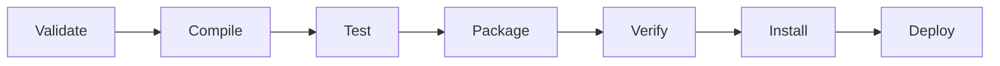

<Cover title="Formation Spring Boot" logoUrl="/images/spring-boot-logo.png" />

---
title: Sommaire
layout: chapter_title
level: 2
---

- Java
  - Rappels
- Maven / Gradle
- Spring Boot
  - Spring Web
  - Spring Data
  - Spring Security
  - Tests
  - Bonus: Spring Webflux

---
title: Fonctionnement
layout: chapter_title
transition: slide-up
logo: /images/java-logo.png
level: 2
---

::top::
<div class="mb-6">
  <a href="https://fr.wikipedia.org/wiki/Java_(technique)" class="text-blue-600">Java</a> est un langage de <b>programmation orienté objet</b>.
  <br/>
  La version 1.0 de Java est sortie en <b>1995</b> par la société <a href="https://fr.wikipedia.org/wiki/Sun_Microsystems" class="text-blue-600">Sun Microsystems</a>.
</div>

::left::
<div v-click>
  <p>
    A l'époque, Java se démarquait des autres langages car il était <b>indépendant de la plateforme matérielle</b>.
  </p>
  <p>
    Pour cela Java s'abstrait du système d'exploitation grâce à la <u>Java Virtual Machine</u>, c'est un <b>langage interprété</b>.
  </p>
</div>

::right::


---
title: Editions
layout: chapter_subtitle
transition: slide-up
logo: /images/java-logo.png
level: 3
---

::left::
Java possède trois éditions

<ul>
    <li><b>J</b>ava <b>R</b>untime <b>E</b>nvironment<br/>Contient uniquement l'environnement d'exécution de programmes Java.</li>
    <li><b>J</b>ava <b>D</b>evelopment <b>K</b>it<br/>Contient lui-même le JRE et un ensemble d'outils de développement de programme Java.</li>
    <li>Documentation<br/>Contient toute la documentation au format HTML des API de Java</li>
</ul>

::right::


---
title: Versions
layout: chapter_subtitle
transition: slide-up
logo: /images/java-logo.png
level: 3
---

<table class="m-auto">
    <thead>
        <tr>
            <th style="text-align: left;">version</th><th style="text-align: center;">release date</th><th style="text-align: center;">end of support</th>
        </tr>
    </thead>
    <tbody>
        <tr>
            <td style="text-align: left;">8 (LTS)</td><td style="text-align: center;">2014</td><td style="text-align: center;">2030</td>
        </tr>
        <tr>
            <td style="text-align: left;">11 (LTS)</td><td style="text-align: center;">2018</td><td style="text-align: center;">2026</td>
        </tr>
        <tr>
            <td style="text-align: left;">17 (LTS)</td><td style="text-align: center;">2021</td><td style="text-align: center;">2029</td>
        </tr>
        <tr>
            <td style="text-align: left;">21 (LST)</td><td style="text-align: center;">2023</td><td style="text-align: center;">2031</td>
        </tr>
    </tbody>
</table>

<br/>
<Note type="info">
    Utilisez uniquement les LTS, sauf si vous voulez essayer les nouvelles fonctionnalités du langage.
</Note>

---
title: Programmation orienté objet
layout: chapter_subtitle
transition: slide-up
logo: /images/java-logo.png
level: 3
---


::top::
La POO permet de faciliter la vie des développeurs.<br/>
Plus longue à mettre en place, mais permet de garder une bonne structure du code.

::bottom::


---
title: Syntaxe
layout: chapter_subtitle
transition: slide-up
logo: /images/java-logo.png
level: 3
---

::left::

```java {all|1|3|5|7-9|11-20|21-30}{maxHeight:'320px'}
package com.mycompany.service1;

public class Person {

  private static long PERSON_COUNTER = 0; 

  private final long id;
  private String name;
  private LocalDate dateOfBirth;

  public Person () {
    super();
    this.id = Person.PERSON_COUNTER++;
  }

  public Person (String name, LocalDate dateOfBirth) {
    this();
    this.name = name;
    this.dateOfBirth = dateOfBirth;
  }

  /* Getter & Setter */
  public long getId () {
    return id;
  }

  public void setName (String name) {
    this.name = name;
  }
  /* ... Other methods ... */
}
```

::right::

<v-clicks at=1>

- Package
  - Permet de grouper le code Java sous un nom commun (~dossier), ce qui évite les conflits de nommage
- Class
  - Type Java permettant de définir une classe d'object
- Attribute/methode statique
  - Partagé entre toutes les instances d'object
- Attributes
  - Représente l'état d'un objet
- Constructeurs
- Méthodes
  - Représente le comportement d'un d'objet

</v-clicks>

---
title: Tips
layout: chapter_title
transition: slide-up
logo: /images/java-logo.png
level: 3
---

<Subtitle>StringBuilder</Subtitle>
```java
StringBuilder builder = new StringBuilder();
for (String address : addresses) {
  builder.append(address).append("\n");
}
String csv = builder.toString();
```

<div v-click>
<Subtitle>Optional</Subtitle>
```java
Optional<Object> wrapper = Optional.of(obj);
wrapper.ifPresent(object -> System.out.println(object));
Object resultObject = wrapper.orElseThrow(() -> new EntityNotFoundException());
```
</div>

<div v-click>
<Subtitle>Stream</Subtitle>
```java
stream.filter(obj -> obj != null).map(obj -> obj.hashCode()).collect(Collectors.toList());
```
</div>

<div v-click>
<Subtitle>Remote debug</Subtitle>
JVM options:
```shell
-agentlib:jdwp=transport=dt_socket,server=y,suspend=n,address=5005
```
</div>

---
title: Maven / Gradle
layout: chapter_title
transition: slide-up
logo: /images/java-logo.png
level: 3
---

Outils pour construire vos applications Java et autres

- Automatiser certaines tâches : compilation, tests unitaires et déploiement des applications qui composent le projet
- Gérer des dépendances vis-à-vis des bibliothèques nécessaires au projet
- Générer des documentations concernant le projet

<table class="mt-4em m-auto w-1/2 text-center">
  <tbody>
    <tr class="odd:bg-white odd:dark:bg-gray-900 even:bg-gray-50 even:dark:bg-gray-800">
      <th class="border-1px"><b>Maven</b></th>
      <th class="border-1px"><b>Gradle</b></th>
    </tr>
    <tr class="odd:bg-white odd:dark:bg-gray-900 even:bg-gray-50 even:dark:bg-gray-800">
      <td class="border-1px">Simple</td>
      <td class="border-1px">Fichier .xml</td>
    </tr>
    <tr class="odd:bg-white odd:dark:bg-gray-900 even:bg-gray-50 even:dark:bg-gray-800">
      <td class="border-1px">Performant / Flexible</td>
      <td class="border-1px">Fichier .gradle</td>
    </tr>
  </tbody>
</table>

---
title: Démo
layout: chapter_title
logo: /images/java-logo.png
level: 3
---

::top::


::bottom::


---
title: Spring Boot
subtitle: Spring framework
layout: chapter_title
transition: slide-up
logo: /images/spring-logo.svg
level: 2
---

Historiquement, le framework Spring est le premier à avoir été créé. Spring permet de construire et de définir l’infrastructure d’une application Java.

<div class="text-center mb-4em">

**2004 (1.0)** -> **2022 (6.0)**

</div>


Ensuite plusieurs projets ont émergé de l’équipe Spring:

- Spring Data pour le traitement de données
- Spring Web pour les applications Web.
- ...

---
title: Principe de Spring
layout: chapter_title
transition: slide-up
logo: /images/spring-logo.svg
level: 3
---

- **Conception basée sur l’inversion de contrôle** ([IoC](https://gayerie.dev/docs/spring/spring/principe_ioc.html)).
  C'est une façon de concevoir l'architecture d'une application en se basant sur le mécanisme objet de l’injection de dépendance.

<v-clicks>

- **Programmation Orientée Aspect**
    

- **Couche d'abstraction**

</v-clicks>

---
title: Injection de dépendances
layout: chapter_subtitle
transition: slide-up
logo: /images/spring-logo.svg
level: 3
---
::top::
```java
interface reservationSalleDao {
  void sauver (ReservationSalle reservationSalle)
}
```

::left::
<div v-click=1>
Couplage Fort

```java {0|all|1|3-7|6|8-14|all}
public class ReservationSalleService {

  private ReservationSalleDao reservationSalleDao;

  public ReservationSalleService() {
    reservationSalleDao = new ReservationSalleDao();
  }

  public void reserver(ReservationSalle reservationSalle) {
    /** CODE **/

    // sauvegarder la réservation
    reservationSalleDao.sauver(reservationSalle);
  }

}
```
</div>

::right::
<div v-click=7 class="text-overflow">

Couplage faible

```java {0|all|3,10|7-9|all}
public class ReservationSalleService {

  public void reserver(ReservationSalle reservationSalle) {
    /** CODE **/

    // récupération d'une instance de ReservationSalleDao
    ReservationSalleDao reservationSalleDao = ReservationSalleDaoLocator.get();
    // sauvegarder la réservation
    reservationSalleDao.sauver(reservationSalle);
  }

}
```
</div>

::bottom::
<Note type="info" v-click>
  <p>Un couplage faible rend votre code plus facile à maintenanir !</p>
  <p>Dans cet exemple, charge à la personnes créant une instance de votre objet <code>ReservationSalleService</code>, de fournir une implementation de <code>ReservationSalleDao</code>.</p>
</Note>

---
title: Inversion de contrôle
layout: chapter_subtitle
transition: slide-up
logo: /images/spring-logo.svg
level: 3
---

Spring prend en charge la création et la mise en relation d'objets.


Spring est considéré comme un conteneur léger (*rien à voir avec la conteneurisation*)

- Création des objets
- Injection des dépendances
- Aspects non-fonctionnels

---
title: Injection de dépendance
layout: chapter_subtitle
transition: slide-up
logo: /images/spring-logo.svg
level: 3
---

::left::
```java {all|3|5-7|9-15}
public class ReservationSalleService {

  private ReservationSalleDao reservationSalleDao;

  public ReservationSalleService(ReservationSalleDao reservationSalleDao) {
    this.reservationSalleDao = reservationSalleDao;
  }

  public void reserver(ReservationSalle reservationSalle) {
    // faire un traitement nécessaire
    // (par exemple la validation de la réservation)

    // sauvegarder la réservation
    reservationSalleDao.sauver(reservationSalle);
  }
}
```

::right::
<v-clicks at=1>

- Encapsulation d'une instance de <code>ReservationSalleDao</code>
- Couplage faible au niveau du constructeur
- Utilisation des méthodes <code>ReservationSalleDao</code>

</v-clicks>

---
title: Annotation
layout: chapter_subtitle
transition: slide-up
logo: /images/spring-logo.svg
level: 3
---
::left::

<v-clicks at=1>

- Indique au conteneur Spring d'instancier <code>ReservationSalleService</code> en fournissant toutes les dépendences requises et la stocké dans son conteneurs
- **\[deprecated\]** Permet de spécifier au moteur Spring que c'est lui qui doit fournir cet attribut, et éviter d'écrire le constructeur.
- <Note type="info">Il existe de nombreuse Annotation, <a class="text-blue" href="https://www.baeldung.com/spring-boot-annotations">aller voir la doc !</a></Note>
</v-clicks>

::right::
```java {all|1|4|all}
@Service
public class ReservationSalleService {

  @Autowired
  private ReservationSalleDao reservationSalleDao;

  public void reserver(ReservationSalle reservationSalle) {
    // faire un traitement nécessaire
    // (par exemple la validation de la réservation)

    // sauvegarder la réservation
    reservationSalleDao.sauver(reservationSalle);
  }
}
```

---
title: Bean
layout: chapter_subtitle
logo: /images/spring-logo.svg
level: 3
---


Les objets managés par le conteneur spring sont des **Beans**.


Chaque annotation permet de créer une bean avec un comportement différents, il est possible de créer vos propre annotations qui enrichiront des annotations existantes.

---
title: Spring Boot
layout: chapter_title
transition: slide-up
logo: /images/spring-boot-logo.png
level: 2
---

::top::
De nombre solution ont permis de créer un éco-système Spring complet, mais parfois difficile à mettre en place.


::bottom::
<div v-click>
À la suite de la création de toutes ces solutions, Spring boot a été créé.

Spring Boot sert à faciliter la mise en place de tout les projets Spring, et bien d’autres, en intégrant toutes les <u>configurations nécessaires</u> avec des valeurs par défaut.
Libre au développeur de modifier ces valeurs par défaut.
</div>

---
title: Starters
layout: chapter_title
transition: slide-up
logo: /images/spring-boot-logo.png
level: 3
---

::left::


::right::
<p>Tous ces projets peuvent être utilisés dans des projets Java.</p>
<br/>
<p>Par contre, grâce à Spring Boot l’utilisation est devenue beaucoup plus simple, car ils ont créé des starters pour chaque projets Spring et tiers.</p>
<br/><br/>
<p><a class="text-blue" href="hhttps://www.geeksforgeeks.org/springboot/spring-boot-starters/">Liste des starters Spring Boot</a></p>

---
title: Spring Web MVC
layout: chapter_title
transition: slide-up
logo: /images/spring-boot-logo.png
level: 3
---

::right::


::left::
<p>
Ce projet permet de créer des applications Web et des API (<a class="text-blue" href="https://gayerie.dev/docs/spring/spring/spring_mvc_intro.html">doc</a>).
</p>
<br/>
<p>
Concrètement, il simplifie la manipulation des servlets Java ce qui permet de faciliter la création d'application Web.
</p>

::bottom::
<Subtitle v-click>Architecture</Subtitle>
<div class="flex" v-after>
  
  
</div>

---
title: Controller
layout: chapter_subtitle
transition: slide-up
logo: /images/spring-boot-logo.png
level: 3
---

Pour créer un point d'entrée (_endpoint_) à votre application Web, vous devez créer un **Controller**.

Il existe deux types de contrôleur:

<v-clicks>

- **Controller**
  Permet de renvoyer une page HTML ([SSR](https://openclassrooms.com/fr/courses/5922626-optimisez-le-referencement-de-votre-site-seo-en-ameliorant-ses-performances-techniques/6055261-decidez-entre-client-side-et-server-side-rendering))
- **RestController**
  Permet de renvoyer une réponse HTTP ([API Rest](https://aws.amazon.com/fr/what-is/restful-api/))

</v-clicks>

<p v-click>
Une fois votre choix fait, vous devez placer l'annotation <b>@Controller</b> ou <b>@RestController</b> au-dessus de votre classe.
</p>

---
title: Rendu côté serveur
layout: chapter_subtitle
transition: slide-up
logo: /images/spring-boot-logo.png
level: 3
---

::top::
```java{all|1|4-5|7|8,17|9-16|all}
@Controller
public class PersonController {

  @Autowired
  private PersonService personService;

  @GetMapping("/person/{id}")
  public String getPersonById (@PathVariable Long id, Model model) {
    Optional<Person> person = personService.findById(id);
    if (person.isPresent()) {
      model.addAttribute("person", person);
      return "person";
    } else {
      model.addAttribute("error", "Person not found");
      return "redirect:/home";
    }
  }
}
```

::bottom::
> La méthode _getPersonById_ renvoie une chaîne de caractère qui permet de définir le nom du patron HTML qui sera envoyé au client.
<br/>
<br/>
> Un point d'entrée dans un @Controller peut directement renvoyer de la donnée en utilisant l'annotation @ResponseBody placé juste avant la signature de fonction

---
title: API Rest
layout: chapter_subtitle
transition: slide-up
logo: /images/spring-boot-logo.png
level: 3
---

::top::
```java {all|1|4-5|7|8,15|9-14|all}
@RestController
public class PersonRestController {

  @Autowired
  private PersonService personService;

  @GetMapping("/person/{id}")
  public ResponseEntity<Person> getPersonById (@PathVariable Long id) {
    Optional<Person> person = personService.findById(id);
    if (person.isPresent()) {
      return ResponseEntity.ok(person.get());
    } else {
      return ResponseEntity.notFound().build();
    }
  }
}
```

::bottom::
> L'objet ResponseEntity permet de définir l'état, les headers et le body de la réponse HTTP

---
title: Thymeleaf
layout: chapter_title
transition: slide-up
logo: /images/spring-boot-logo.png
level: 3
---

::top::


<p class="mt-4"><a class="text-blue" href="http://www.thymeleaf.org/">Thymeleaf</a> est le moteur de template qui vous permettra de générer du HTML dynamique rendu côté serveur.</p>

::bottom::
<div click>
  <div class="m-auto text-center">
      http://**&lsaquo;host\&rsaquo;**:**&lsaquo;port\&rsaquo;**/hello/Paul
  </div>

  <div class="m-auto text-center"  v-click>
    &#8595;
  </div>

  <div v-after>
```java
@Controller
public class PersonController {
  @GetMapping("/hello/{name}")
  public String getHelloPage (@PathVariable String name, Model model) {
    model.addAttribute("name", name);
    return "hello";
  }
}
```
  </div>

  <div class="m-auto text-center" v-click>
    &#8595;
```html
<div class="title">Hello <span th:text="${name}">Unknow</span></div>
```
  </div>
  <div class="m-auto text-center" v-click>
    &#8595;
```html
<div class="title">Hello <span>Paul</span></div>
```
  </div>
</div>

---

> Avec Thymeleaf, vous pouvez manipuler du Java dans votre fichier HTML dans le but de dynamiser vos balises HTML pendant le rendu.
>
> - Remplacer du texte
> - Remplacer du HTML
> - Remplacer des attributs
> - Insérer le contenu d’un autre fichier (ex: header.html)
> - Rediriger un appel vers un autre contrôleur en ajoutant des variables au model (ex: error)


---
title: Spring Data
layout: chapter_title
transition: slide-up
logo: /images/spring-boot-logo.png
level: 3
---

::right::


::left::
Ce projet permet de gérer les interactions avec un SGBD ([doc](https://gayerie.dev/epsi-b3-orm/spring_data/spring_data_jpa.html)).

Grâce à divers modules, vous pourrez gérer la plupart des SGBD existants.

---
title: JPA
layout: chapter_subtitle
transition: slide-up
logo: /images/spring-boot-logo.png
level: 3
---

::top::
<p>Les requêtes sont abstraites grâce à des conventions de nommage.</p>

<Note type="info">On écrit des requêtes en <b>JPQL</b> depuis le code Java, puis les modules vont traduire le JPQL dans le langage spécifique de votre SGBD</Note>

::left::
<div class="my-3em">
  <p>Pour créer des méthodes d'accès aux données, vous devez créer un <b>Repository</b>.</p>
</div>

::right::
<div class="my-3em">

```java {all|1|2,7|3-6|all}
@Repository
public interface PersonRepository extends CrudRepository<PersonEntity, Long> {

  Optional<PersonEntity> findFirstByName (String name);

  Page<PersonEntity> findAllByTypeOrderByName (String type, Pageable page);
}
```

</div>

::bottom::
<Note type="info" v-after>
  <p>Etendre la classe <b>CrudRepository</b> vous permet d'avoir plusieurs méthodes classiques sans devoir les écrire (save, update, delete, find, ...)</p>
  <p>Il existe plusieurs interface du même type (<a class="text-blue" href="https://www.baeldung.com/spring-data-repositories">voir article</a>).</p>
</Note>

---
title: Spring Security
layout: chapter_title
transition: slide-up
logo: /images/spring-boot-logo.png
level: 3
---


::right::


::left::
Spring Security est un module permettant d’ajouter des méthodes de filtrage pour sécuriser votre application Spring Web.


---
transition: slide-up
logo: /images/spring-boot-logo.png
level: 3
---

::top::
Son fonctionnement est simple, il intercepte les requêtes HTTP reçu du client.

Il applique des **filtres** pour vérifier l’identité du client.
-  Si un filtre authentifie la requête, Spring Security va laisser Spring Web travailler.
-  Si aucun filtre ne l’authentifie, la requête sera renvoyée avec un **code HTTP** d’erreur (401) ou de redirection (301) pour rediriger le client vers la page de connexion.

::left::


::right::
<Note type="info" class="mt-5/10">
  <p> Par défaut, Spring Security sécurise automatiquement votre application.</p>
  <p>Charge à vous de modifier cette configuration en surchargeant les méthodes.</p>
</Note>

---
title: Personnalisation des méthodes
layout: chapter_subtitle
transition: slide-up
logo: /images/spring-boot-logo.png
level: 3
---


---
transition: slide-up
logo: /images/spring-boot-logo.png
---

Pour modifier l'utilisation des filtres de sécurité, il vous faut surcharger la bean **SecurityFilterChain**.
<br/>

Vous allez pouvoir :

- Modifier les autorisations d'accès
- Activer/Désactiver des fonctionnalités (CSRF, CORS, ...)
- ...

<Note type="info">

<p><b>CSRF</b>: technique pour manipuler un utilisateur connecté à lancer une requête au serveur</p>
<p><b>CORS</b>: sécurité sur les navigateurs pour empêcher une page web de chargé du contenu d’un serveur n’ayant pas la même origine (usurpation de site, …)</p>
<p><b>FrameOption</b>: options personnalisables pour l’utilisation de votre application depuis des &lt;iframe&gt;</p>

</Note>

---
title: Exemple de configuration
layout: chapter_subtitle
logo: /images/spring-boot-logo.png
level: 3
---

```java {all|1|3|4,24|5-15|16-21|23|26-29}
@Configuration
public class SecurityConfiguration {
  @Bean
  public SecurityFilterChain filterChain(HttpSecurity http) throws Exception {
    http.authorizeRequests()
        .antMatchers("/login").permitAll()
        .antMatchers(HttpMethod.GET, "/service/**").permitAll()
        .antMatchers("/service/**").hasRole("user")
        .anyRequest().authenticated()
      .and()
        .formLogin().permitAll()
      .and()
        .logout().permitAll()
      .and()
        .httpBasic();

    http.csrf().disable();

    http.cors().disable();

    http.headers().frameOptions().sameOrigin();

    return http.build();
  }

  @Bean
  public WebSecurityCustomizer webSecurityCustomizer() {
    return (web) -> web.ignoring().antMatchers("/css/**", "/js/**");
  }
}
```

---
title: Tests
layout: chapter_title
transition: slide-up
logo: /images/spring-boot-logo.png
level: 3
---

::top::
<div class="text-center">
« Les tests automatisés ne sont pas une option, mais une assurance qualité intégrée. »
</div>

::bottom::


<Note type="info" v-click>
  <p>Dans le vrai monde, il est parfois difficile de respecter la théorie, 80% de couverture de test peu être compliqué à mettre en place et rendre difficile le travail de vos équipes...</p>
  <p>D'un point de vue valeur, les tests end-to-end sont les tests qui rapport le plus de valeurs car ils permettent de validé le fonctionement des règles métiers, vous pouvez donc prioriser ses tests dans certains cas (Definition of Done).</p>
</Note>

---
title: Tests boîtes blanches
layout: chapter_subtitle
transition: slide-up
logo: /images/spring-boot-logo.png
level: 3
---

Mise en place de tests en utilisant les composants internes de votre application (Service, Repository, ...).

```java {all|1|2|5-6|8-10,18|11-14|16-17}
@SpringBootTest
@TestMethodOrder(MethodOrderer.OrderAnnotation.class)
public class ItemRepositoryTests {

  @Autowired
  private ItemRepository itemRepository;

  @Test
  @Order(1)
  void wellInsert () {
    ItemEntity item1 = new ItemEntity();
    item1.setName("Test 1");
    item1.setPrice(10.0);
    item1 = itemRepository.save(item1);

    Assert.notNull(item1, "The item is null");
    Assert.isTrue(item1.getId() > 0, "The id is not incremented");
  }
}
```

---
title: Tests boîtes noire
layout: chapter_subtitle
logo: /images/spring-boot-logo.png
level: 3
---


Mise en place de tests en utilisant uniquement les points d'entrée de votre application (Controller, RestController, ...).

```java {all|1|2|3|6-7|9-11,24|12-16|17-18|19-23}
@SpringBootTest
@AutoConfigureMockMvc
@TestMethodOrder(MethodOrderer.OrderAnnotation.class)
public class ItemRestController {

  @Autowired
  private MockMvc mvc;

  @Test
  @Order(1)
  void saveNewItem () throws Exception {
    ItemEntity item = new ItemEntity();
    item.setName("Item name");

    ObjectMapper mapper = new ObjectMapper();
    mapper.setSerializationInclusion(JsonInclude.Include.NON_NULL);
    MvcResult result = mvc.perform(post("/service/item")
      .content(mapper.writeValueAsString(item)))
      .andExpect(status().isCreated())
      .andExpect(content()
        .contentTypeCompatibleWith(MediaType.APPLICATION_JSON))
      .andReturn();
    /** additional test **/
  }
}
```


> Il y a plusieurs façons de faire des tests boîte noire (<a class="text-blue" href="https://docs.spring.io/spring-framework/reference/testing/spring-mvc-test-framework/vs-end-to-end-integration-tests.html">voir article</a>)
>
> - MockMVC
> - End-to-End

---
title: Spring WebFlux
layout: chapter_title
transition: slide-up
logo: /images/spring-boot-logo.png
level: 3
---


Avec ce projet, vous allez pouvoir créer des application **réactive** (<a class="text-blue" href="https://docs.spring.io/spring-framework/docs/5.0.0.M4/spring-framework-reference/html/web-reactive.html">doc</a>).


<Note type="info" class="mt-2em">
  <p>En informatique, la programmation réactive est un paradigme de programmation visant à conserver une cohérence d'ensemble en propageant les modifications d'une source réactive (modification d'une variable, entrée utilisateur, etc.) aux éléments dépendants de cette source.</p>
</Note>

---
transition: slide-up
level: 3
---
::top::
Pour une meilleure expérience, toute votre pile technique doit être réactive (API, SGBD, ...).

<Note type="info" class="mb-10">
  <p>Vous pouvez ajouter Spring Webflux à un projet Spring Boot existant est modifier petit à petit vos Controllers puis vos Services puis vos Repository...</p>
</Note>

::right::
<Subtitle>Avantages</Subtitle>

- Communication non blocantes
- Scalabilité
- Performance IO
- Backpressure
- Compatibilité
- ...

::left::
```java
@RestController
public class GreetingController {
    @GetMapping("/greet")
    public Mono<String> greet(@RequestParam String name) {
        return Mono.just("Hello, " + name + "!");
    }
}
```


---
title: Comportement de Pub/Sub
layout: chapter_subtitle
logo: /images/spring-boot-logo.png
level: 3
---


---
title: Spring WebClient
layout: chapter_title
transition: slide-up
logo: /images/spring-boot-logo.png
level: 3
---

Avec la création de Spring Webflux, les équipes Spring ont créé un client Web beaucoup plus pratique pour appeler des applications Web.

Je vous conseille donc d'utiliser cet outil plutôt que les anciens comme RestTemplate ou autre.

---
transition: slide-up
logo: /images/spring-boot-logo.png
level: 3
---

Création du client

```java {all|1|3-7|9-10,15|11-14}
@Configuration
public class WeatherClientConfig {
  @Value("${weather.token}")
  private String token;

  @Value("${weather.baseurl}")
  private String baseUrl;

  @Bean
  public WebClient weatherClient() {
    return WebClient.builder()
      .baseUrl(baseUrl)
      .defaultHeader(HttpHeaders.AUTHORIZATION, token)
      .build();
  }
}
```
---

Utilisation du client

```java {all|1|4-5|8-13}
@Service
public class WeatherService {

  @Resource(name = "weatherClient")
  private WebClient client;

  public String getWeatherForOneCity (String weather) {
    return client.get()
      .uri("/city/" + weather)
      .retrieve()
      .bodyToMono(String.class)
      .onErrorReturn("not found")
      .block(Duration.ofMinutes(1));
  }
}
```

---
title: Kotlin
layout: chapter_title
logo: /images/spring-boot-logo.png
level: 3
---

::top::
<div class="h-10">
  
</div>

::left::
Spring Boot est compatible avec **Kotlin**.

Kotlin est un langage moderne utilisant le principe d’inconsistance (réduction des boilerplate, null safe, réduction du nombre de lignes).

::right::
```kotlin
@GetMapping("/")
fun blog(model: Model): String {
  model["title"] = "Blog"
  model["articles"] = repository.findAllByOrderByAddedAtDesc().map { it.render() }
  return "blog"
}
```

::bottom::
<Note type="info" v-click>
  <p>C’est le python du monde Java</p>
  <br/>
  <p>Vous pouvez suivre le tutoriel <a class="text-blue" href="https://spring.io/guides/tutorials/spring-boot-kotlin/">officiel</a></p>
</Note>

---
title: Tips
layout: chapter_title
logo: /images/spring-boot-logo.png
level: 3
---

<v-clicks>

- Utiliser toujours un [Logger](https://www.baeldung.com/spring-boot-logging)
  Cela vous permettra de rediriger les logs de votre application sur différents supports (console, fichier, bdd, ...).

  Exemple:

  ```java
  private Logger logger = LoggerFactory.getLogger(this.getClass());

  /* … */
      logger.info("It is information");
      logger.debug("It is debug message");
      logger.warn("It is warning message");
      logger.error("It is error message: {}", error.getMessage());
  /* … */
  ```

  > Fin des println hasardeux !<br/><br/>

- <a class="text-blue" href="https://docs.spring.io/spring-boot/docs/2.0.6.RELEASE/reference/html/howto-hotswapping.html">Devtools</a>
  Hotreload/Hotswap<br/><br/>

- <a class="text-blue" href="https://www.baeldung.com/spring-debugging">Remote debug</a>
  JVM options:
  -agentlib:jdwp=transport=dt_socket,server=y,suspend=n,address=5005

</v-clicks>

---
title: Documentations
layout: chapter_title
logo: /images/spring-boot-logo.png
level: 2
---

- <a class="text-blue" href="https://www.baeldung.com/">baeldung.com</a>
- <a class="text-blue" href="https://docs.spring.io/">docs.spring.io</a>
- <a class="text-blue" href="https://www.youtube.com/c/DevoxxFRvideos">Devoxx france</a>

---
title: Demo
layout: chapter_title
logo: /images/spring-boot-logo.png
level: 3
---


<div class="text-center mt-2em">
  <a class="text-blue" href="https://start.spring.io/"><b>spring initializr</b></a>
</div>
---
title: Questions ?
layout: impacting_message
level: 3
---

Merci !

Avez-vous des questions ?
