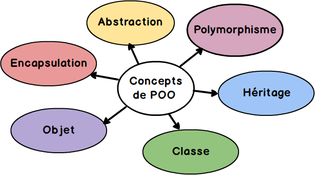

<!-- _header: '' -->
<!-- _footer: '' -->
<!-- _paginate: skip -->
<div class="grid grid-cols-3 grid-flow-col gap-2 text-center">
  <div class="row-span-1">


  </div>

  <div class="row-span-1 row-start-3">
  
  
  </div>
  
  <div class="row-span-3 col-span-3">


# Spring Boot

### INTES

### 2023-2024

  </div>
  
  <div class="row-span-1 row-start-3">

###### Fabien HAINGUE

  </div>
</div>

---

## Sommaire

- Java
  - Rappels
- Maven / Gradle
- Spring Boot
  - Spring Web
  - Spring Data
  - Spring Security
  - Tests
  - Bonus: Spring Webflux

---

<!-- header: 'Java' -->

## Fonctionnement

[Java](<https://fr.wikipedia.org/wiki/Java_(technique)>) est un langage de **programmation orienté objet**.
La version 1.0 de Java est sorti en **1995** par la société [Sun Microsystems](https://fr.wikipedia.org/wiki/Sun_Microsystems).

<br/>

A l'époque, Java se démarquait des autres langages car il était **indépendant de la plateforme matérielle**.
Pour cela Java s'abstrait du système d'exploitation grâce à la Java Virtual Machine.


---

## Editions

Java possède trois éditions

- **J**ava **R**untime **E**nvironment
  Contient uniquement l'environnement d'exécution de programmes Java.
- **J**ava **D**evelopment **K**it
  Contient lui-même le JRE et un ensemble d'outils de développement de programme Java.
- Documentation
  Contient toute la documentation au format HTML des API de Java

---

## Versions

<center>

| version  | release date | end of support |
| :------- | :----------: | :------------: |
| 8 (LTS)  |     2014     |      2030      |
| 11 (LTS) |     2018     |      2026      |
| 17 (LTS) |     2021     |      2029      |
| 21 (LST) |     2023     |       ?        |

</center>

> Conseil: utilisez uniquement les LTS, sauf si vous voulez essayer les nouvelles fonctionnalités du langage.

---

## Programmation orienté objet

<center>



</center>
La POO permet de faciliter la vie des développeurs.<br/>
Plus longue à mettre en place mais permet de garder une bonne structure du code.

---

## Syntaxe

<center>


</center>

---

## Tips

### StringBuilder

```java
StringBuilder builder = new StringBuilder();
for (String address : addresses) {
  builder.append(address).append("\n");
}
String csv = builder.toString();
```

### Optional

```java
Optional<Object> wrapper = Optional.of(obj);
wrapper.ifPresent(object -> System.out.println(object));
Object resultObject = wrapper.orElseThrow(() -> new EntityNotFoundException());
```

### Stream

```java
stream.filter(obj -> obj != null).map(obj -> obj.hashCode()).collect(Collectors.toList());
```

### Remote debug

JVM options:
-agentlib:jdwp=transport=dt_socket,server=y,suspend=n,address=5005

---

<!-- header: 'Maven / Gradle' -->

## Maven / Gradle

Outils pour construire vos application Java et autre

- Automatiser certaines tâches : compilation, tests unitaires et déploiement des applications qui composent le projet
- Gérer des dépendances vis-à-vis des bibliothèques nécessaires au projet
- Générer des documentations concernant le projet

<center>

|  **Maven**   |      **Gradle**       |
| :----------: | :-------------------: |
|    Simple    | Performant / Flexible |
| Fichier .xml |    Fichier .gradle    |

</center>

---

## Démo


---

<!-- header: 'Spring Boot' -->

## Spring framework

Historiquement, le framework Spring est le premier à avoir été créé. Spring permet de construire et définir l’infrastructure d’une application Java.

<center>

**2004 (1.0)** -> **2017 (5.0)**

</center>

Ensuite plusieurs projet ont émergés de l’équipe Spring:

- Spring Data pour le traitement de données
- Spring Web pour les applications Web.
- ...

---

## Principe de Spring

- Conception basée sur l’inversion de contrôle ([IoC](https://gayerie.dev/docs/spring/spring/principe_ioc.html)).
  C'est une façon de concevoir l'architecture d'une application en se basant sur le mécanisme objet de l’injection de dépendance.

- Programmation Orientée Aspect

  <center>

  

  </center>

- Couche d'abstraction

---

Couplage Fort

```java

public class ReservationSalleService {

  private ReservationSalleDao reservationSalleDao;

  public ReservationSalleService() {
    reservationSalleDao = new ReservationSalleDao();
  }

  public void reserver(ReservationSalle reservationSalle) {
    /** CODE **/

    // sauvegarder la réservation
    reservationSalleDao.sauver(reservationSalle);
  }

}
```

<br/>

Couplage faible

```java

public class ReservationSalleService {

  public void reserver(ReservationSalle reservationSalle) {
    /** CODE **/

    // récupération d'une instance de ReservationSalleDao
    ReservationSalleDao reservationSalleDao = ReservationSalleDaoLocator.get();
    // sauvegarder la réservation
    reservationSalleDao.sauver(reservationSalle);
  }

}

```

<br/>

---

Spring prend en charge la création d'objets et la mise en relation d'objets. <center>


</center>
Spring est considéré comme un conteneur léger (*rien à voir avec la conteneurisation*)

- Création des objets
- Injection des dépendances
- Aspects non fonctionnels

---

<div>
Injection de dépendance

```java
public class ReservationSalleService {

  private ReservationSalleDao reservationSalleDao;

  public ReservationSalleService(ReservationSalleDao reservationSalleDao) {
    this.reservationSalleDao = reservationSalleDao;
  }

  public void reserver(ReservationSalle reservationSalle) {
    // faire un traitement nécessaire
    // (par exemple la validation de la réservation)

    // sauvegarder la réservation
    reservationSalleDao.sauver(reservationSalle);
  }
}
```

</div>

<div>
Annotation

```java
@Service
public class ReservationSalleService {

  @Autowired
  private ReservationSalleDao reservationSalleDao;

  public void reserver(ReservationSalle reservationSalle) {
    // faire un traitement nécessaire
    // (par exemple la validation de la réservation)

    // sauvegarder la réservation
    reservationSalleDao.sauver(reservationSalle);
  }
}
```

</div>

---

Les objets managés sont des **Beans**.

<center>


</center>

---

<center>


</center>

À la suite de la création de toutes ces solutions, Spring boot a été créé.

Spring Boot sert à faciliter l’utilisation des tous les projets Spring et bien d’autres en intégrant toutes les configurations nécessaires au fonctionnement avec des valeurs par défaut.
Libre au développeur de modifier ces valeurs par défaut.

---

## Starters

<center>


</center>

Tous ces projets peuvent être utilisés dans des projets Java.
Par contre, grâce à Spring Boot l’utilisation est devenue beaucoup plus simple car ils ont créé des starters pour chaque projets Spring et tiers.

[Liste des starters Spring Boot](https://www.javatpoint.com/spring-boot-starters)

---

## Spring Web MVC


Ce projet permet de créer des applications Web et des API ([doc](https://gayerie.dev/docs/spring/spring/spring_mvc_intro.html)).

Concrètement, il simplifie la manipulation des servlets Java ce qui permet de faciliter la création d'application Web.

---

### Architecture


---

Pour créer un point d'entré (_endpoint_) à votre application Web, vous devez créer un **Controller**.

Il existe deux types de contrôleur:

- **Controller**
  Permet de renvoyer une page HTML ([SSR](https://openclassrooms.com/fr/courses/5922626-optimisez-le-referencement-de-votre-site-seo-en-ameliorant-ses-performances-techniques/6055261-decidez-entre-client-side-et-server-side-rendering))
- **RestController**
  Permet de renvoyer une réponse HTTP ([API Rest](https://aws.amazon.com/fr/what-is/restful-api/))

Un fois votre choix fait, vous devez placer l'annotation **@Controller** ou **@RestController** au-dessus de votre classe.

---

<div>
Rendu côté serveur

```java
@Controller
public class PersonController {

  @Autowired
  private PersonService personService;

  @GetMapping("/person/{id}")
  public String getPersonById (@PathVariable Long id, Model model) {
    Optional<Person> person = personService.findById(id);
    if (person.isPresent()) {
      model.addAttribute("person", person);
      return "person";
    } else {
      model.addAttribute("error", "Person not found");
      return "redirect:/home";
    }
  }
}
```

> La méthode _getPersonById_ renvoie une chaîne de caractère qui permet de définir le nom du patron HTML qui sera envoyé au client.

> Un point d'entré dans un @Controller peut directement renvoyer de la donnée en utilisant l'annotation @ResponseBody placé juste avant la signature de fonction

</div>

---

<div>
API Rest

```java
@RestController
public class PersonRestController {

  @ Autowired
  private PersonService personService;

  @GetMapping("/person/{id}")
  public ResponseEntity<Person> getPersonById (@PathVariable Long id) {
    Optional<Person> person = personService.findById(id);
    if (person.isPresent()) {
      return ResponseEntity.ok(person.get());
    } else {
      return ResponseEntity.notFound().build();
    }
  }
}
```

> L'objet ResponseEntity permet de définir l'état, les headers et le body de la réponse HTTP

</div>

---

## Thymeleaf


[Thymeleaf](http://www.thymeleaf.org/) est le moteur de template qui vous permettra de générer du HTML dynamique rendu côté serveur.

---

<center>

http://**<host\>**:**<port\>**/hello/Paul

&#8595;

</center>

```java
@Controller
public class PersonController {
  @GetMapping("/hello/{name}")
  public String getHelloPage (@PathVariable String name, Model model) {
    model.addAttribute("name", name);
    return "hello";
  }
}
```

<center>

&#8595;

</center>

```html
<div class="title">Hello <span th:text="${name}">Unknow</span></div>
```

<center>

&#8595;

</center>

```html
<div class="title">Hello <span th:text="${name}">Unknow</span></div>
```

> Avec Thymeleaf, vous pouvez manipuler du Java dans votre fichier HTML dans le but de dynamiser vos balise HTML pendant le rendu.
>
> - Remplacer du texte
> - Remplacer du HTML
> - Remplacer des attributs
> - Insérer le contenu d’un autre fichier (ex: header.html)
> - Rediriger un appel vers un autre contrôleur en ajoutant des variables au model (ex: error)

---

## Spring Data


Ce projet permet de gérer les interactions avec un SGBD ([doc](https://gayerie.dev/epsi-b3-orm/spring_data/spring_data_jpa.html)).

Grâce à divers modules, vous pourrez gérer la plupart des SGBD existant.

Les requêtes sont abstraites grâce à des conventions de nommage.

> On écrit des requête en **JPQL** depuis le code Java et les modules vont traduire le JPQL dans le langage spécifique de votre SGBD

---

Pour créer des méthodes d'accès aux données, vous devez créer un **Repository**.

```java
@Repository
public interface PersonRepository extends CrudRepository<PersonEntity, Long> {

  Optional<PersonEntity> findFirstByName (String name);

  Page<PersonEntity> findAllByTypeOrderByName (String type, Pageable page);
}
```

> Etendre la classe **CrudRepository** vous permet d'avoir plusieurs méthodes classiques sans devoir les écrire (save, update, delete, find, ...)
> Ils existent plusieurs interface du même type ([voir article](https://www.baeldung.com/spring-data-repositories)).

---

## Spring Security

Spring Security est un module permettant d’ajouter des méthodes de filtrage pour sécuriser votre application Spring Web.

<center>


</center>

---

Son fonctionnement est simple, il intercepte les requêtes HTTP reçu du client.
Il applique des **filtres** pour vérifier l’identité du client
Si un filtre authentifie la requête, Spring Security va laisser Spring Web travailler.
Si aucun filtre ne l’authentifie, la requête sera renvoyée avec un **code HTTP** d’erreur (401) ou de redirection (301) pour rediriger le client vers la page de connexion.

> Par défaut, Spring Security sécuriser automatiquement votre application.
> Charge à vous de modifier cette configuration en surchargeant les méthodes.

<center>


</center>

---

### Personnalisation des méthodes

<center>


</center>

---

Pour modifier l'utilisation des filtres de sécurité, il vous faut surcharger la bean **SecurityFilterChain**.
<br/>

Vous aller pouvoir:

- Modifier les autorisations d'accès
- Activer/Désactiver des fonctionnalités (CSRF, CORS, ...)
- ...

> CSRF: technique pour manipuler un utilisateur connecté à lancer une requête au serveur
> CORS: sécurité sur les navigateur pour empêcher une page web de chargé du contenu d’un serveur n’ayant pas la même origine (usurpation de site, …)
> FrameOption: options personnalisable pour l’utilisation de votre application depuis des \<iframe\>

---

### Exemple de configuration

```java
@Configuration
public class SecurityConfiguration {
  @Bean
  public SecurityFilterChain filterChain(HttpSecurity http) throws Exception {
    http.authorizeRequests()
        .antMatchers("/login").permitAll()
        .antMatchers(HttpMethod.GET, "/service/**").permitAll()
        .antMatchers("/service/**").hasRole("user")
        .anyRequest().authenticated()
      .and()
        .formLogin().permitAll()
      .and()
        .logout().permitAll()
      .and()
        .httpBasic();

    http.csrf().disable();

    http.cors().disable();

    http.headers().frameOptions().sameOrigin();

    return http.build();
  }

  @Bean
  public WebSecurityCustomizer webSecurityCustomizer() {
    return (web) -> web.ignoring().antMatchers("/css/**", "/js/**");
  }
}
```

---

## Tests

### Tests boîtes blanches

Mise en place de tests en utilisant les composants interne de votre application (Service, Repository, ...).

```java
@SpringBootTest
@TestMethodOrder(MethodOrderer.OrderAnnotation.class)
public class ItemRepositoryTests {

  @Autowired
  private ItemRepository itemRepository;

  @Test
  @Order(1)
  void wellInsert () {
    ItemEntity item1 = new ItemEntity();
    item1.setName("Test 1");
    item1.setPrice(10.0);
    item1 = itemRepository.save(item1);

    Assert.notNull(item1, "The item is null");
    Assert.isTrue(item1.getId() > 0, "The id is not incremented");
  }
}
```

---

## Tests

### Tests boîtes noire

Mise en place de tests en utilisant uniquement les points d'entrée de votre application (Controller, RestController, ...).

```java
@SpringBootTest
@AutoConfigureMockMvc
@TestMethodOrder(MethodOrderer.OrderAnnotation.class)
public class ItemRestController {

  @Autowired
  private MockMvc mvc;

  @Test
  @Order(1)
  void saveNewItem () throws Exception {
    ItemEntity item = new ItemEntity();
    item.setName("Item name");

    ObjectMapper mapper = new ObjectMapper();
    mapper.setSerializationInclusion(JsonInclude.Include.NON_NULL);
    MvcResult result = mvc.perform(post("/service/item")
      .content(mapper.writeValueAsString(item)))
      .andExpect(status().isCreated())
      .andExpect(content()
        .contentTypeCompatibleWith(MediaType.APPLICATION_JSON))
      .andReturn();
    /** additional test **/
  }
}
```

---

> Il y a plusieurs façon de faire des tests boîte noir ([voir article](https://docs.spring.io/spring-framework/reference/testing/spring-mvc-test-framework/vs-end-to-end-integration-tests.html))
>
> - MockMVC
> - End-to-End

---

## Spring WebFlux


Avec ce projet, vous aller pouvoir créer des application **réactive** ([doc](https://docs.spring.io/spring-framework/docs/5.0.0.M4/spring-framework-reference/html/web-reactive.html)).

> En informatique, la programmation réactive est un paradigme de programmation visant à conserver une cohérence d'ensemble en propageant les modifications d'une source réactive (modification d'une variable, entrée utilisateur, etc.) aux éléments dépendants de cette source.

---

Pour une meilleure expérience, toute votre pile technique doit être réactif (API, SGBD, ...).
<br/>

### Avantages:

- Meilleurs performances
- Adapté pour les débits faible (Portable, appareil en mouvement)
- ...

> Vous pouvez ajouter Spring Webflux a un projet Spring Boot existant est modifier petit à petit vos contrôleur puis vos service puis vos Repository...

---

### Comportement de Pub/Sub

<center>


</center>

---

## Spring WebClient

Avec la création de Spring Webflux, les équipes Spring ont créer un client Web beaucoup plus pratique pour appeler des applications Web.

Je vous conseille donc d'utiliser cet outil plutôt que les anciens comme RestTemplate ou autre.

---

Création du client

```java
@Configuration
public class WeatherClientConfig {
  @Value("${weather.token}")
  private String token;

  @Value("${weather.baseurl}")
  private String baseUrl;

  @Bean
  public WebClient weatherClient() {
    return WebClient.builder()
      .baseUrl(baseUrl)
      .defaultHeader(HttpHeaders.AUTHORIZATION, token)
      .build();
  }
}
```

Utilisation du client

```java
@Service
public class WeatherService {

  @Resource(name = "weatherClient")
  private WebClient client;

  public String getWeatherForOneCity (String weather) {
    return client.get()
      .uri("/city/" + weather)
      .retrieve()
      .bodyToMono(String.class)
      .onErrorReturn("not found")
      .block(Duration.ofMinutes(1));
  }
}
```

---

## Demo

<center>


</center>

[**spring initializr**](https://start.spring.io/)

---

## Kotlin

<center>


</center>

Spring Boot est compatible avec **Kotlin**.

Kotlin est un langage moderne utilisant le principe d’inconsistance (réduction des boilerplate, null safe, réduction du nombre de lignes).

> C’est le python du monde Java

```kotlin
@GetMapping("/")
fun blog(model: Model): String {
  model["title"] = "Blog"
  model["articles"] = repository.findAllByOrderByAddedAtDesc().map { it.render() }
  return "blog"
}
```

> Vous pouvez suivre le tutoriel [officiel](https://spring.io/guides/tutorials/spring-boot-kotlin/)

---

## Tips

- Utiliser toujours un [Logger](https://www.baeldung.com/spring-boot-logging)
  Cela vous permettra de rediriger les logs de votre application sur différents supports (console, fichier, bdd, ...).

  Exemple:

  ```java
  private Logger logger = LoggerFactory.getLogger(this.getClass());

  /* … */
      logger.info("It is information");
      logger.debug("It is debug message");
      logger.warn("It is warning message");
      logger.error("It is error message: {}", error.getMessage());
  /* … */
  ```

  > Fin des println hasardeux !

- [Devtools](https://docs.spring.io/spring-boot/docs/2.0.6.RELEASE/reference/html/howto-hotswapping.html)
  Hotreload/Hotswap

- [Remote debug](https://www.baeldung.com/spring-debugging)
  JVM options:
  -agentlib:jdwp=transport=dt_socket,server=y,suspend=n,address=5005

---

## Documentations

- [baeldung.com](https://www.baeldung.com/)
- [docs.spring.io](https://docs.spring.io/)
- [Devoxx france](https://www.youtube.com/c/DevoxxFRvideos)
