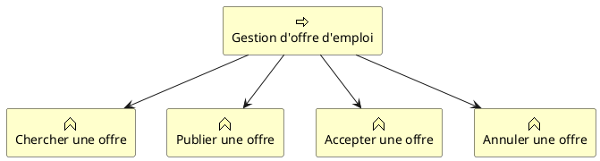
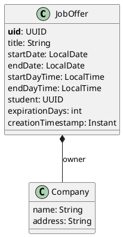

# Sujet TP – Spring Boot

Dans ce TP, vous allez apprendre/revoir comment utiliser Spring Boot et les modules Spring pour créer une application web.

<br><br>

## Objectif

Créer une application Spring Boot permettant de gérer des offre d'emploi pour étudiant  ([voir description](../conception%20de%20projet/INTES%20TP%20-%20Conception%20de%20projet%202025-2026.md)).

#### TODO list
- [x] Initialiser un projet Spring Boot
- [x] Mettez en place une page "Hello World"
- [x] Mettez en place une page d'acceuil
  - [x] Lister les offres d'emploi actives
- [x] Ajoutez des entités
  - [x] JobOfferEntity
  - [x] Company
- [x] Définissez un service regrouprant les logiques métier
  - [x] Obtenir toutes les offres d'emploi
  - [ ] Rechercher une offre par son titre
  - [ ] Publier une offre d'emploi
  - [ ] Modifier une offre d'emploi
  - [ ] Annulation d'une offre d'emploi
- [ ] Définissez des point d'entrée pour chaque fonction du service (voir tableau)

<br/>
<br/>

<center>



</center>

<br><br>

## Prérequis

- [Java installé sur votre machine](https://www.oracle.com/fr/java/technologies/downloads/#java21)
  - Version 8 minimum
  - Version 21 conseillée
- IDE installé et configuré
  - Eclipse / [Spring Tool Suite](https://spring.io/tools "IDE officiel de Spring")
  - [VS Code](https://code.visualstudio.com/docs/java/java-spring-boot "VS Code pour Spring Boot")
  - [IntelliJ Comunity](https://www.jetbrains.com/toolbox-app/ "Installez la toolbox Jetbrain pour mieux gérer votre installation")
- [Docker installé sur votre machine](https://docs.docker.com/engine/install/ "Documentation officielle")

<br><br>

## 1. Initialisation du projet

Rendez-vous sur https://start.spring.io/ pour générer un projet Spring Boot.<br>
Remplissez les champs de la manière suivante :

<center>


</center>
<br>

Téléchargez l’archive et décompressez-la.

Eclipse :

- Lancer l’IDE
- Importe « Projet Maven »
- … ([voir article](https://medium.com/eat-sleep-code-repeat/running-your-first-spring-boot-project-in-eclipse-ide-4fbc699d44dd))

VS Code / IntelliJ :

- Lancer l’IDE
- Ouvrez le dossier décompressé

Lancer l’application

```shell
$ mvn spring-boot:run
```

<br>

Rendez-vous sur [http://localhost:8080](http://localhost:8080 "lien de votre application locale") et vous devriez avoir cet écran :<br>


<br>


<br>

Bravo, votre installation fonctionne !

> Prenez le temps de lire les informations présentes dans les logs, vous allez voir comment Spring analyse et démarre comme vu dans le cours.

<br><br>

## 2. Hello World

Créez votre premier contrôleur pour avoir ce même comportement :<br/>

<center>


</center>

<br>

Placez le fichier **HelloRestControllerTests** dans votre dossier src/**tests**/java/com/imt/intes/partservice/controller.

Et lancez la commande suivante :

```shell
$ mvn test
```
> Ce fichier contient le test qui vérifiera si votre contrôleur fonctionne, n’hésitez pas à y jeter un coup d’œil pour le comprendre.
<details>
<summary>Cliquez pour voir le contenu de ce fichier.</summary>

```Java
@SpringBootTest
@AutoConfigureMockMvc
class HelloRestControllerTest {
    @Autowired
    private MockMvc mvc;

    @Test
    void loadHelloString () throws Exception {
        mvc.perform(MockMvcRequestBuilders.get("/hello"))
                .andExpect(status().isOk())
                .andExpect(MockMvcResultMatchers.content()
                        .contentTypeCompatibleWith(MediaType.TEXT_PLAIN))
                .andExpect(MockMvcResultMatchers.content().string("Hello world !"));
    }
}
```
</details>

<br><br>

## 3. HTML dynamique

Maintenant, que vous avez compris le fonctionnement d’un contrôleur, vous allez pouvoir utiliser **Thymeleaf** pour générer une page HTML dynamique.

Tout d’abord, assurez-vous que la dépendance Thymeleaf est bien dans votre pom.xml. Sans ça, vous n’auriez pas accès aux fonctionnalités de ce moteur de template et vous ne pourrez donc pas générer de HTML.

```xml
<dependency>
   <groupId>org.springframework.boot</groupId>
   <artifactId>spring-boot-starter-thymeleaf</artifactId>
</dependency>
```

Ensuite, créez un fichier HTML « **home.html** » dans le dossier « **template** » de votre projet.


<br>

Puis créez le contrôleur permettant de générer la vue.

```html
<!DOCTYPE html>
<html lang="en">
<head>
    <title>JobOfferService</title>
</head>
<body>
  JobOfferService up !
</body>
</html>
```

Placez le fichier **HomeControllerTests** dans votre dossier src/**tests**/java/com/imt/intes/partservice/controller pour vérifier votre code.

<details>
<summary>Cliquez pour voir le contenu de ce fichier.</summary>

```Java
@SpringBootTest
@AutoConfigureMockMvc
public class HomeControllerTests {

    @Autowired
    private MockMvc mvc;

    @Test
    void loadHome () throws Exception {
        mvc.perform(get("/")
                        // Avec spring security: 
                        //    .with(SecurityMockMvcRequestPostProcessors.user("admin").password("admin"))
                    )
                .andExpect(status().isOk())
                .andExpect(content()
                        .contentTypeCompatibleWith(MediaType.TEXT_HTML))
                .andExpect(view().name("home"));
                // Exemple de test utilisant un JSON path:
                //    .andExpect(xpath("//html/body/div/div[@class='title']").exists());
    }
}
```
> Ici, j'utilise thymeleaf pour comparer le resultat avec le template grâce à la méthode *view().name("home")*

</details>

> Notez que l'on créer un micro-service, donc la génération de vue n'est normalement pas utile, cependant cela peux permettre de donner des indications sur l'utilisation de votre API.

<br><br>

## 4. Les Entités

Il est temps de voir comment utiliser une base de données.

Pour cela, assurez-vous d’avoir toutes les dépendances nécessaires :

- Spring Data JPA

  ```xml
  <dependency>
    <groupId>org.springframework.boot</groupId>
    <artifactId>spring-boot-starter-data-jpa</artifactId>
  </dependency>
  ```

- Driver de la base de données utilisée
  ```xml
  <dependency>
    <groupId>com.h2database</groupId>
    <artifactId>h2</artifactId>
    <scope>runtime</scope>
  </dependency>
  ```
  > Ici, nous allons utiliser dans un premier temps la base de données H2database qui permet de lancer une instance en mémoire. A chaque, redémarrage les données seront perdues, mais c’est très simple pour commencer ou pour faire des tests automatiques.

<br>

Ensuite, il faut ajouter les **propriétés Spring** permettant à l’application de se connecter à la base de données :

```properties
## Database properties ##
spring.datasource.url=jdbc:h2:mem:JobOfferService
spring.datasource.driverClassName=org.h2.Driver
spring.datasource.username=sa
spring.datasource.password=password
spring.jpa.database-platform=org.hibernate.dialect.H2Dialect
```

Maintenant, votre application est prête pour créer vos entités et les méthodes pour les gérer.
<br/><br/>

**Créez l'entité JobOffer et les méthodes permettant de les manipuler.**

**Entité**:

<center>



</center>

> Notez l'utilisation de UUID plutôt que d'un entier auto-increment, cela rend l'annalyse plus facile quand on agrège différent type de donnée ([voir article](https://www.base-de-donnees.com/uuid-vs-auto-increment/)).

<br>

Une fois vos entités terminées, vous pouvez créer vos repository puis vos services.<br/>
A noter que le résultat d'une fonction métier ne dois pas être votre entité met un **DTO**.

**Méthodes métiers**
- JobOfferDto findOneJobOffer (UUID jobOfferId)
- List&lt;JobOfferDto&gt; searchJobOffer (String titleRegex, int page, int number)
- JobOfferDto publishJobOffer (JobOfferDto newjobOfferDto)
- JobOfferDto updateJobOffer (JobOfferDto jobOfferDto)
- void cancelJobOffer (UUID jobOfferId)

Placez le fichier **jobOfferRepositoryTest** dans votre dossier src/**tests**/java/com/imt/service/eventservice/repository pour vérifier votre code.

<details>
<summary>Cliquez pour voir le contenu de ce fichier.</summary>

> [!CAUTION]
> Il faut modifier ce test pour coller au sujet

```Java
import static org.junit.jupiter.api.Assertions.*;

@SpringBootTest
class JobOfferRepositoryTest {

    private final JobOffer defaultJobOffer;
    private final JobOfferRepository jobOfferRepository;

    @Autowired
    public JobOfferRepositoryTest(JobOfferRepository jobOfferRepository) {
        this.jobOfferRepository = jobOfferRepository;
        JobOffer jobOffer = new JobOffer();
        jobOffer.setId(UUID.randomUUID());
        jobOffer.setTitle("Job Offer test");
        jobOffer.setStartDate(LocalDate.MIN);
        jobOffer.setEndDate(LocalDate.MAX);
        jobOffer.setStartDayTime(LocalTime.MIN);
        jobOffer.setEndDayTime(LocalTime.MAX);
        jobOffer.setExpirationDays(10);
        jobOffer.setCreationTimestamp(Instant.MIN);

        this.defaultJobOffer = jobOffer;
    }

    @BeforeAll
    static void setUp(@Autowired JobOfferRepository jobOfferRepository) {
        jobOfferRepository.deleteAll();
    }

    @Test
    void shouldInsertJobOffer() {
        JobOffer savedEntity = this.jobOfferRepository.save(defaultJobOffer);
        assertNotNull(savedEntity);
        assertEquals(defaultJobOffer, savedEntity);
    }

    @Test
    void shouldFindJobOfferByTitle() {
        // Prepare data
        this.jobOfferRepository.save(defaultJobOffer);

        List<JobOffer> results = this.jobOfferRepository.findAllByTitleLikeOrderByCreationTimestampDesc("Job Offer %");
        assertNotNull(results);
        assertFalse(results.isEmpty());
        assertEquals(defaultJobOffer.getTitle(), results.get(0).getTitle());
    }

    void shouldUpdateJobOffer() {
        // Prepare data
        JobOffer modifiedJobOffer = this.jobOfferRepository.save(defaultJobOffer);
        modifiedJobOffer.setTitle("Job Offer test (bis)");
        modifiedJobOffer.setStartDate(modifiedJobOffer.getStartDate().plusDays(1));
        modifiedJobOffer.setEndDate(modifiedJobOffer.getEndDate().minusDays(1));
        modifiedJobOffer = this.jobOfferRepository.save(modifiedJobOffer);

        Optional<JobOffer> savedJobOffer = this.jobOfferRepository.findById(defaultJobOffer.getId());
        assertTrue(savedJobOffer.isPresent());
        assertEquals(modifiedJobOffer.getTitle(), savedJobOffer.get().getTitle());
        assertNotEquals(defaultJobOffer.getTitle(), savedJobOffer.get().getTitle());
    }

    void shoudDeleteJobOffer() {
        // Prepare data
        this.jobOfferRepository.save(defaultJobOffer);

        this.jobOfferRepository.deleteById(defaultJobOffer.getId());
        List<JobOffer> all = this.jobOfferRepository.findAll();
        assertTrue(all.isEmpty());
    }
}
```
</details>

<br><br>

## 5. Spring Security

Avant d’aller plus, il serait judicieux de protéger votre application.

Pour cela, nous pouvons utiliser **Spring Security**, ce projet Spring va nous permettre d’ajouter une vérification des appels reçu par votre application pour vérifier si le demandeur à le droit d’accéder à la ressource qu’il a demandée.

<br>

Ajoutez la dépendance Spring Security et la dépendance de test :

```xml
<!-- Security dependencies -->
<dependency>
   <groupId>org.springframework.boot</groupId>
   <artifactId>spring-boot-starter-security</artifactId>
</dependency>
<dependency>
   <groupId>org.springframework.security</groupId>
   <artifactId>spring-security-test</artifactId>
   <scope>test</scope>
</dependency>
```

<br>

Vous pouvez démarrer votre application et regardez les logs.
spring-security-started-log


<br>

Rafraichissez votre page d’accueil, normalement une page de connexion devrait apparaître.
La configuration automatique de Spring Security a créé un utilisateur avec le login "**user**" et un mot de passe temporaire généré automatiquement (affiché dans les logs).<br/>
Il sera regénéré à chaque redémarrage de l’application, je vous laisse trouver le moyen pour fixer ce mot de passe.

<br>

Pour vous déconnecter, aller à l’adresse [http://localhost:8080/logout](http://localhost:8080/logout "Votre lien de déconnexion"), vous pouvez ajouter un bouton sur votre page d’accueil pour vous déconnecter plus facilement.

> Par défaut, Spring Security sécurise toutes vos urls Mais il est possible de le personnaliser pour définir d’autres règles de sécurité.

**Rendez la page « Hello world ! » public.**

<br><br>

## 6. Gérer vos entités

Comme votre application est sécurisé, vous pouvez créer des points de terminaisons (**endpoints**) pour manipuler vos entités.

<br>

Créez ces Endpoints :


| Method | url | request param | request body | response body | Result | Description |
| --- | --- | --- | --- | --- | --- | --- |
| GET | /service/job-offer | | | [ ]: Collection\<JobOffer> | 200 ou 204 | List 10 job offers |
| GET | /service/job-offer | title | | []: Collection<JobOffer> | 200 ou 201 | Permet de chercher les offres par titre |
| GET | /service/job-offer | company | | []: Collection<JobOffer> | 200 ou 201 | Renvoi la liste des offre de l'entrerpies |
| GET | /service/job-offer/{uid} | | | {}: JobOffer | 200 ou 404 | Renvoi une offer sinon error |
| POST | /service/job-offer | | {}: JobOffer | {}: JobOffer | 201 ou 400 ou 401 | Créer une offer |
| PUT | /service/job-offer | | {}: JobOffer | {}: JobOffer | 200 ou 400 ou 401 ou 404 | Modifier une offer |
| DELETE | /service/job-offer/{uid} | | | | 200 ou 401 ou 404 | Annuler une offer |


Placez le fichier **JobOfferControllerTest** dans votre dossier src/**tests**/java/com/<*your package*>/repository pour vérifier votre code.

<details>
<summary>Cliquez pour voir le contenu de ce fichier.</summary>

```Java
import static org.junit.jupiter.api.Assertions.assertFalse;
import static org.junit.jupiter.api.Assertions.assertTrue;

@SpringBootTest
@AutoConfigureMockMvc
class JobOfferControllerTest {

    @Autowired
    private MockMvc mockMvc;
    @Autowired
    private JobOfferRepository jobOfferRepository;
    @Autowired
    private CompanyRepository companyRepository;

    @BeforeAll
    static void setUp(@Autowired JobOfferRepository jobOfferRepository, @Autowired CompanyRepository companyRepository) {
        jobOfferRepository.deleteAll();
        companyRepository.deleteAll();
    }

    @Test
    @WithMockUser(roles = "user")
    void shouldPublishNewOffer() throws Exception {
        HashMap<String, Object> company = new HashMap<>();
        company.put("name", "Company 1");
        company.put("address", "10 rue de Java");

        HashMap<String, Object> newOffer = new HashMap<>();
        newOffer.put("title", "New offer");
        newOffer.put("description", "This is a new offer");
        newOffer.put("startDayTime", "08:00:00");
        newOffer.put("endDayTime", "16:00:00");
        newOffer.put("startTime", "2025-06-01");
        newOffer.put("endTime", "2025-01-30");
        newOffer.put("creationTimestamp", "2025-03-01T12:00:00Z");
        newOffer.put("expirationDays", 90);

        newOffer.put("owner", company);

        ObjectMapper objectMapper = new ObjectMapper();
        String json = objectMapper.writeValueAsString(newOffer);

        mockMvc.perform(MockMvcRequestBuilders
                        .post("/service/job-offer")
                        .content(json)
                        .contentType(MediaType.APPLICATION_JSON)
                )
                .andExpect(MockMvcResultMatchers.status().isCreated())
                .andExpect(MockMvcResultMatchers.jsonPath("$.title").value(newOffer.get("title")));

        Page<JobOffer> savedEntities = this.jobOfferRepository.searchAllByTitleLikeIgnoreCase(newOffer.get("title").toString(), Pageable.ofSize(10));
        assertFalse(savedEntities.isEmpty());
        Optional<Company> savedCompany = companyRepository.findById(company.get("name").toString());
        assertTrue(savedCompany.isPresent());
    }

    @Test
    @WithMockUser(roles = "user")
    void shouldFindOffer() throws Exception {
        shouldPublishNewOffer();
        mockMvc.perform(MockMvcRequestBuilders.get("/service/job-offer").param("title", "New offer"))
                .andExpect(MockMvcResultMatchers.status().isOk());
    }

    @Test
    @WithMockUser(roles = "user")
    void shouldUpdateOffer() throws Exception {
        shouldPublishNewOffer();
        UUID previousId = this.jobOfferRepository.searchAllByTitleLikeIgnoreCase("New offer", Pageable.ofSize(10)).getContent()
                .stream().map(JobOffer::getId)
                .findFirst().get();
        HashMap<String, Object> company = new HashMap<>();
        company.put("name", "Company 1");
        company.put("address", "10 rue de Java");

        HashMap<String, Object> jobOffer = new HashMap<>();
        jobOffer.put("id", previousId);
        jobOffer.put("title", "This is a real offer");
        jobOffer.put("description", "This is a new offer");
        jobOffer.put("startDayTime", "08:00:00");
        jobOffer.put("endDayTime", "16:00:00");
        jobOffer.put("startTime", "2025-06-01");
        jobOffer.put("endTime", "2025-01-30");
        jobOffer.put("creationTimestamp", "2025-03-01T12:00:00Z");
        jobOffer.put("expirationDays", 90);

        ObjectMapper objectMapper = new ObjectMapper();
        mockMvc.perform(
                        MockMvcRequestBuilders.put("/service/job-offer")
                                .contentType(MediaType.APPLICATION_JSON)
                                .content(objectMapper.writeValueAsString(jobOffer))
                )
                .andExpect(MockMvcResultMatchers.status().isOk())
                .andExpect(MockMvcResultMatchers.jsonPath("$.id").value(previousId.toString()))
                .andExpect(MockMvcResultMatchers.jsonPath("$.title").value(jobOffer.get("title")));
    }

    @Test
    @WithMockUser(roles = {"user", "admin"})
    void shouldDeleteOffer() throws Exception {
        shouldPublishNewOffer();
        JobOffer jobOffer = this.jobOfferRepository.searchAllByTitleLikeIgnoreCase("%", Pageable.ofSize(10)).getContent().getFirst();
        jobOffer.setTitle("This is a real offer");

        ObjectMapper objectMapper = new ObjectMapper();
        mockMvc.perform(
                        MockMvcRequestBuilders.delete("/service/job-offer/"+jobOffer.getId())
                )
                .andExpect(MockMvcResultMatchers.status().isOk());
        Optional<JobOffer> deletedEntity = this.jobOfferRepository.findById(jobOffer.getId());
        assertFalse(deletedEntity.isPresent());
    }

}
```
</details>
<br/>
<br/>
Vous pouvez également ajouter un tableau HTML sur votre page d’accueil pour être capable de voir le contenu de votre base de données.

Pensez à sécuriser vos endpoints, pour cela vous pouvez ajouter la configuration ci-dessous :

```java
/* CODES */
.authorizeHttpRequests((requests) -> requests
  .requestMatchers(HttpMethod.GET, "/service/**").permitAll()
  .requestMatchers(HttpMethod.DELETE, "/service/**").hasRole("admin")
  .requestMatchers("/service/**").hasRole("user")
})
/* … */
  .httpBasic();
/* … */
  http.csrf(AbstractHttpConfigurer::disable);
/* … */
  http.cors(AbstractHttpConfigurer::disable);
/* CODES */
```

Cette configuration permet de rendre public toutes actions de lecture sur les urls « /service/\*\* », d’autoriser uniquement les administrateurs à supprimer des données et d’autoriser n’importe quelle personne connecter à créer/modifier des entités.

> La méthode httpBasic() permet d’activer l’envoi de l’identifiant et du mot de passe dans le Header http de la requête sous le format d’un jeton encodé en base64 (ex : Basic ikxhkzmsoh5yup4==).

> La méthode csrf() permet de configurer la protection CSRF ou de la désactiver (doc).

> La méthode cors() permet de configurer la protections CORS policy ou de la désactiver (doc).

<br/>

Libre à vous de configurer la sécurité que vous souhaitez.

<details>
  <summary>Exemple de configuration personalisé</summary>
Exemple de filtre personalisé:

```java

@Component
public class CustomFilter implements Filter {

    private static final Logger LOGGER = LoggerFactory.getLogger(CustomFilter.class);

    @Override
    public void doFilter(ServletRequest servletRequest, ServletResponse servletResponse, FilterChain filterChain)
            throws IOException, ServletException {
        HttpServletRequest request = (HttpServletRequest) servletRequest;
        HttpServletResponse response = (HttpServletResponse) servletResponse;
        try {
            String uri = request.getRequestURI();
            if (isValidUri(uri)) {
                String username = request.getHeader("Authorization");
                UsernamePasswordAuthenticationToken authentication = new UsernamePasswordAuthenticationToken(
                    username, null, null);
                SecurityContextHolder.getContext().setAuthentication(authentication);
            }
        } catch (Exception e) {
            LOGGER.error("Cannot set user authentication: {}", e);
        }
 
        filterChain.doFilter(request, response);
        throw new UnsupportedOperationException("Unimplemented method 'doFilter'");
    }

    private boolean isValidUri (String uri) {
        /* A remplacer par une réglèe plus complexe */
        return true;
    }
}
```

Ajouter cette configuration pour ajouter votre filtre dans le `FilterChain` de spring security.

```java
  /* Spring Security configuration */
  /* ... */
  /* Ajouter votre propre filter */
  .addFilterBefore(CustomFilter, UsernamePasswordAuthenticationFilter.class)
  /* ... */
```

> Ce filter est un exemple, normalement on doit vérifier plus de chose (ex: vérifier que le token placé dans le header soit valid)

</details>


###### PS : si vous êtes sur le même réseau, vous êtes capable d’accéder aux Endpoints de vos collègue 😉

<br><br>

# [Optionel] Aller plus loin

## 7. Communication avec JobDemandService

Depuis votre application Spring Boot, essayez d’appeler une autre API.
Pour cela, vous pouvez définir un nouveau service qui enverra une requête http à votre second API et traitera les données en retour (voir : WebClient de Spring Reactive).

> Si vous avez terminé le TP Node.js, utilisez là sinon vous pouvez utiliser **json-server** pour simuler une API simple ([exemple](../resources/weather-api "Outil pour créer une API factif")).

<br><br>

## 8. User (rôle, items, …)

Essayez d’ajouter des utilisateurs, rôles (« USER », « ADMIN ») ainsi que des relations entre part et user.

| UserEntity |            |
| :--------- | :--------- |
| login      | String     |
| password   | String     |
| role       | RoleEntity |

| RoleEntity |        |
| :--------- | :----- |
| id         | String |

> Vous pouvez utiliser cet article: [Medium](https://medium.com/@nagarjun_nagesh/customizing-authentication-in-spring-boot-aa60bd13aebe)
