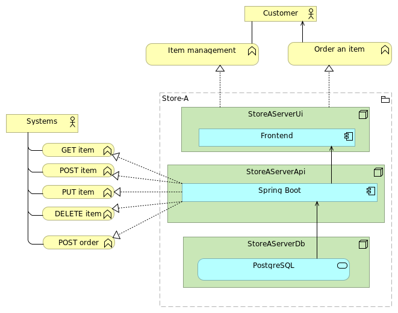
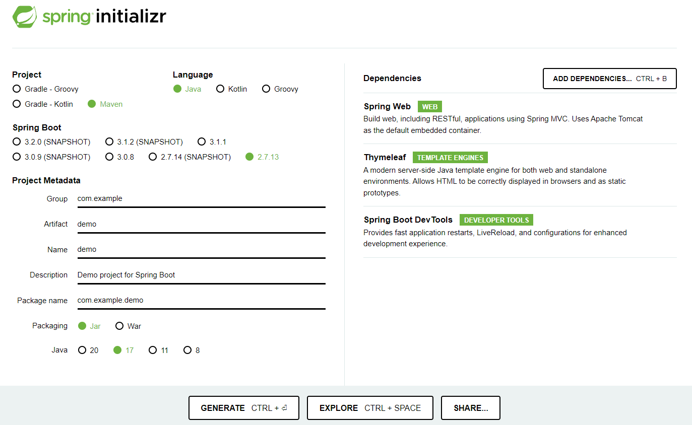

# Sujet TP – Spring Boot

Dans ce TP, vous aller apprendre/revoir comment utiliser Spring Boot et les modules Spring pour créer une application web.

<br><br>

## Objectif

Créer une application Spring Boot permettant de gérer un entrepôt d’objet.

1. Initialiser un projet Spring Boot
2. Obtenir tous les objets
3. Rechercher un objet
4. Ajout d’objet
5. Modification d’objet
6. Suppression d’objet

<center>



</center>

<br><br>

## Prérequis

- [Java installé sur votre machine](https://www.oracle.com/fr/java/technologies/downloads/#java17)
  - Version 8 minimum
  - Version 17 conseillée
- IDE installé et configuré
  - Eclipse / [Spring Tool Suite](https://spring.io/tools "IDE officiel de Spring")
  - [VS Code](https://code.visualstudio.com/docs/java/java-spring-boot "VS Code pour Spring Boot")
  - IntelliJ Comunity
- [Docker installé sur votre machine](https://docs.docker.com/engine/install/ "Documentation officielle")

<br><br>

## 1. Initialisation du projet

Rendez-vous sur https://start.spring.io/ pour générer un projet Spring Boot.<br>
Remplissez les champs de la manière suivante :

<center>



</center>
<br>

Téléchargez l’archive et décompressez-la.

Eclipse :

- Lancer l’IDE
- Importe « Projet Maven »
- … ([voir article](https://medium.com/eat-sleep-code-repeat/running-your-first-spring-boot-project-in-eclipse-ide-4fbc699d44dd))

VS Code / IntelliJ :

- Lancer l’IDE
- Ouvrez le dossier décompressez

Lancer l’application

```shell
$ mvn spring-boot:run
```

<br>

Rendez-vous sur [http://localhost:8080](http://localhost:8080 "lien de votre application locale") et vous devriez avoir cet écran :<br>


<br>


<br>

Bravo votre installation fonctionne !

<br><br>

## 2. Hello World

Créez votre premier contrôleur pour avoir ce même comportement:<br/>

<center>


</center>

<br>

Placez le fichier **HelloRestControllerTests** dans votre dossier src/tests/java/com/imt/intes.

Et lancez la commande suivante :

```shell
$ mvn test
```

> Ce fichier contient le test qui vérifiera si votre contrôleur fonctionne, n’hésitez pas à y jeter un coup d’œil pour le comprendre.

<br><br>

## 3. HTML dynamique

Maintenant que vous avez compris le fonctionnement d’un contrôleur, vous allez pouvoir utiliser **Thymeleaf** pour générer une page HTML dynamique.

Tout d’abord assurez-vous que la dépendance Thymeleaf est bien dans votre pom.xml. Sans ça, vous n’aurais pas accès aux fonctionnalités de ce moteur de template et vous ne pourrez donc pas générer de HTML.

```xml
<dependency>
   <groupId>org.springframework.boot</groupId>
   <artifactId>spring-boot-starter-thymeleaf</artifactId>
</dependency>
```

Ensuite créez un fichier HTML « **home.html** » dans le dossier « **template** » de votre projet.


<br>

Puis créez le contrôleur permettant de générer la vue.

```html
<html>
  <head>
    <title>Hello</title>
  </head>
  <body>
    Hello World !
  </body>
</html>
```

Placez le fichier **HomeControllerTests** dans votre dossier src/tests/java/com/imt/intes pour vérifier votre code.

<br><br>

## 4. Les Entités

Il est temps de voir comment utiliser une base de données.

Pour cela, assurez-vous d’avoir toutes les dépendances nécessaires :

- Spring Data JPA

  ```xml
  <dependency>
    <groupId>org.springframework.boot</groupId>
    <artifactId>spring-boot-starter-data-jpa</artifactId>
  </dependency>
  ```

- Driver de la base de données utilisée
  ```xml
  <dependency>
    <groupId>com.h2database</groupId>
    <artifactId>h2</artifactId>
    <scope>runtime</scope>
  </dependency>
  ```
  > Ici nous allons utiliser dans un premier temps la base de données H2database qui permet de lancer une instance en mémoire, à chaque redémarrage les données seront perdues mais c’est très simple pour commencer ou pour faire des tests automatiques.

<br>

Ensuite, il faut ajouter les **propriété Spring** permettant à l’application de se connecter à la base de données :

```properties
## Database properties ##
spring.datasource.url=jdbc:h2:mem:storeA
spring.datasource.driverClassName=org.h2.Driver
spring.datasource.username=sa
spring.datasource.password=password
spring.jpa.database-platform=org.hibernate.dialect.H2Dialect
```

Maintenant, votre application est prête pour créer vos entités et les méthodes pour les gérer.
<br/><br/>

**Créez l'entitée Item et les méthodes permettant de les manipuler**

**Entité**:

<center>

| ItemEntity |        |
| :--------- | :----- |
| id         | long   |
| name       | String |
| weight     | double |
| price      | double |

</center>

<br>

**Méthodes** :

- ItemEntity save (ItemEntity entity)
- Void delete (ItemEntity entity)
- ItemEntity findFirstByName (String name)
- List<ItemEntity> findAll ()
- Page<ItemEntity> findAll (Pageable page)

Placez le fichier **ItemRepositoryTests** dans votre dossier src/tests/java/com/imt/intes pour vérifier votre code.

<br><br>

## 5. Spring Security

Avant d’aller plus, il serait judicieux de protéger votre application.

Pour cela nous pouvons utiliser **Spring Security**, ce projet Spring va nous permettre d’ajouter une vérification des appels reçu par votre application pour vérifier si le demandeur à le droit d’accéder à la ressource qu’il a demandé.

<br>

Ajoutez la dépendance Spring Security et la dépendance de test :

```xml
<!-- Security dependencies -->
<dependency>
   <groupId>org.springframework.boot</groupId>
   <artifactId>spring-boot-starter-security</artifactId>
</dependency>
<dependency>
   <groupId>org.springframework.security</groupId>
   <artifactId>spring-security-test</artifactId>
   <scope>test</scope>
</dependency>
```

<br>

Vous pouvez démarrer votre application et regardez les logs.
spring-security-started-log


<br>

Rafraichissez votre page d’accueil, normalement une page de connexion devrait apparaitre.
La configuration automatique de Spring Security a créé un utilisateur avec le login user et un mot de passe temporaire généré automatiquement (affiché dans les logs).
Il sera regénéré à chaque redémarrage de l’application, je vous laisse trouver le moyen pour fixer ce mot de passe.

<br>

Pour vous déconnecter, aller à l’adresse [http://localhost:8080/logout](http://localhost:8080/logout "Votre lien de déconnexion"), vous pouvez ajouter un bouton sur votre page d’accueil pour vous déconnecter plus facilement.

> Par défaut, Spring Security sécurise toutes vos urls Mais il est possible de le personnaliser pour définir d’autres règles de sécurité.

**Rendez la page « Hello world ! » public.**

<br><br>

## 6. Gérer vos entités

Comme votre application est sécurisé, vous pouvez créer des points de terminaisons (**endpoints**) pour manipuler vos entités.

<br>

Créez c’est Endpoints :

- **GET** : /service/item<br>
  Renvoi la liste des items sauvegardée
- **POST** : /service/item<br>
  Permet de sauvegarder un nouvel item
- **PUT** : /service/item<br>
  Permet de mettre à jour un item existant
- **DELETE** : /service/item<br>
  Permet de supprimer un item existant
- **GET** : /service/item/search/_\<nameRegex\>_<br>
  Renvoi tous les items qui ont un nom ressemblant à _nameRegex_

Vous pouvez également ajouter un tableau HTML sur votre page d’accueil pour être capable de voir le contenu de votre base de données.

Pensez à sécuriser vos endpoints, pour cela vous pouvez ajouter la configuration ci-dessous :

```java
/* CODES */
  .antMatchers(HttpMethod.GET, "/service/**").permitAll()
  .antMatchers(HttpMethod.DELETE, "/service/**").hasRole("admin")
  .antMatchers("/service/**").hasRole("user")
/* … */
  .httpBasic();
/* … */
  http.csrf().disable();
/* … */
  http.cors().disable();
/* CODES */
```

Cette configuration permet de rendre public toutes actions de lecture sur les urls « /service/\*\* », d’autoriser uniquement les administrateurs à supprimer des données et d’autoriser n’importe quelle personne connecter à créer/modifier des entités.

> La méthode httpBasic() permet d’activer l’envoi de l’identifiant et du mot de passe dans le Header http de la requête sous le format d’un jeton encodé en base64 (ex : Basic ikxhkzmsoh5yup4==).

> La méthode csrf() permet de configurer la protection CSRF ou de la désactiver (doc).

> La méthode cors() permet de configurer la protections CORS policy ou de la désactiver (doc).

<br>

Libre à vous de configurer la sécurité que vous souhaitez.

###### _PS : Si vous êtes sur le même réseau, vous êtes capable d’accéder aux Endpoints de vos collègue 😉_

<br><br>

# Aller plus loin

## 7. User (rôle, items, …)

Essayez d’ajouter des utilisateurs, rôles (« USER », « ADMIN ») ainsi que des relations entre item et user.

> | UserEntity |            |
> | :--------- | :--------- |
> | login      | String     |
> | password   | String     |
> | role       | RoleEntity |

<br>

> | RoleEntity |        |
> | :--------- | :----- |
> | id         | String |

<br><br>

## 8. Communication storeB

Depuis votre application Spring Boot, essayez d’appeler une autre API.
Pour cela, vous pouvez définir un nouveau service qui enverra une requête http à votre second API et traitera les données en retour (voir : WebClient de Spring Reactive).

> Si vous avez terminé le TP Node.js, utilisez là sinon vous pouvez utiliser **json-server** pour simuler une API simple ([exemple](../resources/weather-api "Outil pour créer une API factif")).
