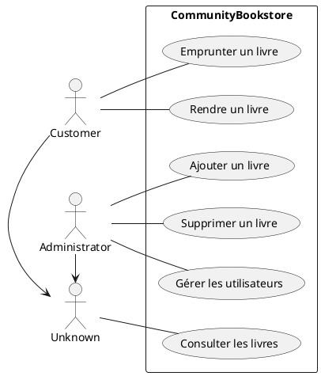
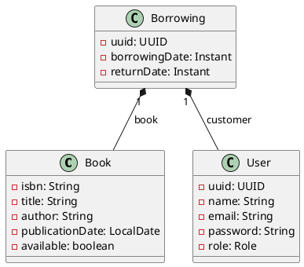
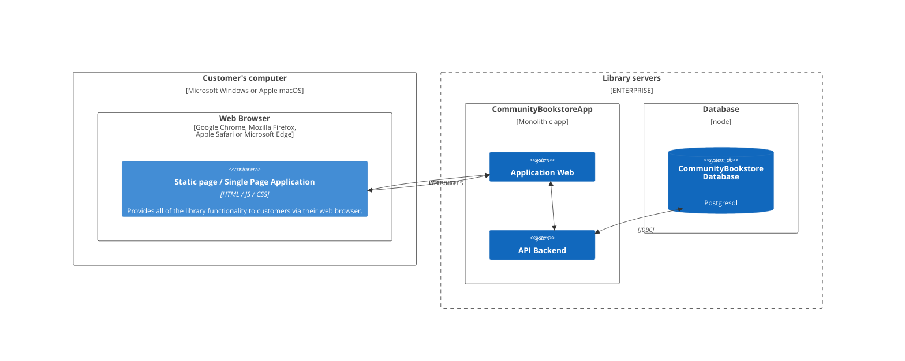

# Spring Boot - TP #1

Vous êtes chargé·e de développer une application web pour gérer une bibliothèque communautaire. Les utilisateurs pourront consulter, emprunter et rendre des livres. L’application devra évoluer pour répondre à des besoins croissants en termes de fonctionnalités, de sécurité et de performance.

## 🔵 Préparation

### Contexte

```
Une bibliothèque communautaire souhaite moderniser sa gestion des emprunts et des retours de livres. Actuellement, tout est géré manuellement sur papier, ce qui entraîne des erreurs et des pertes de temps. L’objectif est de développer une application web pour automatiser ces processus.
```

### Exigences métier

- Permettre aux utilisateurs de consulter les livres disponibles.
- Gérer les emprunts et les retours.
- Sécuriser l’accès aux fonctionnalités sensibles (ex : ajout/suppression de livres).
- Assurer une expérience utilisateur fluide et intuitive.

<center>



<p>Diagramme de cas d'utilisation</p>

</center>

<details>
<summary>Description des fonctionnalités</summary>

- Emprunter un livre
  - Diagramme de séquence
    ```plantuml
    @startuml
    actor       Customer       as user
    participant Frontend as frontend
    collections Backend as backend
    database    Database    as db

    user -> frontend : L’utilisateur clique sur « Emprunter ce livre »
    frontend -> backend : Demande l'emprunt de ce livre
    backend -> backend : Vérifie si la requête est valide
    backend -> db : Récupére les informations du livre
    backend -> backend : Vérifie la disponibilité du livre

    alt livre disponible
      backend -> backend : Modifie les informations du livre
      backend -> db : Sauvegarde les modifications
      backend -> frontend : Accepte la demande
    else
      backend -> frontend : Rejette la demande
    end

    frontend -> user : Affiche le résultat du traitement
    @enduml
    ```
- Supprimer un livre
  - Logigramme
    ```plantuml
    @startuml
    actor       Customer       as user
    participant Frontend as frontend
    collections Backend as backend
    database    Database    as db

    user -> frontend : L’utilisateur clique sur « Emprunter ce livre »
    frontend -> backend : Demande l'emprunt de ce livre
    backend -> backend : Vérifie si la requête est valide
    backend -> db : Récupére les informations du livre
    backend -> backend : Vérifie la disponibilité du livre

    alt livre disponible
      backend -> backend : Modifie les informations du livre
      backend -> db : Sauvegarde les modifications
      backend -> frontend : Accepte la demande
    else
      backend -> frontend : Rejette la demande
    end

    frontend -> user : Affiche le résultat du traitement
    @enduml
    ```
</details>

<details>
<summary>Maquettes des interfaces</summary>

[TODO]

</details>

<details>
<summary>Modèle Conceptuel de Données (MCD)</summary>

Entités et relations :


MLD :

- Book (isbn, title, author, publicationDate, available)
- User (uuid, name, email, password, role)
- Borrowing (uuid, book_isbn, cutomer_uuid, borrowingDate, returnDate)



</details>


### Exigences technique

#### Technologies :

- Backend : Spring Boot (version 3.5+ ou 4+)
- Frontend : Thymeleaf + Tailwind
- Base de données : H2 (développement), PostgreSQL (production)
- Sécurité : Spring Security + JWT
- Couverture des tests attendue: 60%

#### Architecture :

- MVC (Model-View-Controller)
- API REST pour le backend

#### ⁉️ Questions pour la réflexion :
- Pourquoi est-il important de modéliser les cas d’utilisation avant de coder ?
- Comment les maquettes aident-elles à valider les besoins avec le client ?
- Quels risques pourraient survenir si on ne fait pas d’analyse fonctionnelle ?


### Conception



---

## 🟦 MVP

> #### 📍 MVP (Minimal Valuable Product)
> Le MVP est une version minimale d’un produit, contenant uniquement les fonctionnalités essentielles pour tester une hypothèse sur le marché. Son objectif est de valider rapidement l’intérêt des utilisateurs et de recueillir des retours, sans investissement excessif. En cas d’échec, l’entreprise peut ajuster ou abandonner le projet avec un risque financier limité.

### ☑️ DoR - Critères à remplir

- [x] Préparation et compréhension des attentes du projet
- [x] Équipe de développement prête

### ✅ DoD - Définition du fini
- Mise en place de l’application de base
- Ajout d’une interface web dynamique
- Sécurité de l’application

### 🧭 Guide

#### Étape 1 : Mise en place de l’application de base

##### 🎯 Objectifs :

Créer une API REST simple avec Spring Boot.
Comprendre les bases : contrôleurs, services, repositories, entités JPA.
Manipuler une base de données (H2 en mémoire pour simplifier).

##### ✏️ Fonctionnalités à implémenter :

1. Modélisation des entités :
     - Livre (titre, auteur, année, disponible)
     - Utilisateur (nom, email)
     - Emprunt (livre, utilisateur, dateEmprunt, dateRetour)

2. API REST :
     - CRUD pour les livres (GET /livres, POST /livres, etc.).
     - Endpoint pour emprunter/rendre un livre (POST /emprunts).

3. Tests unitaires :
     - Tester les contrôleurs et services avec JUnit et Mockito.

##### ⁉️ Questions pour la réflexion :

- Pourquoi utilise-t-on des couches (contrôleur/service/repository) ?
- Comment Spring Boot simplifie-t-il la configuration de la base de données ?
- Quels sont les avantages/inconvénients d’utiliser H2 en mémoire ?

#### Étape 2 : Ajout d’une interface web dynamique

##### 🎯 Objectifs :

- Intégrer Thymeleaf (HTML/JS) et Tailwind (css) pour rendre l’application plus interactive.
- Comprendre le rendu côté serveur vs. client.

##### ✏️ Fonctionnalités à implémenter :

- Pages web :
    - Page d’accueil listant les livres disponibles.
    - Formulaire pour ajouter un livre ou emprunter/rendre un livre.

- Interaction avec l’API :
    - Utiliser Fetch pour appeler l’API depuis le frontend.

- Amélioration de l’UX :
    - Afficher des messages de succès/erreur.
    - Filtrer les livres par auteur ou disponibilité.

##### ⁉️ Questions pour la réflexion :

- Pourquoi séparer le frontend et le backend ?
- Comment rendre l’interface plus réactive sans recharger la page ?
- Quels frameworks JS pourraient être utilisés pour une application plus complexe ?

#### Étape 3 : Sécurité de l’application

##### 🎯 Objectifs :

- Ajouter une couche de sécurité avec Spring Security.
- Comprendre les rôles et les authorisations.

##### ✏️ Fonctionnalités à implémenter :

- Authentification :
  - Ajouter un système de login/logout (utilisateurs en base de données).
  - Protéger les endpoints sensibles (ex : suppression d’un livre).

- Rôles :
  - Différencier les rôles : ADMIN (peut ajouter/supprimer des livres) et USER (peut emprunter).

- Sécurité des mots de passe :
  - Hachage des mots de passe avec BCrypt.

##### ⁉️ Questions pour la réflexion :

- Pourquoi ne pas stocker les mots de passe en clair ?
- Comment gérer les sessions utilisateur de manière sécurisée ?
- Quels sont les risques d’une mauvaise configuration de Spring Security ?


---

## 🔷 MMP

> #### 📍 MMP (Minimal Marketable Product)
> Une fois le MVP validé et les retours analysés, le MMP représente la première version **commercialisable** du produit. Il intègre uniquement les fonctionnalités apportant une réelle valeur aux utilisateurs, en s’appuyant sur les enseignements du MVP. Chaque fonctionnalité est conçue selon le principe du **MMF (Minimum Marketable Feature)** : la version minimale mais suffisante pour satisfaire le client.

### ☑️ DoR - Critères à remplir

- [ ] Réalisation et déploiement du MVP
- [ ] Récolte et analyses des retours utilisateurs après 3 semaines d'utilisation

### ✅ DoD - Définition du fini
- Scalabilité et performance
- Déploiement et monitoring (Bonus)

### 🧭 Guide

#### Étape 4 : Scalabilité et performance

##### 🎯 Objectifs :

- Comprendre les limites de l’application actuelle.
- Explorer des solutions pour gérer plus d’utilisateurs simultanés.

##### ✏️ Fonctionnalités à implémenter :

- Stateless :
  - Remplacer les sessions par des tokens JWT pour une API stateless.

- Tests de charge :
  - Utiliser JMeter ou un outil similaire pour simuler 100 utilisateurs simultanés.
  - Mesurer le temps de réponse et identifier les goulots d’étranglement.

- Optimisation :
  - Ajouter un cache (ex : EhCache) pour les requêtes fréquentes.
  - Configurer un pool de connexions à la base de données.

##### ⁉️ Questions pour la réflexion :

- Pourquoi une application stateless est-elle plus scalable ?
- Comment choisir entre scaling vertical et horizontal ?
- Quels outils utiliser pour monitorer les performances en production ?

#### Étape 5 : Déploiement et monitoring (Bonus)

##### 🎯 Objectifs :

- Déployer l’application sur un serveur (ex : Docker/Podman, ...).
- Ajouter des logs et du monitoring.

##### ✏️ Fonctionnalités à implémenter :

- Déploiement :
  - Créer un Dockerfile et déployer l’application.

- Logs :
  - Configurer Logback pour tracer les erreurs et les requêtes.

- Monitoring :
  - Intégrer Spring Boot Actuator pour exposer des métriques.

##### ⁉️ Questions pour la réflexion :

- Comment assurer la haute disponibilité de l’application ?
- Quels outils utiliser pour centraliser les logs ?
- Comment automatiser les tests et le déploiement ?

---


## 🟦 MMR

> #### 📍 MMR (Minimum Marketable Release)
> Le MMR désigne une **version évolutive** du produit, dont le MMP est la première itération. Il permet de livrer des mises à jour régulières, en ajoutant progressivement des fonctionnalités ou améliorations basées sur les retours utilisateurs et les besoins du marché. Le MMR assure ainsi une adaptation continue du produit.


### ☑️ DoR - Critères à remplir

- [ ] Réalisation et déploiement du MMP
- [ ] Récolte et analyses des retours utilisateurs après 6 semaines d'utilisation
- [ ] Analyse fonctionnel des nouvelles fonctionnalités demandées

### ✅ DoD - Définition du fini
- ????

### 🧭 Guide

- WebSockets / EventListener
- Messaging
- i18n
- GraphQL
- LDAP / SSO
- API Gateway
- Trace (Zipkin)

---

## 🏁 Livrables attendus

Rendez-vous sur MyLearningSpace pour téléverser vos fichiers:

- Code source

Et en utilisant vos notes, répondez au questionnaire.